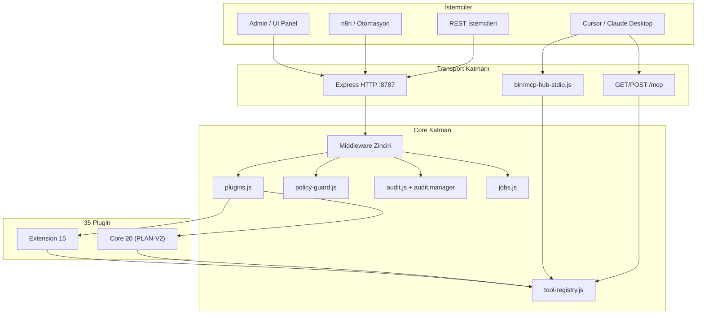
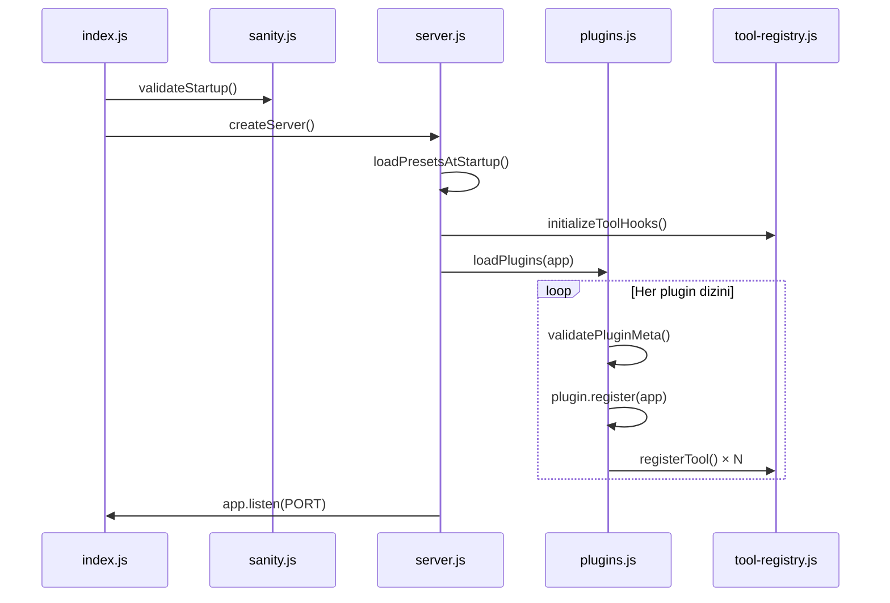
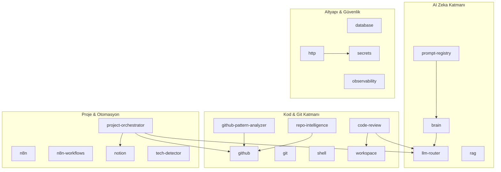
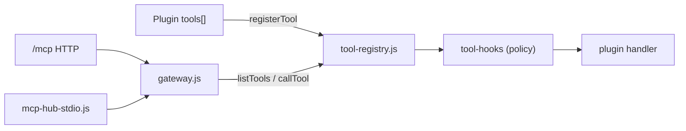

# Mimari

mcp-hub, Express tabanlı bir HTTP sunucusu üzerinde plugin keşfi, merkezi tool registry ve çift transport (REST + MCP) ile çalışan modüler bir AI agent platformudur.

---

## Sistem Genel Bakış



---

## Başlangıç Akışı



**Giriş noktası:** `mcp-server/src/index.js`  
**Sunucu fabrikası:** `mcp-server/src/core/server.js`

---

## Middleware Zinciri

İstekler aşağıdaki sırayla işlenir (`createServer()` içinde):

```mermaid
flowchart LR
    A[cors] --> B[morgan]
    B --> C[express.json]
    C --> D[correlationIdMiddleware]
    D --> E[projectContextMiddleware]
    E --> F[workspaceContextMiddleware]
    F --> G[auditMiddleware]
    G --> H[responseEnvelopeMiddleware]
    H --> I[policyGuardrailMiddleware]
    I --> J[Core Routes]
    J --> K[Plugin Routes]
    K --> L[404 NotFoundError]
    L --> M[Global Error Handler]
```



| Sıra | Middleware | Dosya | Görev |
|------|------------|-------|-------|
| 1 | `cors()` | express | Cross-origin istekler |
| 2 | `morgan("dev")` | express | HTTP access log |
| 3 | `express.json()` | express | JSON body parse |
| 4 | `correlationIdMiddleware` | server.js | `x-correlation-id` üret/echo |
| 5 | `projectContextMiddleware` | server.js | `x-project-id`, `x-env` veya default |
| 6 | `workspaceContextMiddleware` | workspace.js | Workspace bağlamı |
| 7 | `auditMiddleware` | audit.js | HTTP istek audit (ring buffer) |
| 8 | `responseEnvelopeMiddleware` | server.js | `{ ok, data/error, meta }` zarfı |
| 9 | `policyGuardrailMiddleware` | policy-guard.js | Write isteklerinde policy değerlendirme |

**Plugin route'ları** middleware zincirinden sonra mount edilir. Her plugin kendi router'ında `requireScope()` uygular.

**MCP `/mcp` endpoint'i** ayrı middleware kullanır (`mcp/http-transport.js`) — REST `requireScope` zincirine girmez; kendi Bearer token doğrulamasını yapar.

---

## Katman Mimarisi (PLAN-V2)



Toplam **20 core plugin** + **15 extension plugin** = **35 plugin**.

---

## Core Endpoint Haritası

Sunucu tarafından doğrudan sağlanan route'lar (`server.js`):

| Method | Path | Scope | Açıklama |
|--------|------|-------|----------|
| GET | `/health` | — | Sağlık kontrolü (auth durumu dahil) |
| GET | `/whoami` | read | Auth scope ve proje bağlamı |
| GET | `/plugins` | read | Yüklü plugin manifest listesi |
| GET | `/plugins/:name/manifest` | read | Tek plugin manifest |
| GET | `/openapi.json` | read | Otomatik OpenAPI 3.0 spec |
| GET | `/audit/logs` | read | HTTP istek audit logları |
| GET | `/audit/stats` | read | HTTP audit istatistikleri |
| GET | `/audit/operations` | read | Core işlem audit kayıtları |
| POST | `/jobs` | write | Asenkron job gönder |
| GET | `/jobs` | read | Job listesi |
| GET | `/jobs/:id` | read | Job detayı |
| GET | `/jobs/stats` | read | Job istatistikleri |
| GET | `/approvals/pending` | read | Bekleyen onaylar |
| POST | `/approve` | write | Onaylanmış tool çalıştır |
| ALL | `/mcp` | MCP auth | MCP Streamable HTTP gateway |
| GET | `/ui`, `/admin` | — | Statik web panelleri |
| POST | `/ui/token` | localhost | 6 haneli UI oturum kodu |
| GET | `/` | — | Landing page |

Plugin endpoint'leri otomatik keşfedilir ve `/openapi.json`'a birleştirilir. Detaylı liste: [api-reference.md](./api-reference.md).

---

## Tool Registry ve MCP Gateway



- **Kayıt:** Plugin yükleme sırasında `plugins.js` her tool'u `registerTool()` ile registry'ye ekler.
- **Çağrı:** `callTool(name, args, context)` before-hook → handler → audit → after-hook.
- **MCP:** `gateway.js` SDK `Server` instance'ı oluşturur; `ListTools` ve `CallTool` handler'ları registry'yi kullanır.

---

## Veri ve Durum Depolama

| Bileşen | Bellek | Redis | Dosya |
|---------|--------|-------|-------|
| Jobs | Varsayılan | `REDIS_URL` ile kalıcı | — |
| HTTP audit | Ring buffer (1000) | — | `AUDIT_LOG_FILE=true` |
| Core audit | Memory sink | — | `AUDIT_SINKS=file` |
| Brain/RAG cache | — | Opsiyonel | `CATALOG_CACHE_DIR` |
| Prompt registry | — | — | `prompts-v2.json` |
| Policy rules | Bellek | — | `presets.json` bootstrap |

Redis başlatılamazsa jobs otomatik bellek moduna düşer.

---

## Multi-Tenant Proje Bağlamı

Her istekte:

- `x-project-id` → `req.projectId`
- `x-env` → `req.projectEnv`

`REQUIRE_PROJECT_HEADERS=true` ise header'lar zorunludur; aksi halde `DEFAULT_PROJECT_ID` / `DEFAULT_ENV` kullanılır.

Job gönderiminde proje bağlamı job context'ine eklenir.

---

## Response Envelope

Tüm JSON yanıtlar standart zarf formatına normalize edilir:

**Başarı:**
```json
{
  "ok": true,
  "data": { },
  "meta": { "requestId": "req-..." }
}
```

**Hata:**
```json
{
  "ok": false,
  "error": { "code": "...", "message": "...", "details": {} },
  "meta": { "requestId": "req-..." }
}
```

---

## İlgili Belgeler

- [Core Bileşenler](./core-components.md)
- [Güvenlik](./security.md)
- [MCP Entegrasyonu](./mcp-integration.md)
- [Plugin Genel Bakış](./plugins/overview.md)
