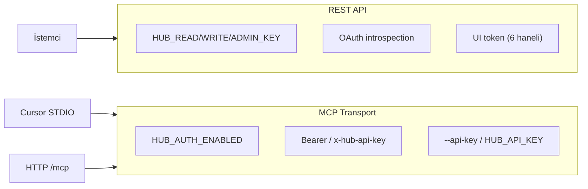

# Kimlik Doğrulama

mcp-hub üç farklı kimlik doğrulama yüzeyi sunar: REST API anahtarları, MCP transport auth ve kısa ömürlü UI token'ları. Bunlar birbirinden bağımsız yapılandırılır.

---

## Genel Bakış



| Yüzey | Kontrol mekanizması | Varsayılan |
|-------|---------------------|------------|
| REST | `HUB_*_KEY` tanımlı mı? | Boş = açık mod |
| MCP HTTP | `HUB_AUTH_ENABLED=true` | false = opsiyonel token |
| MCP STDIO | `HUB_AUTH_ENABLED=true` | API key zorunlu |
| UI Panel | `POST /ui/token` (localhost) | Admin scope token |

---

## HUB API Anahtarları

**Dosya:** `mcp-server/src/core/auth.js`

### Ortam değişkenleri

```env
HUB_READ_KEY=your-read-key
HUB_WRITE_KEY=your-write-key
HUB_ADMIN_KEY=your-admin-key
```

### Scope hiyerarşisi

```
read  <  write  <  admin
                  (danger = admin alias)
```

| Anahtar | Grant edilen scope'lar |
|---------|------------------------|
| `HUB_READ_KEY` | `read` |
| `HUB_WRITE_KEY` | `read`, `write` |
| `HUB_ADMIN_KEY` | `read`, `write`, `admin` |

### Header formatı

```http
Authorization: Bearer <HUB_READ_KEY|HUB_WRITE_KEY|HUB_ADMIN_KEY>
```

Alternatif:

```http
x-hub-api-key: <anahtar>
```

### requireScope kullanımı

Plugin route'larında:

```javascript
import { requireScope } from "../../core/auth.js";

router.get("/resource", requireScope("read"), handler);
router.post("/resource", requireScope("write"), handler);
router.delete("/resource", requireScope("admin"), handler);
```

### Açık mod

Üç anahtar da boş veya tanımsızsa `authEnabled()` false döner; `requireScope()` middleware'i istekleri geçirir.

**Uyarı:** Production'da açık mod kullanmayın.

### Kimlik sorgulama

```bash
curl http://localhost:8787/whoami \
  -H "Authorization: Bearer $HUB_READ_KEY"
```

Yanıt:

```json
{
  "ok": true,
  "data": {
    "auth": { "enabled": true, "scopes": ["read"] },
    "actor": { "type": "api_key", "scopes": ["read"] },
    "project": { "id": "default-project", "env": "default-env" }
  }
}
```

---

## REST Auth vs MCP Auth (Kritik Ayrım)

| Özellik | REST (`requireScope`) | MCP (`/mcp`, STDIO) |
|---------|----------------------|---------------------|
| Etkinleştirme | `HUB_*_KEY` tanımlı | `HUB_AUTH_ENABLED=true` |
| Bağımsızlık | REST korumalı, MCP açık olabilir | Evet |
| Doğrulama | `requireScope()` middleware | `validateBearerToken()` |
| UI token | REST'te geçerli (admin scope) | MCP'de geçerli değil* |
| OAuth | `requireOAuthScope()` | `validateBearerToken()` introspection |

\* UI token yalnızca `requireScope()` içinde `validateUiToken()` ile kabul edilir.

### MCP auth davranışı (`http-transport.js`)

```javascript
// Token varsa ve geçerliyse → authContext set
// Token yok veya geçersiz:
//   HUB_AUTH_ENABLED=true  → 401
//   HUB_AUTH_ENABLED≠true  → devam (açık mod)
```

### STDIO auth (`bin/mcp-hub-stdio.js`)

```javascript
if (process.env.HUB_AUTH_ENABLED === "true" && !options.apiKey) {
  console.error("Error: API key required...");
  process.exit(1);
}
```

STDIO CLI seçenekleri:

```bash
npx mcp-hub-stdio --api-key secret123 --scope write --project-id myproj --env development
```

Env alternatifleri: `HUB_API_KEY`, `HUB_SCOPE`, `HUB_PROJECT_ID`, `HUB_ENV`.

---

## OAuth 2.1 Bearer Token

**Dosya:** `auth.js` — `introspectOAuthToken()`, `validateBearerToken()`

```env
OAUTH_INTROSPECTION_ENDPOINT=https://auth.example.com/introspect
OAUTH_INTROSPECTION_AUTH=client_id:client_secret
```

RFC 7662 introspection: `active: true` ise token geçerli. Scope'lar `claims.scope` (space-separated) alanından çıkarılır.

`requireOAuthScope(scope)` middleware'i OAuth + API key hibrit doğrulama sağlar.

---

## UI Token (Admin Panel)

**Dosya:** `mcp-server/src/core/ui-tokens.js`

Kısa ömürlü 6 haneli kod; macOS'ta sistem bildirimi ile teslim edilir.

### Alma

```bash
curl -X POST http://localhost:8787/ui/token
```

Yalnızca localhost (`127.0.0.1`, `::1`) kabul edilir → aksi halde `403 forbidden`.

### Yapılandırma

```env
UI_TOKEN_TTL_MS=300000   # varsayılan 5 dakika
```

### Kullanım

Admin panel (`/admin`) veya API isteklerinde:

```http
Authorization: Bearer 042857
```

UI token geçerli olduğunda `req.actor.type = "ui_token"` ve scope'lar `read`, `write`, `admin` olarak atanır.

---

## Actor Modeli

Her authenticated istekte:

```javascript
req.authScopes = ["read", "write"];  // normalize edilmiş
req.actor = {
  type: "api_key" | "ui_token" | "oauth",
  scopes: req.authScopes,
  subject: "..."  // OAuth sub claim (varsa)
};
```

Policy guard ve audit logları `req.actor` kullanır.

---

## Hata Kodları

| HTTP | code | Anlam |
|------|------|-------|
| 401 | `unauthorized` | Header yok |
| 401 | `invalid_key` | Geçersiz HUB key |
| 401 | `invalid_token` | Geçersiz OAuth/MCP token |
| 403 | `forbidden` | Scope yetersiz |
| 403 | `forbidden` | UI token localhost dışından istendi |

---

## Cursor MCP Yapılandırması

`.cursor/mcp.json` veya Cursor settings:

```json
{
  "mcpServers": {
    "mcp-hub": {
      "command": "node",
      "args": [
        "/path/to/mcp-hub/mcp-server/bin/mcp-hub-stdio.js",
        "--api-key", "YOUR_HUB_WRITE_KEY",
        "--scope", "write"
      ],
      "env": {
        "HUB_AUTH_ENABLED": "true"
      }
    }
  }
}
```

**Not:** STDIO giriş noktası `bin/mcp-hub-stdio.js`'dir (`stdio-bridge.js` değil).

---

## Güvenlik Önerileri

1. Her ortam için farklı anahtarlar kullanın (dev/staging/prod)
2. READ key'i salt okunur otomasyonlara verin; WRITE/ADMIN'i sınırlı tutun
3. MCP için production'da `HUB_AUTH_ENABLED=true` zorunlu kılın
4. UI token yalnızca localhost'tan alınabilir — remote admin için HUB_ADMIN_KEY kullanın
5. Anahtarları loglara yazdırmayın; config startup logları maskeler

---

## İlgili Belgeler

- [Güvenlik](./security.md)
- [MCP Entegrasyonu](./mcp-integration.md)
- [Yapılandırma](./configuration.md)
- [API Referansı](./api-reference.md)
