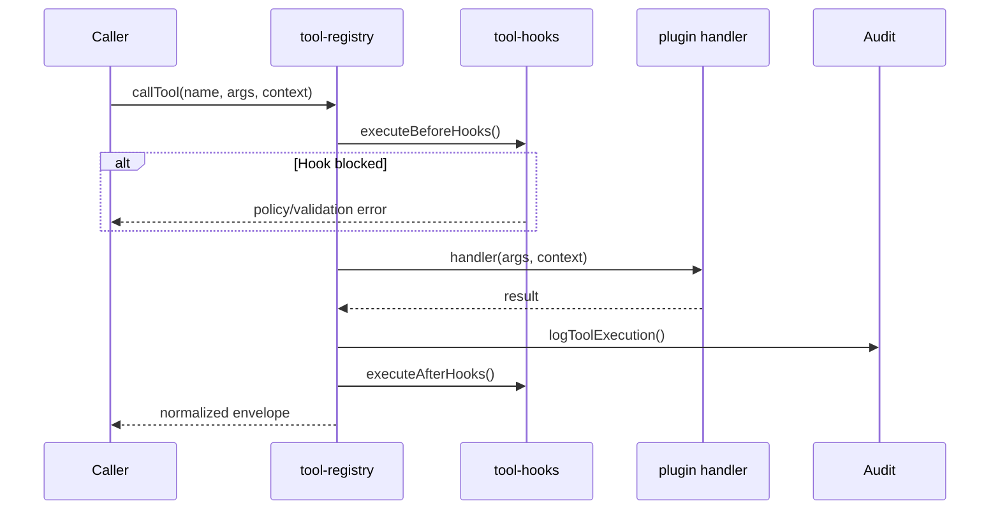

# Core Bileşenler

mcp-hub'un çekirdek modülleri `mcp-server/src/core/` altında toplanır. Plugin'ler bu altyapıyı paylaşır; tutarlı auth, audit, policy ve hata formatı buradan gelir.

---

## Dosya Haritası

```
mcp-server/src/
├── index.js                 # Giriş noktası
├── core/
│   ├── server.js            # Express app, middleware, core route'lar
│   ├── plugins.js           # Plugin keşfi ve yükleme
│   ├── tool-registry.js     # MCP tool kayıt ve çağrı
│   ├── config.js            # Env → config eşlemesi
│   ├── config-schema.js     # Zod doğrulama
│   ├── auth.js              # HUB key RBAC
│   ├── audit.js             # HTTP istek audit middleware
│   ├── audit/               # Core audit manager + sink'ler
│   ├── jobs.js              # Job kuyruğu
│   ├── policy-guard.js      # REST write policy middleware
│   ├── policy-hooks.js      # Policy plugin hook bağlantısı
│   ├── security-guard.js    # Tool chain analizi, arg sanitization
│   └── plugins/index.js     # createMetadata, PluginStatus
└── mcp/
    ├── gateway.js           # MCP Server instance
    └── http-transport.js    # /mcp Express middleware
```

---

## server.js

**Konum:** `mcp-server/src/core/server.js`

Express uygulamasını oluşturan ana fabrika fonksiyonu: `createServer()`.

### Sorumluluklar

1. Global middleware zincirini kurmak (CORS, JSON, correlation ID, proje bağlamı, audit, response envelope, policy guard)
2. Core REST route'larını mount etmek (`/health`, `/plugins`, `/jobs`, `/audit/*`, `/approvals/*`, `/mcp`)
3. Statik UI dosyalarını sunmak (`/ui`, `/admin`, landing page)
4. Plugin yüklemesini tetiklemek (`loadPlugins`, `initializeToolHooks`, `loadPresetsAtStartup`)
5. 404 ve global error handler

### Önemli yardımcılar

| Fonksiyon | Açıklama |
|-----------|----------|
| `correlationIdMiddleware` | `x-correlation-id` header veya otomatik ID |
| `projectContextMiddleware` | Multi-tenant proje/ortam header'ları |
| `responseEnvelopeMiddleware` | Tüm JSON yanıtları `{ ok, data/error, meta }` formatına çevirir |
| `extractPathParams` | OpenAPI spec için Express `:param` çıkarımı |

### Başlatma sırası

```javascript
loadPresetsAtStartup();      // Policy preset kuralları
initializeToolHooks();       // Tool hook altyapısı (plugin'ler hook kaydeder)
await loadPlugins(app);      // Tüm plugin route + tool kayıtları
```

---

## plugins.js

**Konum:** `mcp-server/src/core/plugins.js`

`src/plugins/<name>/index.js` dizinlerini tarar ve her plugin'i yükler.

### Plugin sözleşmesi

Her plugin şunları export etmelidir:

| Export | Zorunlu | Açıklama |
|--------|---------|----------|
| `register(app)` | Evet | Express route mount |
| `name` | Önerilen | Plugin kimliği |
| `version` | Önerilen | Semver |
| `tools[]` | Opsiyonel | MCP tool tanımları |
| `endpoints[]` | Opsiyonel | OpenAPI manifest |
| `metadata` | Opsiyonel | `createMetadata()` ile standart manifest |

### Yükleme akışı

1. `PLUGINS_DIR` altındaki dizinler listelenir
2. `ENABLE_N8N_*` flag'leri ile n8n plugin'leri filtrelenebilir
3. `plugin.meta.json` doğrulanır (`validatePluginMeta`)
4. `index.js` dynamic import edilir
5. `register(app)` await ile çağrılır
6. `tools[]` varsa her biri `registerTool()` ile registry'ye eklenir
7. Manifest `loaded[]` dizisine push edilir

### Export fonksiyonları

| Fonksiyon | Dönüş |
|-----------|-------|
| `loadPlugins(app)` | Async — tüm plugin'leri yükler |
| `getPlugins()` | Başarılı manifest listesi |
| `getFailedPlugins()` | Yüklenemeyen plugin'ler ve nedenleri |

### Strict mod

- `PLUGIN_STRICT_MODE=true` — herhangi bir plugin başarısız olursa sunucu başlamaz
- `STRICT_PLUGIN_LOADING=true` — config flag (schema üzerinden)

---

## tool-registry.js

**Konum:** `mcp-server/src/core/tool-registry.js`

MCP ve REST üzerinden paylaşılan merkezi tool kayıt defteri.

### Tool yapısı

```javascript
{
  name: "github_list_repos",
  description: "...",
  inputSchema: { type: "object", properties: { ... } },
  handler: async (args, context) => ({ ok: true, data: ... }),
  plugin: "github",
  tags: ["read_only", "EXTERNAL_API"]
}
```

### ToolTags

| Tag | Anlam |
|-----|-------|
| `read_only` | Salt okunur işlem |
| `write` | Yazma işlemi |
| `destructive` | Geri alınamaz işlem |
| `needs_approval` | İnsan onayı gerekebilir |
| `BULK` | Toplu işlem |
| `NETWORK` | Ağ erişimi |
| `LOCAL_FS` | Yerel dosya sistemi |
| `GIT` | Git operasyonu |
| `EXTERNAL_API` | Harici API çağrısı |

Write/destructive tool'larda `inputSchema.properties.explanation` alanı önerilir (Faz 3 Cursor pattern).

### Ana fonksiyonlar

| Fonksiyon | Açıklama |
|-----------|----------|
| `registerTool(tool)` | Tool kaydet (Zod/MCP contract validation) |
| `listTools()` | Tüm tool'ları listele |
| `callTool(name, args, context)` | Before-hook → handler → audit → after-hook |
| `approveTool(approvalId, context)` | Onay sonrası tool yeniden çalıştır |
| `initializeToolHooks()` | Startup hook init (plugin'ler kendi hook'larını kaydeder) |

### callTool akışı



Policy plugin `registerBeforeExecutionHook` ile tool çağrılarını değerlendirir.

---

## config.js ve config-schema.js

**Konum:** `mcp-server/src/core/config.js`, `config-schema.js`

Ortam değişkenlerini Zod şeması ile doğrular ve `config` objesi export eder.

### config yapısı (özet)

| Alan | Kaynak env | Açıklama |
|------|------------|----------|
| `port` | `PORT` | HTTP port (8787) |
| `auth.readKey/writeKey/adminKey` | `HUB_*_KEY` | API anahtarları |
| `plugins.enableN8n*` | `ENABLE_N8N_*` | n8n plugin toggle |
| `redis.url` | `REDIS_URL` | Redis bağlantısı |
| `n8n.*` | `N8N_*` | n8n entegrasyonu |
| `notion.*` | `NOTION_*` | Notion API |
| `http.*` | `HTTP_*` | HTTP plugin policy |
| `database.*` | `MSSQL_*`, `PG_*`, `MONGODB_*` | DB bağlantıları |

Startup'ta secret değerler maskelenerek loglanır (`logStartupConfig`).

Detaylı env listesi: [configuration.md](./configuration.md).

---

## jobs.js

**Konum:** `mcp-server/src/core/jobs.js`

Uzun süren işler için asenkron job kuyruğu.

### Job durumları

```
queued → running → completed | failed | cancelled
```

### API

| Fonksiyon | Açıklama |
|-----------|----------|
| `registerJobRunner(type, handler)` | Plugin job handler kaydı |
| `submitJob(type, payload, context)` | Job kuyruğa al |
| `getJob(id)` | Job detayı |
| `listJobs({ state, type, limit })` | Filtreli liste |
| `getJobStats()` | İstatistik özeti |

### Depolama

- **Bellek:** `REDIS_URL` yoksa — restart'ta kaybolur, ~1 saat sonra temizlenir
- **Redis:** `jobs.redis.js` — kalıcı kuyruk, yetim job recovery

REST endpoint'leri: `POST /jobs`, `GET /jobs`, `GET /jobs/:id`, `GET /jobs/stats`.

---

## Audit Sistemi (İki Katman)

### 1. HTTP İstek Audit — audit.js

**Middleware:** Her HTTP isteğini loglar (method, path, plugin, status, süre).

- Bellekte son **1000** kayıt (ring buffer)
- `AUDIT_LOG_FILE=true` → `cache/audit.log`
- Request body'de password/token/secret alanları `[REDACTED]`

Endpoint'ler: `GET /audit/logs`, `GET /audit/stats`

### 2. Core İşlem Audit — audit/audit.manager.js

Plugin tool çağrıları ve write operasyonları için yapılandırılabilir audit manager.

```javascript
await auditLog({
  plugin: "workspace",
  operation: "write_file",
  actor: "api_key",
  correlationId: "...",
  allowed: true,
  success: true,
  durationMs: 42,
  resource: "/path/to/file",
});
```

**Sink'ler:** `memory`, `file` (`AUDIT_SINKS=memory,file`)

Endpoint: `GET /audit/operations`

---

## Policy Sistemi

### policy-guard.js (REST middleware)

Write HTTP isteklerini (`POST`, `PUT`, `PATCH`, `DELETE`) policy kurallarına karşı değerlendirir.

**Aksiyonlar:**

| Aksiyon | HTTP | Davranış |
|---------|------|----------|
| `allow` | — | Devam |
| `block` | 403 | Engelle |
| `require_approval` | 202 | Onay kuyruğuna al |
| `dry_run` | 200 | Önizleme; `?confirmed=true` ile devam |
| `policy_rate_limit` | 429 | Rate limit |

Startup'ta `plugins/policy/presets.json` kuralları yüklenir (`loadPresetsAtStartup`).

### policy plugin

Tam policy motoru: kural CRUD, onay kuyruğu, rate limit, dry-run. REST middleware ve tool hook'ları `policy-hooks.js` üzerinden bağlanır.

### security-guard.js

Tool chain analizi ve parametre sanitization:

- Tehlikeli tool zincirleri (ör. `shell_execute` → `http_request`)
- SQL injection, path traversal, command injection pattern tespiti
- Plugin güvenlik metadata değerlendirmesi

---

## Diğer Core Modüller

| Modül | Görev |
|-------|-------|
| `auth.js` | `requireScope()`, OAuth introspection, UI token |
| `error-standard.js` | `AppError`, `createPluginErrorHandler()` |
| `validate.js` | `validateBody()`, `validateQuery()` |
| `ratelimit.js` | Express rate limit factory |
| `resilience.js` | Retry, circuit breaker |
| `health/` | Aggregate plugin health service |
| `tenancy/` | Tenant context, isolation middleware |
| `ui-tokens.js` | 6 haneli kısa ömürlü admin UI token |
| `workspace.js` | Workspace context middleware |
| `redis.js` | Redis health check |

---

## Plugin Standartları (createMetadata)

`core/plugins/index.js` export'ları:

- `createMetadata({ name, version, status, riskLevel, endpoints, ... })`
- `PluginStatus`: `stable`, `beta`, `experimental`
- `RiskLevel`: `LOW`, `MEDIUM`, `HIGH`, `CRITICAL`

Evrensel checklist (PLAN-V2):

1. `createMetadata()` kullan
2. `createPluginErrorHandler()` kullan
3. `auditLog()` — write operasyonlarında
4. `requireScope()` — REST route'larda
5. `ToolTags` — MCP tool'larda
6. `inputSchema` (parameters değil)
7. `register(app)` gerçek route mount etmeli
8. Kendi `callLLM()` kopyası olmamalı — `llm-router` kullan
9. `GET /plugin/health` endpoint
10. En az 3 MCP tool

---

## İlgili Belgeler

- [Mimari](./architecture.md)
- [Güvenlik](./security.md)
- [Operasyonlar](./operations.md)
- [Plugin Geliştirme](./plugins/development.md)
