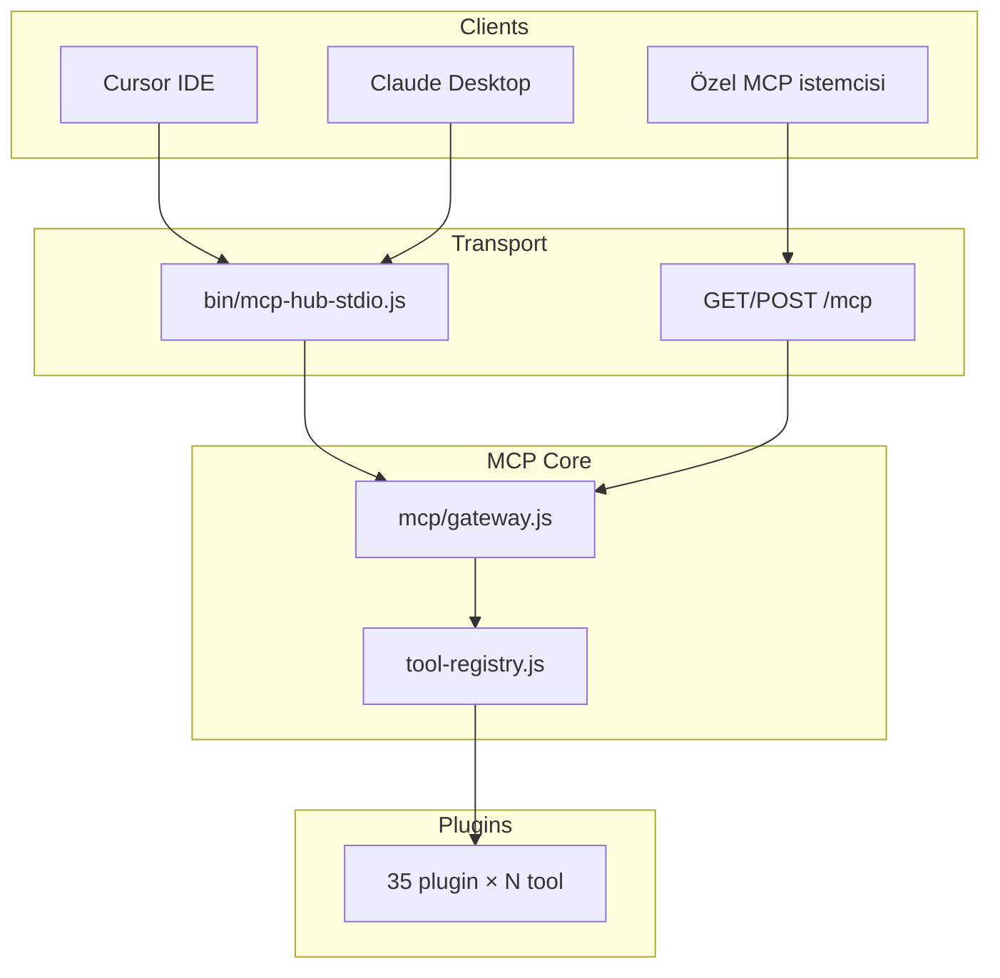

# MCP Entegrasyonu

mcp-hub, Model Context Protocol (MCP) üzerinden AI istemcilerine (Cursor, Claude Desktop vb.) tüm plugin tool'larını sunar. İki transport desteklenir: **HTTP Streamable** (`/mcp`) ve **STDIO** (`bin/mcp-hub-stdio.js`).

---

## Genel Akış



---

## MCP Gateway (`gateway.js`)

**Konum:** `mcp-server/src/mcp/gateway.js`

`@modelcontextprotocol/sdk` kullanarak MCP Server instance oluşturur:

```javascript
export function createMcpServer() {
  const server = new Server(
    { name: "mcp-hub", version: "1.0.0" },
    { capabilities: { tools: {} } }
  );
  // ListToolsRequestSchema → listTools()
  // CallToolRequestSchema → callTool()
}
```

### listTools

Registry'deki tüm tool'ları MCP formatında döner:

```json
{
  "tools": [
    {
      "name": "github_list_repos",
      "description": "...",
      "inputSchema": { "type": "object", "properties": { ... } }
    }
  ]
}
```

### callTool

1. Tool adı ve argümanları alır
2. `callTool(name, args, context)` çağırır
3. Sonucu MCP `content` formatına çevirir

**Özel durumlar:**

| Durum | MCP yanıtı |
|-------|------------|
| Başarı | JSON `data` text content |
| `require_approval` | `⏳ Approval Required` metni (isError: false) |
| `dry_run` | `🔍 Dry Run Mode` + preview JSON |
| Hata | `❌ Error: code` (isError: true) |

---

## HTTP Transport (`/mcp`)

**Konum:** `mcp-server/src/mcp/http-transport.js`

Express middleware: `app.all("/mcp", createMcpHttpMiddleware())`

### Desteklenen methodlar

| Method | Davranış |
|--------|----------|
| GET | SSE stream — session info + 30s ping |
| POST | JSON-RPC message işleme |
| Diğer | 405 Method Not Allowed |

### Kimlik doğrulama (REST'ten ayrı)

```javascript
// Token extraction
Authorization: Bearer <token>
// veya
x-hub-api-key: <token>

// validateBearerToken() → HUB key veya OAuth introspection

// HUB_AUTH_ENABLED=true ise token zorunlu
// HUB_AUTH_ENABLED≠true ise token opsiyonel (açık mod)
```

### Origin güvenliği

DNS rebinding koruması:

- Varsayılan: `localhost`, `127.0.0.1` pattern'leri
- Production: `MCP_ALLOWED_ORIGINS=https://app.example.com,https://other.example.com`

Geçersiz origin → `403 invalid_origin`

### Örnek POST isteği

```bash
curl -X POST http://localhost:8787/mcp \
  -H "Authorization: Bearer $HUB_WRITE_KEY" \
  -H "Content-Type: application/json" \
  -d '{
    "jsonrpc": "2.0",
    "id": 1,
    "method": "tools/call",
    "params": {
      "name": "github_list_repos",
      "arguments": { "owner": "myorg" }
    }
  }'
```

---

## STDIO Transport (`bin/mcp-hub-stdio.js`)

**Konum:** `mcp-server/bin/mcp-hub-stdio.js`

Cursor ve Claude Desktop için birincil entegrasyon noktası. **Not:** `stdio-bridge.js` kullanılmaz; resmi giriş noktası `mcp-hub-stdio.js`'dir.

### Neden ayrı entrypoint?

STDIO protokolü stdout'ta yalnızca JSON-RPC frame bekler. Bu script:

1. `console.log/info/warn` → stderr'e yönlendirir (JSON parse bozulmasını önler)
2. `.env` dosyasını yükler (ENV_FILE, `../.env`, cwd `.env`)
3. Plugin'leri yükler (Express app ile route mount — tool handler'lar için)
4. MCP Server + `StdioServerTransport` bağlar

### Kullanım

```bash
# Doğrudan
node mcp-server/bin/mcp-hub-stdio.js --api-key YOUR_KEY --scope write

# npx (package.json bin tanımı varsa)
npx mcp-hub-stdio --api-key YOUR_KEY --scope write --project-id myproj
```

### CLI seçenekleri

| Seçenek | Env alternatifi | Açıklama |
|---------|-----------------|----------|
| `--api-key <key>` | `HUB_API_KEY` | MCP auth anahtarı |
| `--scope <scope>` | `HUB_SCOPE` | `read`, `write`, `admin` |
| `--project-id <id>` | `HUB_PROJECT_ID` | Proje bağlamı |
| `--env <env>` | `HUB_ENV` | Ortam (default: development) |
| `--help` | — | Yardım |

### Auth kontrolü

```javascript
if (process.env.HUB_AUTH_ENABLED === "true" && !options.apiKey) {
  process.exit(1);  // API key zorunlu
}
```

### Başlatma sırası

```
1. parseArgs()
2. initializeToolHooks()
3. loadPlugins(express app)   // tool handler'lar kayıt olur
4. createMcpServer()
5. StdioServerTransport.connect()
6. SIGINT/SIGTERM → graceful shutdown
```

---

## Cursor Yapılandırması

`.cursor/mcp.json`:

```json
{
  "mcpServers": {
    "mcp-hub": {
      "command": "node",
      "args": [
        "/Users/you/mcp-hub/mcp-server/bin/mcp-hub-stdio.js",
        "--api-key",
        "YOUR_HUB_WRITE_KEY",
        "--scope",
        "write",
        "--project-id",
        "my-project"
      ],
      "env": {
        "HUB_AUTH_ENABLED": "true",
        "NODE_ENV": "development"
      }
    }
  }
}
```

Alternatif: HTTP MCP (Cursor sürümüne bağlı):

```json
{
  "mcpServers": {
    "mcp-hub-http": {
      "url": "http://localhost:8787/mcp",
      "headers": {
        "Authorization": "Bearer YOUR_HUB_WRITE_KEY"
      }
    }
  }
}
```

---

## Tool Kayıt Süreci

Plugin yükleme sırasında MCP tool'ları otomatik kaydedilir:

```javascript
// plugins.js
if (Array.isArray(plugin.tools)) {
  for (const tool of plugin.tools) {
    registerTool({ ...tool, plugin: plugin.name || dir });
  }
}
```

Tool handler imzası:

```javascript
handler: async (args, context) => {
  // context: { method, user, requestId, projectId, approvalId, ... }
  return { ok: true, data: { ... } };
}
```

---

## Policy ve Onay (MCP)

Tool çağrıları policy hook'larından geçer. Onay gerektiren işlemlerde MCP istemcisine hata yerine bilgilendirici metin döner:

```
⏳ Approval Required

This operation requires human approval.

Approval ID: apr-abc123
```

Onay REST üzerinden:

```bash
curl -X POST http://localhost:8787/approve \
  -H "Authorization: Bearer $HUB_WRITE_KEY" \
  -H "Content-Type: application/json" \
  -d '{ "approval_id": "apr-abc123" }'
```

---

## REST vs MCP Karşılaştırma

| Özellik | REST API | MCP |
|---------|----------|-----|
| Keşif | `/openapi.json`, `/plugins` | `tools/list` |
| Çağrı | Plugin-specific POST route | `tools/call` |
| Auth | `HUB_*_KEY` + requireScope | `HUB_AUTH_ENABLED` + Bearer |
| Response | JSON envelope | MCP content blocks |
| Streaming | Plugin-specific | GET /mcp SSE |
| Cursor entegrasyonu | — | STDIO (birincil) |

Her iki yüzey de aynı `tool-registry` ve plugin handler'larını paylaşır.

---

## Web UI Chat İstemcisi (Faz 1 + Unified React SPA)

Kaynak: `mcp-server/frontend/` — Vite + React + TanStack Query + Framer Motion.

Production build Express üzerinden `/` altında sunulur. Chat sayfası (`/chat`) sunucu tarafı proxy kullanır; LLM API key sunucuda kalır (tarayıcıda yalnızca hub token).

| Modül | Dosya | Rol |
|-------|-------|-----|
| API client | `frontend/src/lib/api-client.ts` | REST envelope unwrap, Bearer auth |
| Auth | `frontend/src/lib/auth.ts` | `localStorage mcpHubApiKey`, `POST /ui/token` |
| Chat SSE | `frontend/src/lib/chat-stream.ts` | SSE olayları, approval submit |

| Endpoint | Method | Scope | Açıklama |
|----------|--------|-------|----------|
| `/ui/chat/models` | GET | read | Provider, model listesi, tool sayısı |
| `/ui/chat` | POST | read | SSE streaming chat + tool loop |
| `/ui/chat/approve` | POST | write | Policy onayı (destructive tool) |

### SSE olayları

| Event | Payload | Anlam |
|-------|---------|-------|
| `meta` | `{ provider, model, toolCount }` | Oturum meta |
| `token` | `{ text }` | Streaming token |
| `tool` | `{ phase: start\|end, name, ... }` | Tool çağrısı |
| `approval` | `{ approvalId, tool, arguments }` | Onay modal tetikle |
| `done` | `{ content, iterations }` | Tamamlandı |
| `error` | `{ message }` | Hata |

Örnek chat isteği:

```bash
curl -N -X POST http://localhost:8787/ui/chat \
  -H "Authorization: Bearer $UI_TOKEN" \
  -H "Content-Type: application/json" \
  -d '{"message":"Merhaba"}'
```

Onay akışı: SSE `approval` → UI modal → `POST /ui/chat/approve` `{ "approval_id": "...", "approved": true }`.

OpenAI tool limiti (128) nedeniyle chat en fazla 128 tool gönderir (read-only öncelikli).

---

## Sorun Giderme

| Belirti | Olası neden | Çözüm |
|---------|-------------|-------|
| Cursor tool listesi boş | Plugin yüklenmedi | STDERR log: `[mcp-hub-stdio] Plugins loaded` |
| JSON parse error | Log stdout'a yazılıyor | `mcp-hub-stdio.js` kullanın (log stderr'de) |
| 401 on /mcp | `HUB_AUTH_ENABLED=true`, token yok | Bearer header veya flag kapat |
| Tool not found | Tool register edilmemiş | Plugin `tools[]` export kontrol |
| Approval stuck | Policy rule aktif | `/approvals/pending` + `/approve` |

---

## İlgili Belgeler

- [Kimlik Doğrulama](./authentication.md)
- [Güvenlik](./security.md)
- [Core Bileşenler](./core-components.md)
- [Plugin Genel Bakış](./plugins/overview.md)
