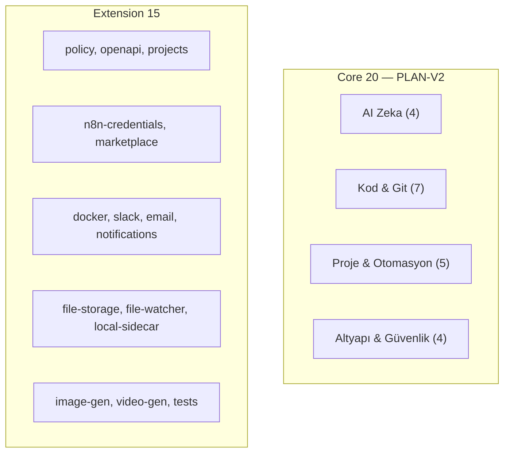
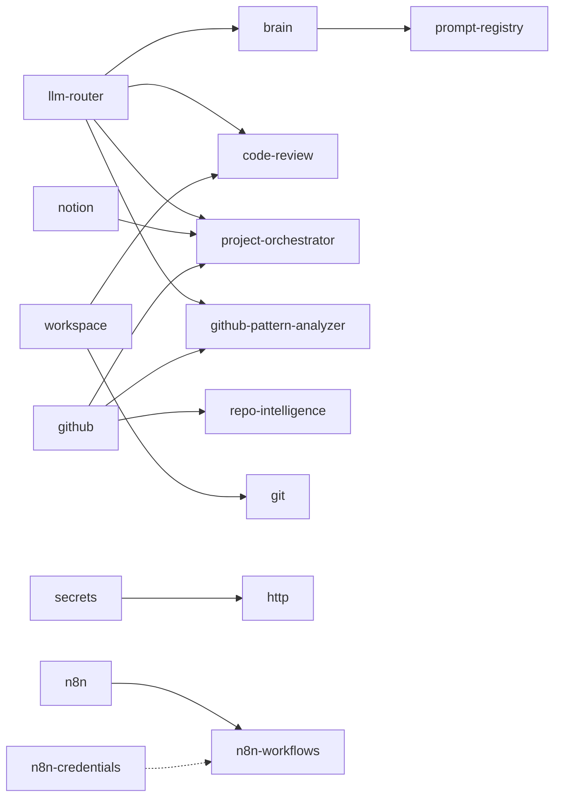

# Plugin Genel Bakış

mcp-hub **35 plugin** içerir. Bunların **20'si** PLAN-V2 core platformunun parçasıdır; kalan **15'i** extension/opsiyonel entegrasyon plugin'leridir.

---

## Katman Özeti



---

## Tüm 35 Plugin Tablosu

| # | Plugin | Katman | Core | Durum | Auth | MCP Tools | Açıklama |
|---|--------|--------|------|-------|------|-----------|----------|
| 1 | `llm-router` | AI Zeka | ✅ | stable | ✅ | ✅ | Çoklu LLM sağlayıcı yönlendirme |
| 2 | `brain` | AI Zeka | ✅ | stable | ✅ | ✅ (16+) | Kişisel AI hafıza ve context engine |
| 3 | `rag` | AI Zeka | ✅ | stable | ✅ | ✅ | Doküman indeksleme ve semantik arama |
| 4 | `prompt-registry` | AI Zeka | ✅ | stable | ✅ | ✅ | Section-based prompt composition (Faz 3) |
| 5 | `github` | Kod & Git | ✅ | stable | ✅ | ✅ | GitHub repo, PR, branch yönetimi |
| 6 | `git` | Kod & Git | ✅ | stable | ✅ | ✅ (11) | Yerel git operasyonları |
| 7 | `shell` | Kod & Git | ✅ | stable | ✅ | ✅ | Shell komut çalıştırma + session (Faz 3) |
| 8 | `workspace` | Kod & Git | ✅ | stable | ✅ | ✅ (8) | Workspace içi güvenli dosya CRUD |
| 9 | `code-review` | Kod & Git | ✅ | stable | ✅ | ✅ (4) | Otomatik kod inceleme ve güvenlik taraması |
| 10 | `repo-intelligence` | Kod & Git | ✅ | stable | ✅ | ✅ | Repo analizi + similar commits (Faz 3) |
| 11 | `github-pattern-analyzer` | Kod & Git | ✅ | stable | ✅ | ✅ | GitHub pattern öğrenme |
| 12 | `project-orchestrator` | Proje | ✅ | stable | ✅ | ✅ | AI planlama, spec→plan→execute (Faz 3) |
| 13 | `n8n` | Proje | ✅ | stable | ✅ | ✅ (9) | n8n workflow katalog ve çalıştırma |
| 14 | `n8n-workflows` | Proje | ✅ | stable | ✅ | ✅ (5) | n8n workflow CRUD ve aktivasyon |
| 15 | `notion` | Proje | ✅ | stable | ✅ | ✅ | Notion sayfa, DB, proje, görev |
| 16 | `tech-detector` | Proje | ✅ | stable | ✅ | ✅ (3) | Proje tech stack tespiti |
| 17 | `database` | Altyapı | ✅ | stable | ✅ | ✅ | MSSQL, PostgreSQL, MongoDB |
| 18 | `secrets` | Altyapı | ✅ | stable | ✅ | ✅ (4) | `{{secret:NAME}}` referans sistemi |
| 19 | `http` | Altyapı | ✅ | stable | ✅ | ✅ (3) | Güvenli HTTP client (SSRF korumalı) |
| 20 | `observability` | Altyapı | ✅ | stable | ✅ | ✅ (3) | Health, Prometheus, dashboard |
| 21 | `policy` | Extension | — | stable | ✅ | ✅ | Policy motoru, onay kuyruğu |
| 22 | `n8n-credentials` | Extension | — | stable | ✅ | ✅ | n8n credential metadata (secret yok) |
| 23 | `openapi` | Extension | — | stable | ✅ | ✅ | OpenAPI spec analizi ve kod üretimi |
| 24 | `projects` | Extension | — | stable | ✅ | ✅ | Multi-project/env konfig registry |
| 25 | `marketplace` | Extension | — | beta | ⚠️ | ✅ | npm plugin keşfi ve kurulum |
| 26 | `local-sidecar` | Extension | — | stable | ✅ | ✅ | Whitelist ile yerel dosya erişimi |
| 27 | `file-storage` | Extension | — | stable | ✅ | ✅ | S3, Google Drive, lokal depolama |
| 28 | `file-watcher` | Extension | — | beta | ✅ | ✅ | Dizin izleme ve AI tetikleme |
| 29 | `docker` | Extension | — | beta | ✅ | ✅ | Docker container/image yönetimi |
| 30 | `slack` | Extension | — | beta | ⚠️ | ✅ | Slack mesajlaşma entegrasyonu |
| 31 | `email` | Extension | — | beta | ⚠️ | ✅ | SMTP e-posta gönder/al |
| 32 | `notifications` | Extension | — | stable | ✅ | ✅ | Sistem bildirimleri ve uyarılar |
| 33 | `image-gen` | Extension | — | beta | ⚠️ | ✅ | AI görsel üretimi |
| 34 | `video-gen` | Extension | — | beta | ⚠️ | ✅ | AI video üretimi |
| 35 | `tests` | Extension | — | beta | ✅ | ✅ | Test runner ve lint entegrasyonu |

**Durum açıklaması:** stable = production-ready hedef; beta = çalışır ama sertifikasyon eksik; ⚠️ partial auth = kısmi scope uygulaması.

---

## Plugin Keşfi

Dizin: `mcp-server/src/plugins/<name>/index.js`

Yükleme sırasında:

1. Dizin taranır (35 klasör)
2. `plugin.meta.json` doğrulanır (varsa)
3. `register(app)` çağrılır
4. `tools[]` → tool-registry

Devre dışı bırakma:

```env
ENABLE_N8N_PLUGIN=false
ENABLE_N8N_CREDENTIALS=false
ENABLE_N8N_WORKFLOWS=false
```

---

## Manifest API

```bash
# Tüm plugin'ler
curl http://localhost:8787/plugins -H "Authorization: Bearer $HUB_READ_KEY"

# Tek plugin
curl http://localhost:8787/plugins/github/manifest -H "Authorization: Bearer $HUB_READ_KEY"
```

Manifest alanları: `name`, `version`, `description`, `capabilities`, `endpoints`, `tools`, `requires`, `status`, `owner`, `testLevel`, `requiresAuth`, `supportsJobs`, `resilience`, `security`.

---

## Admin Panel Görünümü

`http://localhost:8787/admin` → **20 Plugins** sekmesi PLAN-V2 core listesini katman bazında gösterir:

| Katman | Plugin'ler |
|--------|------------|
| AI Zeka | llm-router, brain, rag, prompt-registry |
| Kod & Git | github, git, shell, workspace, code-review, repo-intelligence, github-pattern-analyzer |
| Proje & Otomasyon | project-orchestrator, n8n, n8n-workflows, notion, tech-detector |
| Altyapı & Güvenlik | database, secrets, http, observability |

Extension plugin'ler `/plugins` API'sinde görünür ancak admin "20 Plugins" sekmesinde listelenmez.

---

## Bağımlılık Grafiği (Seçilmiş)



---

## Plugin Olgunluk Kriterleri

Her plugin için PLAN-V2 checklist:

- [ ] `createMetadata()` + `createPluginErrorHandler()`
- [ ] `auditLog()` write operasyonlarında
- [ ] `requireScope()` REST route'larda
- [ ] `ToolTags` + `inputSchema`
- [ ] `register(app)` gerçek route mount
- [ ] `llm-router` (LLM gerekiyorsa)
- [ ] `GET /<plugin>/health`
- [ ] En az 3 MCP tool
- [ ] Entegrasyon testi

---

## İlgili Belgeler

- [Core 20 (PLAN-V2)](./core-20.md)
- [Plugin Geliştirme](./development.md)
- [Core Bileşenler](../core-components.md)
- [API Referansı](../api-reference.md)
