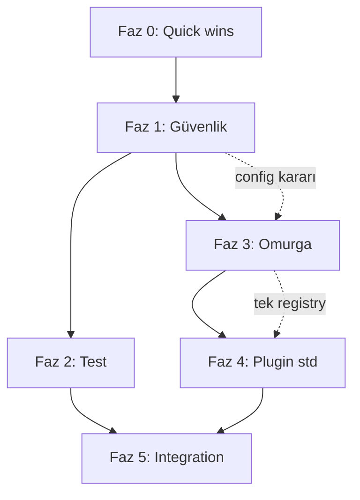

# mcp-hub Yol Haritası

> Tarih: 2026-06-24  
> Kaynak: Tam sistem taraması ([assessment.md](./assessment.md), [technical-debt.md](./technical-debt.md), [security.md](./security.md))  
> Hedef: Feature-rich platformu **production-grade MCP hub**'a dönüştürmek

---

## Stratejik hedef

```
Bugün                          Hedef (8–10 hafta)
─────────────────────────────────────────────────────
Feature-rich                   Güvenli + tutarlı
Çift mimari                    Tek omurga
%46 test CI dışı               Güvenilir CI + kritik path testli
Auth tutarsız                  Her route/tool korumalı
Docs drift                     Tek kaynak gerçek
```

**Temel ilke:** Yeni özellik eklemeden önce omurga sadeleştirilir. Her fazın çıkış kapısı (exit gate) vardır; gate geçilmeden sonraki faza geçilmez.

---

## Faz özeti

| Faz | Ad | Süre | Odak | Exit gate |
|-----|-----|------|------|-----------|
| **0** | Hızlı kazanımlar | 2–3 gün | Düşük efor, yüksek görünürlük | CI yeşil, 5 quick win |
| **1** | Güvenlik omurgası | 1–2 hafta | Auth, config, MCP birleşimi | Tüm route'lar korumalı |
| **2** | Test güvenilirliği | 1 hafta | Kritik modül testleri, CI fix | Settings + chat testli |
| **3** | Platform sadeleştirme | 2 hafta | Tek registry, jobs, audit | Observability doğru |
| **4** | Plugin standardizasyonu | 1–2 hafta | Meta, health, explanation | 35/35 compliant |
| **5** | Integration & release | Ongoing | Exclude testler, manuel paket | Release güveni |

**Toplam tahmini süre:** 8–10 hafta (1 geliştirici, tam zamanlı)

---

## Bağımlılık grafiği



Faz 2 ve 3, Faz 1 tamamlandıktan sonra **paralel** yürütülebilir.

---

## Faz 0 — Hızlı kazanımlar (2–3 gün)

Amaç: Momentum + CI güveni; büyük refactor öncesi düşük riskli düzeltmeler.

| # | İş | Sorun ID | Dosya | Efor |
|---|-----|----------|-------|------|
| 0.1 | `validate:plugins` → CI | TD-22 | `.github/workflows/ci.yml` | S |
| 0.2 | Release workflow pnpm align | TD-23 | `release.yml` | S |
| 0.3 | `unhandledRejection` → exit (prod) | TD-10 | `src/index.js` | S |
| 0.4 | Telegram webhook secret zorunlu | SEC-8 | `telegram.webhook.js` | S |
| 0.5 | `openapi-generator.js` sil/fix | TD-12 | `core/openapi-generator.js` | S |
| 0.6 | file-watcher test teardown | TD-21 | `tests/plugins/file-watcher.test.js` | S |

**Exit gate:**
- [ ] `npm run test:run` exit 0 (EMFILE repro yok)
- [ ] CI'da `validate:plugins` geçiyor
- [ ] Release workflow install adımı çalışıyor

---

## Faz 1 — Güvenlik omurgası (1–2 hafta)

Amaç: Production'a çıkmadan önce tüm yüzeyleri kapat. **En kritik faz.**

### 1A — Config tek karar (2–3 gün) — **Tamamlandı (TD-2 resolved)**

**Eski sorun:** `config-schema.js` key zorunlu ↔ `auth.js` open mode çelişkisi (TD-2)

| Karar | Uygulama |
|-------|----------|
| Development | Key optional → open mode, startup warning |
| Production | Key zorunlu, weak key (`dev`, `test`) → `process.exit(1)` |
| Dokümantasyon | `configuration.md` güncel |

**Dosyalar:** `config-schema.js`, `config.js`, `mcp-server/.env.example`

### 1B — Plugin auth gap (3–4 gün)

**Sorun:** 10 plugin `requireScope` kullanmıyor (TD-4, SEC-1)

| Öncelik | Plugin | Scope |
|---------|--------|-------|
| P0 | notion, github, llm-router, local-sidecar | write/admin |
| P0 | n8n, project-orchestrator | write |
| P1 | n8n-credentials | admin |
| P2 | repo-intelligence, file-watcher, tests | read |

Her plugin için: route audit → `requireScope` ekle → contract test güncelle.

### 1C — MCP + REST auth birleşimi (2 gün)

**Sorun:** `HUB_AUTH_ENABLED` vs `HUB_*_KEY` (TD-3, SEC-2)

- Tek auth modülü: REST ve MCP aynı key setini kullanır
- Production: auth her zaman aktif
- `HUB_AUTH_ENABLED` deprecated → `auth.js` tek kaynak

**Dosyalar:** `mcp/http-transport.js`, `core/auth.js`

### 1D — Yüksek riskli yüzeyler (2 gün)

| İş | Sorun | Dosya |
|----|-------|-------|
| UI chat write scope fix | TD-7, SEC-5 | `ui-chat.js`, `chat-orchestrator.js` |
| Marketplace admin + disable flag | TD-18, SEC-4 | `marketplace/index.js` |
| Policy `confirmed` bypass | TD-8, SEC-10 | `policy-guard.js` |
| CORS whitelist | SEC-12 | `server.js` |
| Bind `127.0.0.1` veya env flag | SEC-3 | `index.js` |

**Exit gate:**
- [ ] 35/35 plugin route'ları auth korumalı (audit script veya grep check)
- [ ] MCP + REST aynı auth modeli
- [ ] Production checklist ([security.md](./security.md)) uygulanabilir
- [ ] Open mode sadece `NODE_ENV=development` + explicit flag

---

## Faz 2 — Test güvenilirliği (1 hafta)

Amaç: Step 2'nin en riskli kodları test altına alınsın; CI güvenilir olsun.

### 2A — Kritik modül testleri (3–4 gün)

| Modül | Test dosyası | Kapsam |
|-------|--------------|--------|
| `settings/crypto.js` | `tests/core/settings-crypto.test.js` | encrypt/decrypt, bad key |
| `settings/effective-config.js` | `tests/core/settings-effective.test.js` | env + DB merge, redaction |
| `settings/routes.js` | `tests/core/settings-routes.test.js` | supertest, admin auth |
| `chat-orchestrator.js` | `tests/core/chat-orchestrator.test.js` | tool select, scope, mock LLM |
| `plugin-meta.js` | `tests/core/plugin-meta.test.js` | validatePluginMeta full |

**Sorun:** TD-19 — şu an 0 test

### 2B — CI ve exclude stratejisi (2 gün)

| İş | Sorun |
|----|-------|
| MCP test import fix (`../../src/`) | TD-20 |
| `plugin-loader.test.js` mock path fix | TD-20 |
| `docs/manual-test-pack.md` yaz | 23 exclude dosya için |
| Coverage threshold review | Yeni core testler %85'i destekler |

### 2C — Frontend minimal test (1 gün)

- `settings-api.ts`, `brain-api.ts` response parsing
- Vitest frontend'e ekle (opsiyonel, Faz 4'e kaydırılabilir)

**Exit gate:**
- [ ] Settings + chat orchestrator testli
- [ ] `npm run test:coverage` core threshold geçiyor
- [ ] Manuel test paketi dokümante

---

## Faz 3 — Platform sadeleştirme (2 hafta)

Amaç: "Hangi registry gerçek?" sorusunu bitir. Observability doğru veri göstersin.

### 3A — Registry kararı ve uygulama (4–5 gün)

**Sorun:** TD-1 — çift plugin/tool registry

**Önerilen karar:** `plugins.js` + `tool-registry.js` **kalır** (production path).

| Adım | İş |
|------|-----|
| 1 | `core/registry/` → `@deprecated` JSDoc + re-export from plugins.js |
| 2 | `runtime.stats.js` → `getPlugins()` / `listTools()` kullan |
| 3 | `core/tools/tool.registry.js` → sil veya thin wrapper |
| 4 | Observability health test: `registry.total > 0` |

### 3B — Jobs tek implementasyon (2 gün)

**Sorun:** TD-9, TD-11 — Redis fallback bug, state enum

- `jobs.js` Redis fail → memory fallback'te `useRedis=false` set et
- `COMPLETED` / `DONE` → tek enum
- `job.manager.js` → deprecate veya `POST /jobs`'a yönlendir

### 3C — Güvenlik runtime wire (2–3 gün)

**Sorun:** TD-5, TD-6, SEC-6, SEC-7

| İş | Dosya |
|----|-------|
| `security-guard` → `callTool()` before hook | `tool-registry.js` |
| Runtime `inputSchema` validation | `tool-registry.js` |
| `rateLimitMiddleware` mount | `server.js` |
| Tool scope enforcement (read key → read-only tools) | `tool-registry.js`, MCP transport |

### 3D — Audit birleştirme (1–2 gün)

**Sorun:** TD-29 — parçalı audit API

- Tek `auditLog()` entry point
- file-storage plugin-local audit → core audit'e migrate

**Exit gate:**
- [ ] Observability `/health` doğru plugin/tool sayısı
- [ ] Redis job fallback testi geçiyor
- [ ] `callTool()` security-guard + schema validation aktif
- [ ] Global rate limit mount

---

## Faz 4 — Plugin standardizasyonu (1–2 hafta)

Amaç: 35 plugin aynı kalite çubuğunda.

### 4A — plugin.meta.json kalite (2 gün)

**Sorun:** TD-25 — scaffold meta

- `envVars` doldur (notifications → `TELEGRAM_*`, brain → `OPENAI_API_KEY`, ...)
- Description güncelle
- Status: stable (4) / beta (21) / experimental (10) — overview ile hizala
- `STRICT_PLUGIN_META=true` production default

### 4B — Tool schema standardı (2–3 gün)

**Sorun:** TD-26 — explanation field eksik

- Write/destructive tool'lara `explanation` ekle
- `STRICT_TOOL_SCHEMA=true` CI'da veya production'da
- Unknown tag silent drop fix (SEC-17)

### 4C — Health routes (1 gün)

**Sorun:** TD-27 — 14 plugin health eksik

Toplu ekle: `GET /<plugin>/health` → `{ ok: true, plugin: name }`

### 4D — God plugin refactor (3–5 gün, paralel)

**Sorun:** TD-13

| Plugin | Hedef modüller |
|--------|----------------|
| notion (~1940 satır) | `notion.client.js`, `notion.pages.js`, `notion.databases.js`, `index.js` |
| llm-router (~1368 satır) | `router.js`, `providers/`, `index.js` |

### 4E — Repo hygiene (1 gün)

**Sorun:** TD-16, TD-17

- Frontend build → gitignore + CI build step
- Lint 19 error fix
- `x-project-id` header frontend'den gönder

**Exit gate:**
- [ ] `validate:plugins` 0 warning (envVars dolu)
- [ ] 35/35 health route
- [ ] Write tool'larda explanation (strict mode geçer)
- [ ] Frontend assets git dışı

---

## Faz 5 — Integration & release güveni (ongoing)

Amaç: Exclude edilen 23 test dosyasını yönetilebilir hale getir.

### Strateji seçimi

| Seçenek | Ne zaman | Nasıl |
|---------|----------|-------|
| **A — Mock'la aktif suite'e al** | Env bağımlılığı düşük testler | 5'er 5'er exclude'dan çıkar |
| **B — Ayrı CI job** | notion, rag, llm-router gibi ağır testler | `integration.yml` nightly |
| **C — Manuel paket** | Live API gerektiren | `manual-test-pack.md` release öncesi |

### Önerilen sıra (exclude'dan çıkarma)

| Hafta | Test dosyası | Gerekli mock |
|-------|--------------|--------------|
| 1 | `plugin-loader.test.js` | config mock fix |
| 1 | `tests/mcp/*.test.js` | import fix |
| 2 | `shell.test.js`, `shell-hardened.test.js` | child_process mock |
| 3 | `database.test.js`, `secrets.test.js` | DB/env stub |
| 4 | `notion.test.js`, `rag.test.js` | API mock |
| 5+ | `llm-router`, `e2e`, `smoke` | Ayrı job veya manuel |

**Exit gate:**
- [ ] Aktif suite ≥ 35 dosya (şu an 27)
- [ ] Integration job yeşil veya manuel paket imzalı
- [ ] Release checklist: unit + integration + manuel

---

## Zaman çizelgesi (Gantt)

```
Hafta:  1    2    3    4    5    6    7    8    9   10
        ├────┤
Faz 0   ██ Quick wins
             ├──────────┤
Faz 1        ████████ Güvenlik
                        ├─────┤
Faz 2                   █████ Test
             ├──────────────────┤
Faz 3        ████████████████ Omurga (Faz 1 sonrası başlar)
                                  ├──────────┤
Faz 4                             ████████ Plugin std
                                            ├──────────────►
Faz 5                                       ████████████ Integration
```

---

## Riskler ve azaltma

| Risk | Olasılık | Etki | Azaltma |
|------|----------|------|---------|
| Auth değişikliği breaking change | Yüksek | Orta | Migration guide; dev open mode korunur |
| Registry refactor regression | Orta | Yüksek | Faz 2 testleri önce; observability snapshot test |
| God plugin split scope creep | Yüksek | Orta | Sadece extract, davranış değiştirme yok |
| Integration test flake | Orta | Düşük | Mock-first; timing testleri exclude |
| Coverage threshold CI fail | Orta | Orta | Faz 2'de testler önce yazılır |

---

## Başarı metrikleri (KPI)

| Metrik | Bugün | Hedef |
|--------|-------|-------|
| Auth korumalı plugin | 25/35 | 35/35 |
| Aktif test dosyası | 27 | ≥ 35 |
| Kritik modül test coverage | 0% (settings, chat) | ≥ 80% |
| CI exclude oranı | 46% | ≤ 25% |
| Observability false unhealthy | Var | Yok |
| Lint errors | 19 | 0 |
| Production checklist maddesi | ~15 fail | 0 fail |

---

## Yapılmayacaklar (bu dönemde)

Bilinçli olarak ertelenen işler — omurga tamamlanana kadar:

- Yeni plugin ekleme
- Premium UI (multi-chat sidebar, PWA)
- Sentry entegrasyonu (önce dependency ekle veya kodu sil)
- Marketplace auto-load (kurulan paketler plugins.js'e bağlansın)
- n8n-core dependency slimming

---

## İlgili dokümanlar

- [priorities.md](./priorities.md) — sprint bazlı checklist
- [technical-debt.md](./technical-debt.md) — borç envanteri (TD-1..29)
- [security.md](./security.md) — güvenlik bulguları
- [testing.md](./testing.md) — test/CI detayı
- [plugins.md](./plugins.md) — plugin uyumluluk matrisi

---

## Sonraki adım

**Hemen başla:** Faz 0 (quick wins) → Faz 1A (config kararı).

Config kararı için tek soru:

> Production'da open mode tamamen kapalı mı olacak, yoksa LAN içi trusted network için istisna mı?

Cevap Faz 1A implementasyonunu belirler. Öneri: **production'da tamamen kapalı**, development'ta opt-in open mode.
