# mcp-hub — Kesin Yürütme Sırası (Canonical)

> **Tek kaynak:** Bu belge mcp-hub geliştirmesinin **resmi sıralamasıdır**. Faz atlama yok; bir faz %100 tamamlanmadan sonraki faza geçilmez.
>
> Detaylı görev listeleri faz belgelerindedir; bu dosya **sıra, kapı (gate) ve kabul** tanımlar.

Son güncelleme: Haziran 2026  
İlgili: [step2-master-plan.md](./step2-master-plan.md) (vizyon), [technical-debt.md](./technical-debt.md) (borç envanteri)

> **Not (2026-06-24):** **6A Premium UI (Unified React SPA)** Faz 3 öncesine çekildi ve tamamlandı. **Faz 3 pivot (2026-06-24):** Birincil teslimat hub-içi **Brain Memory UI** (`/brain`); Obsidian vault export ikincil/opsiyonel (3C). Detay: [brain-ui.md](../brain-ui.md).

---

## Durum Şablonu

Her faz için aşağıdaki üç durumdan **yalnız biri** işaretlenir:

- [ ] **Not started** — Henüz başlanmadı
- [ ] **In progress** — Aktif geliştirme
- [ ] **Done** — Exit gate + manuel test tamam

---

## Tam Sıra Akışı

```mermaid
flowchart TB
    P0["Faz 0<br/>Stabilizasyon"]
    P1["Faz 1<br/>Web UI + LLM"]
    P2["Faz 2<br/>MSSQL Persistence"]
    P3["Faz 3<br/>Brain Memory UI"]
    P4["Faz 4<br/>Dynamic .env UI"]
    P5["Faz 5<br/>Test Cleanup"]
    P6A["6A Premium UI"]
    P6B["6B Telegram Bildirim"]
    P6C["6C Telegram Bot"]
    P6D["6D Plugin Schema"]
    P6E["6E Plugin İyileştirme"]
    P6F["6F Voice Control"]
    P6G["6G Obsidian Refine"]
    P6H["6H Dynamic Env Refine"]

    P0 -->|"Gate ✅"| P1
    P1 -->|"100% kabul"| P2
    P2 -->|"100% kabul"| P3
    P3 -->|"100% kabul"| P4
    P4 -->|"100% kabul"| P5
    P5 -->|"100% kabul"| P6A
    P6A --> P6B --> P6C --> P6D --> P6E --> P6F --> P6G --> P6H

    style P0 fill:#7c2d12
    style P1 fill:#1e3a5f
    style P2 fill:#1e3a5f
    style P3 fill:#1e3a5f
    style P4 fill:#1e3a5f
    style P5 fill:#1e3a5f
    style P6A fill:#334155
    style P6B fill:#334155
    style P6C fill:#334155
    style P6D fill:#334155
    style P6E fill:#334155
    style P6F fill:#334155
    style P6G fill:#334155
    style P6H fill:#334155
```

---

## Kurallar

1. **Paralel feature yok** — Farklı fazlara ait işler aynı sprint/PR'da birleştirilmez. Yalnızca *aktif fazın* scope'u içinde paralel branch kabul edilir.
2. **Manuel test zorunlu** — Faz **Done** sayılmadan ilgili manuel checklist tamamlanır ve tarih/not kaydedilir.
3. **Vitest genişletmesi yasak** — Faz 5'e kadar yeni otomatik test coverage hedefi yok; Faz 5'te temizlik + mevcut kırıkları pragmatik düzeltme.
4. **`.env` asla commit edilmez** — Gizli değerler yalnızca yerel `.env` veya (Faz 4 sonrası) MSSQL `settings_encrypted`.
5. **114 testin tamamını Faz 0'da düzeltme** — Faz 1 kritik yolunu engelleyenler hariç test suite borcu Faz 5'e bırakılır.
6. **Türkçe dokümantasyon** — Faz kapanış notları ve checklist kayıtları Türkçe tutulur.
7. **Referans hiyerarşisi** — Sıralama çelişkisinde bu dosya (`EXECUTION-ORDER.md`) geçerlidir; `step2-master-plan.md` vizyon ve bağlam sağlar.

---

# Faz 0 — Stabilizasyon (Faz 1 Öncesi Kapı)

| Alan | Değer |
|------|-------|
| **Faz ID** | `P0` |
| **Durum** | [x] Done |
| **Efor** | **S** (1–3 gün) |

### Önkoşullar

- [ ] Repo clone, `cd mcp-server && npm install` başarılı
- [ ] Node.js >= 18

### Amaç

Faz 1 (Web UI + LLM chat) geliştirmesine başlamadan önce **kritik yolun** çalıştığını manuel doğrulamak. Tüm test suite yeşil değil; yalnızca Faz 1'i bloke eden regresyonlar giderilir.

### Düzelt vs Atla

| Düzelt (Faz 0) | Atla (Faz 5'e bırak) |
|----------------|----------------------|
| Hub `npm start` ile ayağa kalkmıyor | 114 başarısız vitest case'in çoğu |
| `/ui`, `/admin`, `/health` 500 veya crash | Beta plugin auth testleri (slack, email) |
| `POST /ui/token` localhost'ta çalışmıyor | Env-heavy integration testleri (NOTION vb.) |
| MCP `POST /mcp` JSON-RPC tamamen kırık | Duplicate/obsolete contract testleri |
| `llm-router` veya `tool-registry` startup'ta exception | Coverage gate (%85 core) |
| Auth middleware tüm istekleri yanlışlıkla reddediyor | `explanation` field eksikliği uyarıları |
| Faz 1 chat için gerekli core import/module hatası | Audit API test mock uyumsuzlukları (workspace, secrets) |

### Teslim Edilecekler

- [ ] Faz 0 manuel smoke kaydı (tarih + ortam + sonuç)
- [ ] Kritik yol bloke eden bug fix PR'ları (varsa)
- [ ] Bilinen borç notu: "114 fail → Faz 5"

### Exit Gate (Faz 1 başlayabilir)

- [ ] `cd mcp-server && npm start` — port 8787, crash yok
- [ ] `GET /health` → 200
- [ ] `GET /ui` ve `GET /admin` tarayıcıda açılıyor
- [ ] Localhost `POST /ui/token` → token alınabiliyor
- [ ] `curl POST /mcp` ile `tools/list` JSON-RPC dönüyor
- [ ] `bin/mcp-hub-stdio.js` Cursor/MCP bağlantısı smoke OK
- [ ] LLM provider env set (ör. `OPENAI_API_KEY`) — chat henüz yok, yalnızca llm-router plugin yüklü
- [ ] Faz 0 checklist tamamlandı ve kayıt altında

### Manuel Test Checklist (Faz 0 — 8 madde)

- [ ] `npm install && npm start` — hata yok
- [ ] `http://localhost:8787/ui` — MVP panel (read-only) yükleniyor
- [ ] Token al → localStorage `mcpHubApiKey` doluyor
- [ ] Tools / Plugins / Logs sekmeleri veri gösteriyor veya boş state OK
- [ ] `http://localhost:8787/admin` — 20 plugin listesi
- [ ] `curl -s http://localhost:8787/health | jq .` — status OK
- [ ] MCP HTTP: `tools/list` ve en az bir read tool çağrısı
- [ ] STDIO entry: `node bin/mcp-hub-stdio.js` initialize handshake

### Kapsam Dışı (Faz 0)

- Chat UI, MSSQL persistence, Obsidian export
- Tüm vitest suite'i yeşile çevirme
- Yeni feature veya plugin ekleme
- React migration, Telegram, voice

---

# Step 2 — Faz 1–5

---

## Faz 1 — Web UI + LLM Chat

| Alan | Değer |
|------|-------|
| **Faz ID** | `P1` |
| **Durum** | [ ] Not started / [ ] In progress / [x] Done |
| **Efor** | **XL** |
| **Detay** | [step2-phase-01-web-ui.md](./step2-phase-01-web-ui.md) |

**Özet (2–3 madde):**

- `/ui` Chat sekmesi: streaming sohbet, model seçici, tool call kartları
- Sunucu tarafı `POST /ui/chat` → llm-router + tool loop orchestrator
- Vanilla JS + Tailwind; mevcut auth (`/ui/token`, scope) korunur

### Önkoşullar (100% tamamlanmış olmalı)

- [x] **Faz 0** Done — smoke kaydı: [faz0-smoke-record.md](./faz0-smoke-record.md) ✅

### Teslim Edilecekler

- [x] `POST /ui/chat`, `GET /ui/chat/models`, `POST /ui/chat/approve` endpoint'leri
- [x] React SPA chat client (`frontend/src/lib/chat-stream.ts`, `ChatPage.tsx`)
- [x] ~~`public/ui/chat.js`~~ → unified React SPA (6A erken)
- [x] Tool loop + policy onay modal (destructive tool — SSE `approval` event)
- [x] Brain context inject (`buildCompactContext` → system prompt)
- [x] `docs/mcp-integration.md` Web UI istemci bölümü
- [x] `docs/getting-started.md` chat quick start

### Exit Gate

- [x] Tam sohbet döngüsü (OpenAI — `gpt-4o-mini`, streaming token)
- [x] Read-only MCP tool UI'da çağrılıp sonuç gösteriliyor (`policy_list_rules` curl doğrulandı)
- [x] Streaming canlı (SSE `token` event'leri)
- [x] Auth: token yok → 401; approval modal + `/ui/chat/approve` kod hazır
- [x] `/mcp` HTTP JSON-RPC envelope (`jsonrpc`, `id`, `result`)
- [x] Chat tool limiti: OpenAI 128 cap + priority list (163→128)
- [x] Manuel test checklist tamamlandı (2026-06-24)

### Manuel Test Checklist (Faz 1 — 10 madde)

- [x] Chat sekmesi — "Merhaba" → streaming yanıt (OpenAI)
- [x] Model seçici (`gpt-4o-mini`)
- [x] Markdown render (`marked.js`)
- [x] Read tool — `policy_list_rules` chat'te tool event + yanıt
- [x] Approval modal + `/ui/chat/approve` (kod; destructive E2E UI'da manuel)
- [x] Token olmadan chat 401
- [x] MCP JSON-RPC regresyon OK
- [x] Responsive layout (Tailwind flex — chat panel)

### Kapsam Dışı (Faz 1)

- MSSQL sohbet geçmişi, Obsidian, env UI
- React/Vue SPA, Telegram, voice
- Vitest genişletmesi

---

## Faz 2 — MSSQL Persistence

| Alan | Değer |
|------|-------|
| **Faz ID** | `P2` |
| **Durum** | [ ] Not started / [ ] In progress / [x] Done |
| **Efor** | **L** |
| **Detay** | [step2-phase-02-mssql.md](./step2-phase-02-mssql.md) |

**Özet:**

- `core/persistence/` — hub-internal MSSQL pool, migration runner
- 4 tablo: `settings_encrypted`, `connection_profiles`, `audit_archive`, `memory_sync_state`
- Audit + brain hook; degraded mode (MSSQL kapalıyken hub ayakta)

### Önkoşullar

- [x] **Faz 1** Done

### Teslim Edilecekler

- [x] `mcp-server/migrations/001_hub_schema.sql`
- [x] `MssqlAuditSink`, brain → `memory_sync_state` hook
- [x] Admin audit — `GET /audit/archive` + admin panel
- [x] `/health` persistence durumu
- [x] `docs/configuration.md` — `HUB_MSSQL_URL`, `HUB_PERSISTENCE_ENABLED`

### Exit Gate

- [x] Migration script idempotent DDL (001_hub_schema.sql)
- [x] Tool audit → `auditEmit` → memory sink (MSSQL when enabled)
- [x] Brain hook — `addMemory`/`updateMemory`/`deleteMemory` → sync state
- [x] MSSQL kapalı/yanlış URL → degraded + hub ayakta (doğrulandı)
- [x] Database plugin ayrı pool (hub `core/persistence/` izole)
- [x] Faz 1 chat smoke OK (OpenAI streaming)
- [x] **Kullanıcı aksiyonu:** `.env` → `HUB_PERSISTENCE_ENABLED=true` + `HUB_MSSQL_URL` *(canlı bağlantı için geçerli SQL Server connection string gerekir; geçersiz URL → degraded, hub ayakta)*
- [x] [step2-phase-02](./step2-phase-02-mssql.md) kabul kriterleri ✅ *(kod + degraded mode doğrulandı)*

### Manuel Test Checklist (Faz 2 — 8 madde)

- [ ] Boş MSSQL'de migration → 4 tablo *(canlı `HUB_MSSQL_URL` formatı: `mssql` paketi `Server=...;Database=...;User Id=...;Password=...` veya eşdeğeri)*
- [x] Read tool → audit memory sink (`GET /audit/archive` source=memory)
- [x] Admin audit `/audit/archive` endpoint
- [x] `POST /brain/memories` → Redis + hook (`memory_sync_state` persistence healthy iken)
- [x] Yanlış connection string → degraded (curl test)
- [x] Hub persistence izole pool (database plugin ayrı)
- [x] Faz 1 chat smoke OK

### Kapsam Dışı (Faz 2)

- UI'dan env girişi / encryption (Faz 4)
- Obsidian markdown export (Faz 3)
- Hub persistence PostgreSQL/Mongo
- Test suite düzeltmesi (Faz 5)

---

## Faz 3 — Brain Memory UI (hub-içi birincil)

| Alan | Değer |
|------|-------|
| **Faz ID** | `P3` |
| **Durum** | [ ] Not started / [ ] In progress / [x] Done |
| **Efor** | **M** |
| **Detay** | [step2-phase-03-obsidian.md](./step2-phase-03-obsidian.md), [brain-ui.md](../brain-ui.md) |

**Özet (pivot — Seçenek A):**

- **3A (birincil):** `/brain` React SPA — liste, filtre, markdown CRUD, semantic recall
- **3B (opsiyonel):** Basit tag/proje graph görünümü (`BrainGraph.tsx`)
- **3C (ikincil):** `brain.obsidian.js` vault export + sync butonu

### Önkoşullar

- [x] **Faz 2** Done (kod + degraded mode; canlı MSSQL opsiyonel doğrulama)

### Teslim Edilecekler

- [x] `GET /brain/memories/:id`, `POST /brain/recall` REST
- [x] `brain-api.ts` + `BrainPage.tsx` + `/brain` route + nav
- [x] `docs/brain-ui.md`
- [x] (3B) Graph sekmesi — tag/project kenarları
- [x] (3C) `brain.obsidian.js`, `GET/POST /brain/obsidian/*`, UI sync butonu

### Exit Gate

- [x] `/brain` auth ile yükleniyor
- [x] Bellek listele, filtrele, oluştur, düzenle, sil
- [x] Markdown render + edit
- [x] Proje/tag filtreleri + semantic recall
- [x] Chat regresyon (`/chat` + `?prompt=`)
- [x] `brain_recall` / Redis smoke OK

### Manuel Test Checklist (Faz 3A — 10 madde)

- [x] Token/key kaydet → `/brain` yüklenir
- [x] Yeni bellek oluştur (type=fact, tag=test)
- [x] Listede filtre: tip, tag, proje
- [x] Detayda markdown düzenle → PATCH
- [x] Sil → listeden kalkar
- [x] `GET /brain/stats` UI özeti
- [x] Aynı proje/tag altında ilgili bellekler
- [x] `/chat` context inject regresyon yok
- [x] Auth yok → 401 + banner
- [ ] Mobile 768px — manuel tarayıcı doğrulaması önerilir

### Kapsam Dışı (Faz 3)

- Obsidian Community Plugin (6G)
- İki yönlü sync (Obsidian → hub)
- Force-directed graph kütüphanesi (basit SVG yeterli)

---

## Faz 4 — Dynamic Encrypted .env UI

| Alan | Değer |
|------|-------|
| **Faz ID** | `P4` |
| **Durum** | [ ] Not started / [ ] In progress / [ ] Done |
| **Efor** | **L** |
| **Detay** | [step2-phase-04-dynamic-env.md](./step2-phase-04-dynamic-env.md) |

**Özet:**

- `settings.service.js` — AES-256-GCM, MSSQL `settings_encrypted`
- Admin Settings sekmesi + `GET/PUT /settings`, hot reload matrisi
- `getEffectiveConfig()` — MSSQL override > process.env

### Önkoşullar

- [ ] **Faz 3** Done

### Teslim Edilecekler

- [ ] Settings REST API + admin UI
- [ ] `connection_profiles` CRUD
- [ ] Plugin reload hooks (llm-router, redis, notion, mssql pool)
- [ ] Config değişiklikleri `audit_archive`
- [ ] `docs/configuration.md` UI bölümü

### Exit Gate

- [ ] UI'dan API key → ciphertext MSSQL'de
- [ ] Restart olmadan llm-router yeni key ile istek
- [ ] `HUB_*_KEY` değişikliği restart gerektiriyor (dokümante)
- [ ] Effective config secrets masked
- [ ] `.env` olmadan minimal MSSQL-only startup mümkün
- [ ] [step2-phase-04](./step2-phase-04-dynamic-env.md) kabul kriterleri ✅

### Manuel Test Checklist (Faz 4 — 9 madde)

- [ ] Master key yok → anlamlı hata
- [ ] Key kaydet → DB'de ciphertext, düz metin yok
- [ ] Yanlış OPENAI key → chat fail; UI'dan düzelt + reload → success
- [ ] `POST /settings/reload` sonrası health OK
- [ ] PORT değişikliği → "restart gerekli" uyarısı
- [ ] Read scope `PUT /settings` → 403
- [ ] Audit log'da secret değeri yok
- [ ] Mevcut `.env` backward compat
- [ ] Faz 3 Obsidian sync regresyon OK

### Kapsam Dışı (Faz 4)

- HashiCorp Vault, K8s secrets sync
- Master key rotation UI (6H)
- `.env` otomatik rewrite
- Vitest genişletmesi

---

## Faz 5 — Test Temizliği + Manuel Test Paketi

| Alan | Değer |
|------|-------|
| **Faz ID** | `P5` |
| **Durum** | [ ] Not started / [ ] In progress / [ ] Done |
| **Efor** | **M** |
| **Detay** | [step2-phase-05-tests-cleanup.md](./step2-phase-05-tests-cleanup.md) |

**Özet:**

- 114 fail → envanter, fix/remove/skip/replace sınıflandırması
- Audit API (`auditEntry` → `auditLog`) tutarlılığı
- `step2-manual-test-pack.md` — Faz 1–4 birleşik resmi doğrulama

### Önkoşullar

- [ ] **Faz 1, 2, 3, 4** Done

### Teslim Edilecekler

- [ ] Test envanteri + PR gerekçe listesi (kaldırılan dosyalar)
- [ ] Core testler (`src/core/**`) %100 geçen
- [ ] `docs/roadmap/step2-manual-test-pack.md`
- [ ] `docs/operations.md` test bölümü güncel
- [ ] `current-state.md` metrikleri güncel
- [ ] `technical-debt.md` test maddesi revize

### Exit Gate

- [ ] Başarısız test ≤20 (veya obsolete kaldırılarak anlamlı yeşil suite)
- [ ] Audit API kaynaklı fail = 0
- [ ] Core modül testleri %100 geçiyor
- [ ] Manual test pack Step 2 release adayında uygulandı (kayıt altında)
- [ ] **Yeni coverage hedefi eklenmedi**
- [ ] [step2-phase-05](./step2-phase-05-tests-cleanup.md) kabul kriterleri ✅

### Manuel Test Checklist (Faz 5 — 8 madde)

- [ ] `npm run test:run` — rapor arşivlendi
- [ ] Core testler tam yeşil
- [ ] Faz 1–4 master pack smoke (chat, MSSQL, Obsidian, settings)
- [ ] STDIO MCP Cursor bağlantısı
- [ ] `/admin` + `/ui` + `/mcp` HTTP
- [ ] Skip/manual testler vitest raporunda görünür
- [ ] Kaldırılan test gerekçeleri dokümante
- [ ] `README.md` roadmap linkleri doğru

### Kapsam Dışı (Faz 5)

- Playwright E2E, property-based test
- Yeni plugin %75 coverage hedefi
- Performance/load test suite
- GitHub Actions tam pipeline (ayrı initiative)

---

# Faz 6+ — Future Backlog (Step 2 Sonrası)

> **Önkoşul:** Faz 5 Done. Sıra aşağıdaki gibidir; alt fazlar arasında atlama yok.

---

## Faz 6A — Premium UI (Unified React SPA)

| Alan | Değer |
|------|-------|
| **Faz ID** | `P6A` |
| **Durum** | [ ] Not started / [ ] In progress / [x] Done *(Faz 3 öncesine çekildi — 2026-06-24)* |
| **Efor** | **XL** |
| **Kaynak** | [step2-future-backlog.md §3](./step2-future-backlog.md) |

### Önkoşullar

- [x] Faz 1 chat backend (`/ui/chat` SSE) — **6A erken başlangıç için yeterli**
- [ ] **Faz 5** Done *(orijinal plan; erken tamamlama ile gevşetildi)*

### Teslim Edilecekler

- [x] Vite + React + Tailwind + Framer Motion SPA (`mcp-server/frontend/`)
- [x] Route'lar: `/`, `/chat`, `/tools`, `/plugins`, `/audit`, `/admin`, `/observability`, `/settings`
- [x] AppShell: sidebar, auth bar, theme toggle, mobile nav
- [x] `api-client.ts`, `auth.ts`, `chat-stream.ts`, React Query, toast
- [x] Eski statik UI silindi; Express SPA servisi + legacy redirect'ler
- [x] `npm run ui:dev`, `ui:build`, `dev:all` script'leri
- [ ] Multi-chat sidebar *(gelecek iterasyon)*
- [ ] Mobile PWA manifest *(gelecek iterasyon)*

### Exit Gate

- [x] Faz 1 chat işlevselliği korunuyor (SSE + approval modal)
- [x] Tüm eski panel fonksiyonları yeni route'larda mevcut
- [x] `npm run ui:build && npm start` production path OK
- [x] Dokümantasyon: `getting-started.md`, `mcp-integration.md`

### Manuel Test Checklist (6A — temel)

- [x] `/` dashboard health/plugin stats
- [x] `/chat` streaming + tool kartları + approval modal kodu
- [x] `/tools`, `/plugins`, `/audit`, `/admin`, `/observability` sayfaları yükleniyor
- [x] Theme toggle kalıcı (`localStorage mcpHubTheme`)
- [x] `/ui` → `/chat` redirect
- [ ] Mobile PWA "Add to Home Screen" smoke *(ertelendi)*

### Kapsam Dışı (6A)

- Telegram, voice, plugin schema migration
- Backend persistence değişiklikleri

---

## Faz 6B — Telegram Bildirimleri

| Alan | Değer |
|------|-------|
| **Faz ID** | `P6B` |
| **Durum** | [ ] Not started / [ ] In progress / [ ] Done |
| **Efor** | **S** |
| **Kaynak** | [step2-future-backlog.md §4](./step2-future-backlog.md) |

### Önkoşullar

- [ ] **Faz 6A** Done

### Teslim Edilecekler

- [ ] `notifications/channels/telegram.js`
- [ ] `notifications_send` → `channel: "telegram"`
- [ ] Env/settings: `TELEGRAM_BOT_TOKEN`, `TELEGRAM_CHAT_ID`
- [ ] UI token bildirimi opsiyonel Telegram kanalı

### Exit Gate

- [ ] Test mesajı Telegram'a ulaşıyor
- [ ] Token/secret loglanmıyor
- [ ] Native bildirim kanalları regresyon yok

### Manuel Test Checklist (6B — 5 madde)

- [ ] Bot token + chat ID yapılandırıldı
- [ ] `notifications_send` tool Telegram'a mesaj gönderiyor
- [ ] Markdown escape doğru (hata yok)
- [ ] Token geçersiz → anlamlı hata
- [ ] Faz 4 settings UI'dan key güncelleme (varsa) çalışıyor

### Kapsam Dışı (6B)

- Telegram agent bot (6C)
- Webhook, long polling agent loop

---

## Faz 6C — Telegram Agent Bot

| Alan | Değer |
|------|-------|
| **Faz ID** | `P6C` |
| **Durum** | [ ] Not started / [ ] In progress / [ ] Done |
| **Efor** | **L** |
| **Kaynak** | [step2-future-backlog.md §5](./step2-future-backlog.md) |

### Önkoşullar

- [ ] **Faz 6B** Done (Telegram kanalı)
- [ ] Faz 1 `ui-chat` orchestrator stabil

### Teslim Edilecekler

- [ ] Webhook router (`telegram.webhook.js`)
- [ ] Session map (Redis `telegram:{chatId}:session`)
- [ ] Komutlar: `/start`, `/ask`, `/tools`, `/help`
- [ ] Allowlist: `TELEGRAM_ALLOWED_CHAT_IDS`
- [ ] Audit: `actor=telegram:{chatId}`

### Exit Gate

- [ ] Telegram mesaj → hub tool loop → yanıt Telegram'da
- [ ] Write tool varsayılan kapalı veya Web UI onay
- [ ] Rate limit aktif
- [ ] Allowlist dışı chat reddediliyor

### Manuel Test Checklist (6C — 7 madde)

- [ ] `/start` karşılama mesajı
- [ ] Serbest metin → LLM yanıtı
- [ ] Read tool çağrısı (ör. health) yanıtta yansıyor
- [ ] Write tool engelleniyor veya onay akışı
- [ ] Allowlist dışı chat ID → reddedildi
- [ ] Rate limit tetikleniyor
- [ ] `audit_archive` telegram actor kaydı

### Kapsam Dışı (6C)

- Premium UI değişiklikleri
- Voice input

---

## Faz 6D — Plugin Standartları + Schema (Strict)

| Alan | Değer |
|------|-------|
| **Faz ID** | `P6D` |
| **Durum** | [ ] Not started / [ ] In progress / [ ] Done |
| **Efor** | **M** |
| **Kaynak** | [step2-future-backlog.md §7](./step2-future-backlog.md) |

### Önkoşullar

- [ ] **Faz 6C** Done

### Teslim Edilecekler

- [ ] 35 plugin için `plugin.meta.json`
- [ ] `validatePluginMeta()` strict mode startup fail
- [ ] JSON Schema CI validation
- [ ] Write tool'larda `explanation` required (schema)
- [ ] `docs/plugins/development.md` + PLAN-V2 checklist güncel
- [ ] **Yeni plugin kural seti** (bundan sonra strict uygulanır)

### Exit Gate

- [ ] Tüm plugin'ler meta dosyasına sahip
- [ ] Strict mode açıkken eksik meta → startup fail
- [ ] Core 20 write tool'larda explanation alanı var
- [ ] CI schema validation yeşil

### Manuel Test Checklist (6D — 6 madde)

- [ ] Strict mode ON → hub başlıyor (35 meta OK)
- [ ] Bilerek bozuk meta → startup fail mesajı anlamlı
- [ ] Rastgele 5 plugin MCP tool listesi schema uyumlu
- [ ] Write tool schema'da explanation required doğrulandı
- [ ] Yeni plugin şablonu README checklist içeriyor
- [ ] Risk level → policy preset eşlemesi dokümante

### Kapsam Dışı (6D)

- Her plugin'in iş mantığı refactor'u (6E)
- Vitest coverage %75 hedefi

---

## Faz 6E — Mevcut Plugin İyileştirmeleri (Core 20 Öncelik)

| Alan | Değer |
|------|-------|
| **Faz ID** | `P6E` |
| **Durum** | [ ] Not started / [ ] In progress / [ ] Done |
| **Efor** | **L** |
| **Kaynak** | [step2-future-backlog.md §6](./step2-future-backlog.md), [plugins/core-20.md](../plugins/core-20.md) |

### Önkoşullar

- [ ] **Faz 6D** Done (schema + kurallar)

### Teslim Edilecekler (sıra: core 20 → kalan 15)

- [ ] Core 20: auth (`requireScope`), audit (`auditLog`), explanation
- [ ] slack/email OAuth2 + webhook verification
- [ ] image-gen/video-gen auth + cost tracking
- [ ] llm-router model listesi güncelleme
- [ ] rag Ollama embedding fallback
- [ ] project-orchestrator self-HTTP kaldırma
- [ ] prompt-registry v1 deprecation tamamlama

### Exit Gate

- [ ] Core 20 plugin'ler PLAN-V2 checklist ✅
- [ ] Beta auth eksikleri (slack, email, image-gen, video-gen, marketplace, docker) giderildi
- [ ] `technical-debt.md` ilgili maddeler kapatıldı veya revize

### Manuel Test Checklist (6E — 8 madde)

- [ ] Core 20'den 5 plugin smoke (MCP + REST)
- [ ] slack/email auth scope doğrulama
- [ ] secrets plugin auditLog tutarlı
- [ ] llm-router güncel model listesi
- [ ] rag Ollama fallback (env set ise)
- [ ] project-orchestrator internal import (self-HTTP yok)
- [ ] docker scope tutarlılığı
- [ ] marketplace imza kontrolü (varsa stretch)

### Kapsam Dışı (6E)

- Yeni plugin ekleme
- Premium UI (6A tamamlandı sayılır, yeni UI işi yok)

---

## Faz 6F — Voice Control

| Alan | Değer |
|------|-------|
| **Faz ID** | `P6F` |
| **Durum** | [ ] Not started / [ ] In progress / [ ] Done |
| **Efor** | **L** |
| **Kaynak** | [step2-future-backlog.md §8](./step2-future-backlog.md) |

### Önkoşullar

- [ ] **Faz 6E** Done
- [ ] Faz 6A chat UI stabil

### Teslim Edilecekler

- [ ] Web Speech API STT (push-to-talk)
- [ ] Ses → metin → `/ui/chat` pipeline
- [ ] TTS: browser `speechSynthesis` veya OpenAI TTS (yapılandırılabilir)
- [ ] UI: mikrofon butonu, durum göstergesi

### Exit Gate

- [ ] Push-to-talk ile sohbet tamamlanıyor
- [ ] TTS yanıt okunabiliyor (yapılandırılmışsa)
- [ ] Tarayıcı desteklenmiyorsa graceful fallback

### Manuel Test Checklist (6F — 5 madde)

- [ ] Mikrofon izni → konuşma metne dönüyor
- [ ] Metin chat'e gönderiliyor, LLM yanıtı geliyor
- [ ] TTS toggle çalışıyor
- [ ] Chrome/Safari smoke (en az biri)
- [ ] Desteklenmeyen tarayıcıda UI uyarısı

### Kapsam Dışı (6F)

- Sunucu tarafı wake word
- Mobil native STT/TTS

---

## Faz 6G — Obsidian Refinement

| Alan | Değer |
|------|-------|
| **Faz ID** | `P6G` |
| **Durum** | [ ] Not started / [ ] In progress / [ ] Done |
| **Efor** | **M** |
| **Kaynak** | [step2-future-backlog.md §1](./step2-future-backlog.md) |

### Önkoşullar

- [ ] **Faz 6F** Done

### Teslim Edilecekler

- [ ] Obsidian Community Plugin (status bar sync)
- [ ] Canvas export (`.canvas` JSON)
- [ ] Dataview uyum snippet'leri
- [ ] İki yönlü sync (Obsidian → hub PATCH) — MVP
- [ ] MOC otomatik index sayfaları

### Exit Gate

- [ ] Community plugin vault'ta yüklenebilir ve sync durumu gösteriyor
- [ ] İki yönlü sync en az bir alan için çalışıyor
- [ ] Faz 3 export regresyon yok

### Manuel Test Checklist (6G — 5 madde)

- [ ] Community plugin status bar
- [ ] Vault'ta düzenleme → hub güncelleniyor
- [ ] Canvas export açılabiliyor
- [ ] MOC index sayfası otomatik
- [ ] `#mcp-hub` graph filtresi

### Kapsam Dışı (6G)

- Excalidraw export
- Tam conflict resolution UI

---

## Faz 6H — Dynamic Env Refinement

| Alan | Değer |
|------|-------|
| **Faz ID** | `P6H` |
| **Durum** | [ ] Not started / [ ] In progress / [ ] Done |
| **Efor** | **M** |
| **Kaynak** | [step2-future-backlog.md §2](./step2-future-backlog.md) |

### Önkoşullar

- [ ] **Faz 6G** Done

### Teslim Edilecekler

- [ ] Master key rotation wizard (`key_version`)
- [ ] Profil şablonları (OpenAI + Notion + MSSQL one-click)
- [ ] Encrypted `.env` export/import
- [ ] Effective config vs `.env` diff görünümü
- [ ] Kaydetmeden bağlantı testi (validation preview)

### Exit Gate

- [ ] Key rotation wizard tam akış
- [ ] Profil şablonu ile yeni deploy ≤10 dk manuel
- [ ] Export/import round-trip secret bütünlüğü

### Manuel Test Checklist (6H — 6 madde)

- [ ] Rotation wizard → eski ciphertext okunabilir
- [ ] Şablon profil oluşturma
- [ ] Export → temiz instance import → hub ayakta
- [ ] Diff görünümü masked secret'larla
- [ ] Bağlantı testi başarısız key'i kaydetmiyor
- [ ] Faz 4 hot reload regresyon OK

### Kapsam Dışı (6H)

- HashiCorp Vault
- K8s operator

---

## Faz 6+ Sonrası (Backlog — Sıra TBD)

Aşağıdaki maddeler 6H tamamlandıktan sonra product kararı ile sıraya alınır. Varsayılan öneri:

| Sıra | Konu | Efor | Kaynak |
|------|------|------|--------|
| 7 | MCP HTTP transport hardening | M | [technical-debt.md §5](./technical-debt.md) |
| 8 | Config schema vs açık mod çelişkisi | S | [technical-debt.md §6](./technical-debt.md) |
| 9 | Job depolama Redis zorunluluğu + warning | S | [technical-debt.md §7](./technical-debt.md) |
| 10 | Tool execution audit → core sink | S | [technical-debt.md §8](./technical-debt.md) |
| 11 | E2E / CI pipeline initiative | L | [future-directions.md](./future-directions.md) |
| 12 | Multi-agent orchestration | XL | [future-directions.md](./future-directions.md) |

---

## Hızlı Referans Tablosu

| Faz | ID | Efor | Önkoşul | Detay Belgesi |
|-----|-----|------|---------|---------------|
| Stabilizasyon | P0 | S | — | *(bu dosya)* |
| Web UI + LLM | P1 | XL | P0 | [phase-01](./step2-phase-01-web-ui.md) |
| MSSQL | P2 | L | P1 | [phase-02](./step2-phase-02-mssql.md) |
| Obsidian | P3 | M | P2 | [phase-03](./step2-phase-03-obsidian.md), [brain-ui](../brain-ui.md) |
| Dynamic env | P4 | L | P3 | [phase-04](./step2-phase-04-dynamic-env.md) |
| Test cleanup | P5 | M | P4 | [phase-05](./step2-phase-05-tests-cleanup.md) |
| Premium UI | P6A | XL | P5 | [future-backlog §3](./step2-future-backlog.md) |
| Telegram notify | P6B | S | P6A | [future-backlog §4](./step2-future-backlog.md) |
| Telegram bot | P6C | L | P6B | [future-backlog §5](./step2-future-backlog.md) |
| Plugin schema | P6D | M | P6C | [future-backlog §7](./step2-future-backlog.md) |
| Plugin improve | P6E | L | P6D | [future-backlog §6](./step2-future-backlog.md) |
| Voice | P6F | L | P6E | [future-backlog §8](./step2-future-backlog.md) |
| Obsidian refine | P6G | M | P6F | [future-backlog §1](./step2-future-backlog.md) |
| Env refine | P6H | M | P6G | [future-backlog §2](./step2-future-backlog.md) |

---

## Faz Geçiş Protokolü

Her faz **Done** olmadan önce:

1. Exit gate maddelerinin tamamı ✅
2. Manuel test checklist tamamlandı (tarih, test eden, ortam)
3. İlgili `docs/` güncellendi
4. PR açıklamasında önceki faz gate referansı
5. Bu dosyada faz durumu **Done** olarak işaretlendi

**Sonraki adım:** Aktif fazın detay belgesindeki görev tablosundan ilk tamamlanmamış madde.

---

## İlgili Belgeler

| Belge | Rol |
|-------|-----|
| [step2-master-plan.md](./step2-master-plan.md) | Vizyon, ilkeler, mimari bağlam |
| [step2-future-backlog.md](./step2-future-backlog.md) | 6+ detay ve implementasyon sketch |
| [technical-debt.md](./technical-debt.md) | Borç envanteri; P0/P5/6E'de referans |
| [current-state.md](./current-state.md) | Platform metrikleri |
| [plugins/core-20.md](../plugins/core-20.md) | 6E öncelik listesi |
