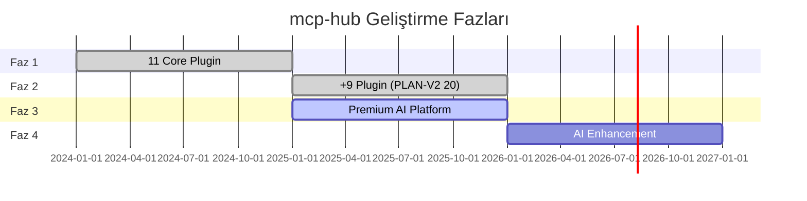

# Mevcut Durum

mcp-hub'un güncel geliştirme durumu: faz tamamlanma, plugin olgunluğu, test metrikleri ve operasyonel hazırlık.

Son güncelleme referansı: Haziran 2026 codebase snapshot.

---

## Özet Dashboard

| Metrik | Değer |
|--------|-------|
| Toplam plugin | **35** |
| Core plugin (PLAN-V2) | **20** |
| Extension plugin | **15** |
| Faz 1 (11 plugin) | ✅ Tamamlandı |
| Faz 2 (+9 plugin) | ✅ Tamamlandı |
| Faz 3 (premium AI) | 🟡 Kodda büyük ölçüde uygulandı |
| Test case | **778** (664 geçti, **114 başarısız**) |
| Test dosyaları | 48 (22 geçti, 26 başarısız) |
| Varsayılan port | 8787 |
| MCP STDIO | `bin/mcp-hub-stdio.js` |

---

## Faz Durumu

### Faz 1 — Core AI Platform (✅)

11 plugin production-ready hedefiyle tamamlandı:

llm-router, notion, github, database, shell, rag, brain, github-pattern-analyzer, n8n, repo-intelligence, project-orchestrator

### Faz 2 — Altyapı & Tooling (✅)

PLAN-V2'nin 20 plugin hedefine ulaşmak için 9 plugin eklendi:

http, secrets, workspace, git, prompt-registry, observability, tech-detector, n8n-workflows, code-review

### Faz 3 — Premium AI Agent Platform (🟡)

PLAN-V3 hedefleri kodda büyük ölçüde mevcut:

| Bileşen | Hedef | Kod durumu |
|---------|-------|------------|
| prompt-registry v2 | Section-based composition | ✅ Uygulandı (v2.0.0) |
| shell sessions | Manus pattern stateful shell | ✅ Uygulandı |
| brain_think | Devin reasoning scratchpad | ✅ Uygulandı |
| repo_similar_commits | Augment git retrieval | ✅ Uygulandı |
| project-orchestrator execute | Kiro spec→plan→implement | ✅ Kısmen uygulandı |
| explanation field | Cursor pattern write tools | 🟡 Kısmi (uyarı var, zorunlu değil) |

Detay: [phase3-summary.md](./phase3-summary.md)

### Extension Plugin'ler (15)

Core 20 dışında yüklenen plugin'ler: policy, n8n-credentials, openapi, projects, marketplace, local-sidecar, file-storage, file-watcher, docker, slack, email, notifications, image-gen, video-gen, tests.

Çeşitli olgunluk seviyelerinde; beta/experimental olanlar production'da dikkatli kullanılmalı.

---

## Test Durumu

Son `npm run test:run` sonuçları:

| Metrik | Değer |
|--------|-------|
| Toplam test case | 778 |
| Geçen | 664 |
| Başarısız | 114 |
| Test dosyası | 48 |
| Geçen dosya | 22 |
| Başarısız dosya | 26 |
| Süre | ~5 saniye |

### Başarısızlık profili

Başarısız testlerin önemli kısmı:

- Plugin audit API uyumsuzlukları (ör. `auditEntry is not a function`)
- Eski test beklentileri vs güncellenmiş core audit manager
- Kısmi auth uygulaması olan beta plugin'ler

Core modüllerin büyük bölümü geçiyor. CI'da tam yeşil suite için [technical-debt.md](./technical-debt.md) maddelerinin giderilmesi gerekir.

### Coverage eşikleri

| Alan | Hedef |
|------|-------|
| `src/core/**/*.js` | %85 |
| `src/plugins/*/index.js` | %60–75 |

---

## Operasyonel Hazırlık

| Bileşen | Durum |
|---------|-------|
| REST API + OpenAPI | ✅ `/openapi.json` otomatik |
| MCP HTTP `/mcp` | ✅ Streamable HTTP |
| MCP STDIO | ✅ `mcp-hub-stdio.js` |
| Admin panel `/admin` | ✅ 20 plugin yönetimi |
| UI panel `/ui` | ✅ UI token auth |
| Job kuyruğu | ✅ Bellek + Redis |
| Audit (HTTP + işlem) | ✅ İki katman |
| Policy motoru | ✅ Preset + onay kuyruğu |
| Observability | ✅ Prometheus + dashboard |
| Multi-tenant headers | ✅ Opsiyonel zorunlu |

---

## Auth Durumu

| Yüzey | Mekanizma | Production hazır? |
|-------|-----------|-------------------|
| REST | `HUB_*_KEY` + requireScope | ✅ (anahtar tanımlanınca) |
| MCP | `HUB_AUTH_ENABLED` (ayrı flag) | ✅ (flag etkinleştirilince) |
| UI | localhost UI token | ✅ (dev/admin) |
| OAuth | introspection (opsiyonel) | 🟡 Yapılandırmaya bağlı |

**Kritik:** REST auth ve MCP auth birbirinden bağımsızdır.

---

## Bilinen Sınırlamalar

1. **114 başarısız test** — CI merge gate olarak kullanılamaz
2. **Bellek modu jobs** — Redis olmadan restart'ta job kaybı
3. **prompt-registry v1 migration** — v2 aktif; v1 deprecation devam ediyor
4. **Beta plugin'ler** — slack, email, image-gen, video-gen, docker kısmi auth
5. **Tool audit stderr** — Production'da yapılandırılmış sink'e yönlendirme önerilir

---

## Sonraki Adımlar

1. Başarısız test suite'i düzelt (audit API uyumu öncelikli)
2. Faz 3 kalan maddeleri tamamla (`explanation` zorunluluğu, orchestrator chain)
3. Extension plugin'leri core standartlarına yükselt
4. Faz 4 AI enhancement planlaması

Detay: [future-directions.md](./future-directions.md)

---

## İlgili Belgeler

- [Faz 3 Özeti](./phase3-summary.md)
- [Teknik Borç](./technical-debt.md)
- [Plugin Genel Bakış](../plugins/overview.md)
- [Operasyonlar](../operations.md)
