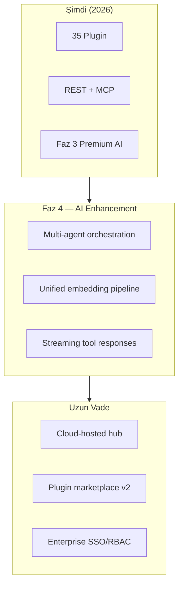
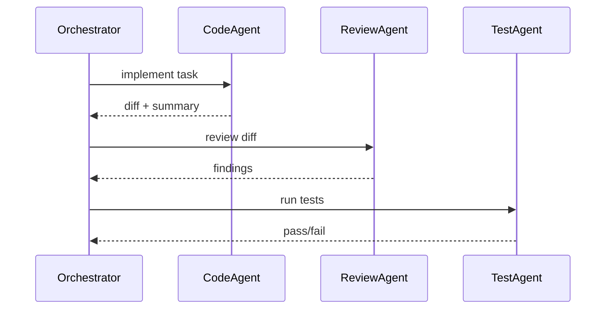

# Gelecek Yönler

mcp-hub'un Faz 3 sonrası vizyonu: AI enhancement, platform olgunlaştırma, ekosistem genişlemesi ve operasyonel mükemmellik.

---

## Vizyon



---

## Faz 4: AI Enhancement

Kaynak: [phase4-ai-enhancement-f47507.md](../roadmap/phase4-ai-enhancement-f47507.md)

### 4.1 Unified Embedding Pipeline

**Hedef:** RAG, brain, repo-intelligence için tek embedding altyapısı.

| Özellik | Açıklama |
|---------|----------|
| Multi-provider | OpenAI, Ollama, local models |
| Shared cache | Redis-backed embedding cache |
| Plugin API | `core/embeddings.js` servisi |

**Fayda:** Tutarlı semantic search; API key olmadan local fallback.

### 4.2 Streaming Tool Responses

**Hedef:** Uzun LLM yanıtları ve shell output için MCP streaming.

| Transport | Yaklaşım |
|-----------|----------|
| MCP HTTP | SSE chunk'ları |
| MCP STDIO | Progressive content blocks |
| REST | `Transfer-Encoding: chunked` |

**Use case:** `shell_session_output`, `llm_route` streaming, `code-review` büyük diff analizi.

### 4.3 Multi-Agent Orchestration

**Hedef:** project-orchestrator üzerine agent delegation.



**Bağımlılık:** code-review, tests, git, shell plugin'leri.

### 4.4 Prompt Marketplace

**Hedef:** prompt-registry üzerine paylaşılabilir prompt template kütüphanesi.

- Community prompt import/export
- Version pinning
- Mode presets (agent, spec, review, debug)

---

## Platform Olgunlaştırma

### Test & CI

| Hedef | Metrik |
|-------|--------|
| Tam yeşil suite | 778/778 test |
| CI pipeline | GitHub Actions — lint + test + coverage gate |
| Contract test | MCP tool schema snapshot |
| E2E | Cursor STDIO integration test |

### Observability v2

- Distributed tracing (OpenTelemetry)
- Tool execution dashboard (admin panel)
- Alerting rules (Prometheus Alertmanager)
- SLA metrikleri (p95 latency per plugin)

### Security Hardening

- mTLS plugin-to-plugin (internal)
- Secret rotation API
- Audit log export (S3, SIEM)
- Penetration test checklist

---

## Extension Plugin Yol Haritası

Mevcut 15 extension plugin için olgunlaştırma:

| Plugin | Hedef |
|--------|-------|
| marketplace | imzalı plugin paketleri, sandbox install |
| docker | container isolation, resource limits |
| file-watcher | debounced events, webhook trigger |
| slack / email | OAuth2, webhook verification |
| image-gen / video-gen | multi-provider, cost tracking |
| local-sidecar | merge into workspace veya deprecate |

---

## Enterprise Özellikler

### SSO & Identity

- SAML/OIDC provider entegrasyonu
- Team-based RBAC (org → project → role)
- API key rotation ve scope granularity

### Multi-Tenancy v2

- Tenant isolation middleware (mevcut tenancy/ genişletme)
- Per-tenant plugin enable/disable
- Tenant-scoped audit ve billing

### Deployment Modelleri

| Model | Açıklama |
|-------|----------|
| Self-hosted | Mevcut — Docker compose, bare Node |
| Managed cloud | Hosted mcp-hub SaaS |
| Hybrid | Cloud control plane + on-prem tool execution |

---

## MCP Protokol Gelişmeleri

- **Resources:** Plugin'lerden MCP resource expose (dosya, config, spec)
- **Prompts:** MCP native prompt template desteği
- **Sampling:** Server-initiated LLM sampling
- **Progress:** Uzun tool'larda progress notification

SDK güncellemeleri takip edilecek; `/mcp` transport spec uyumu sürdürülecek.

---

## Developer Experience

### CLI v2

```bash
mcp-hub init          # Proje scaffold
mcp-hub plugin list   # Yüklü plugin'ler
mcp-hub doctor        # Config + health check
mcp-hub test plugin   # Tek plugin test
```

### Documentation Site

- docs/ → statik site (VitePress veya Docusaurus)
- Interactive API explorer
- MCP tool playground

### Plugin SDK npm Paketi

`@mcp-hub/plugin-sdk` — createMetadata, auditLog, ToolTags export; plugin'ler core'a relative import yerine paket kullanır.

---

## Zaman Çizelgesi (Tahmini)

| Dönem | Odak |
|-------|------|
| Q3 2026 | Test suite yeşil, Faz 3 kapanış, explanation standard |
| Q4 2026 | Faz 4 başlangıç — embedding pipeline, streaming |
| Q1 2027 | Multi-agent orchestration, CI/CD maturity |
| Q2 2027 | Enterprise SSO, marketplace v2 |
| 2027+ | Cloud offering, MCP resources/prompts |

---

## Katkıda Bulunma Öncelikleri

Yeni katkımcılar için yüksek etkili alanlar:

1. **Test fix** — audit API uyumu (114 fail → 0)
2. **explanation field** — core 20 write tools
3. **plugin.meta.json** — eksik 31 plugin
4. **Entegrasyon testleri** — MCP STDIO golden test
5. **Dokümantasyon** — plugin README curl örnekleri

---

## İlgili Belgeler

- [Mevcut Durum](./current-state.md)
- [Teknik Borç](./technical-debt.md)
- [Faz 3 Özeti](./phase3-summary.md)
- [PLAN-V2.md](../../PLAN-V2.md)
- [PLAN-V3.md](../../PLAN-V3.md)
