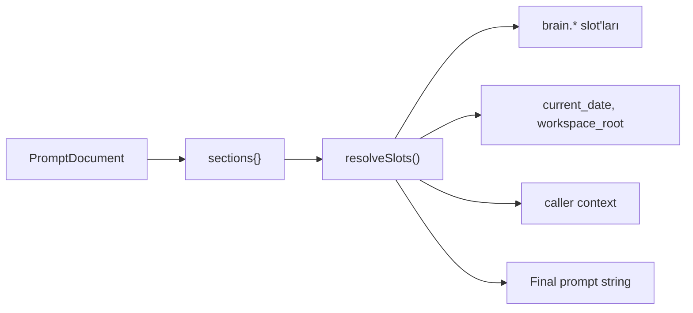
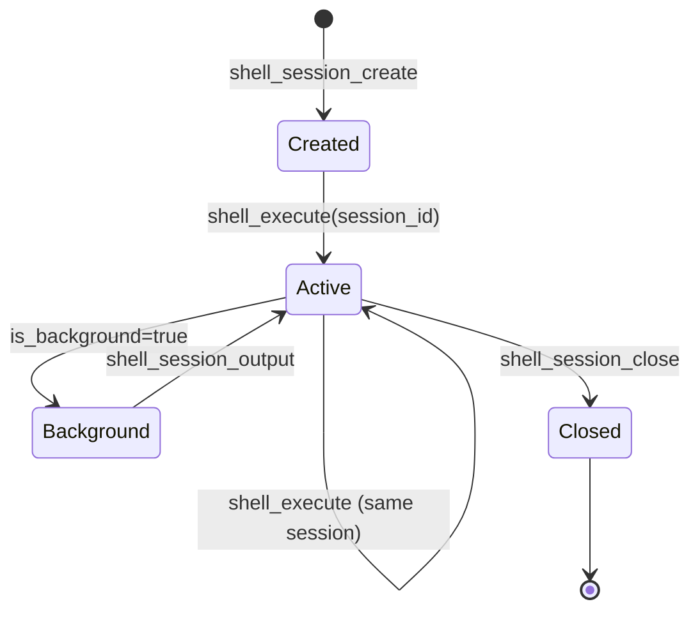

# Faz 3 Özeti

Faz 3, mcp-hub'u premium AI coding tool'larının (Cursor, Devin, Manus, Augment, Kiro) pattern'larını open source alana taşıyan **Premium AI Agent Platform** dönüşümünü hedefler.

Kaynak spesifikasyon: [PLAN-V3.md](../../PLAN-V3.md)  
İlham: [system-prompts-and-models-of-ai-tools](https://github.com/x1xhlol/system-prompts-and-models-of-ai-tools)

---

## Hedef vs Mevcut

| Bileşen | Faz 2 / Önceki | Faz 3 Hedef | Kod Durumu |
|---------|----------------|-------------|------------|
| prompt-registry | Monolitik text, sync I/O | Section composition + slot render | ✅ v2.0.0 uygulandı |
| shell | Stateless exec | Stateful sessions (Manus) | ✅ Session tool'ları mevcut |
| brain | Memory + context | + reasoning scratchpad (Devin) | ✅ `brain_think` mevcut |
| repo-intelligence | Kod analizi | + git commit retrieval (Augment) | ✅ `repo_similar_commits` |
| project-orchestrator | Plan → execute | Spec → Plan → Implement (Kiro) | 🟡 Execute endpoint var, chain kısmi |
| Audit standard | Kısmi explanation | Tüm write tool'larda explanation | 🟡 Uyarı seviyesinde |

**Genel değerlendirme:** Faz 3 **kodda büyük ölçüde uygulanmış** durumda; test suite ve birkaç standardizasyon maddesi kalmış.

---

## Bölüm 1: Prompt-Registry Yeniden Tasarım

### Uygulanan özellikler

**Dosya:** `mcp-server/src/plugins/prompt-registry/index.js` (v2.0.0)



#### Section türleri (standart set)

identity, capabilities, flow, tool_calling, response_style, code_style, context_understanding, memory_injection, preferences_injection, completion_spec, non_compliance, todo_spec

#### Context slot'ları

| Slot | Kaynak |
|------|--------|
| `{{brain.recent_memories}}` | brain plugin |
| `{{brain.user_preferences}}` | brain plugin |
| `{{brain.active_project}}` | brain plugin |
| `{{current_date}}` | System |
| `{{workspace_root}}` | Config |
| `{{project_name}}` | Caller context |

#### Yeni MCP tool'ları

- `prompt_render` — slot çözümleme ile final string
- `prompt_sections` — standart section key listesi
- `prompt_list`, `prompt_create`, `prompt_update`, `prompt_delete`

#### Yeni REST endpoint

- `GET /prompts/:id/render` — context ile render

#### Storage

Async `fs/promises` — `prompts.store.js` ile v2 format. v1 `content` string → `sections.identity` migration destekli.

---

## Bölüm 2: Shell — Stateful Sessions

### Uygulanan özellikler

**Dosya:** `mcp-server/src/plugins/shell/index.js` (v1.1.0)

Manus pattern: session id ile persistent shell.



| Tool | Durum |
|------|-------|
| `shell_execute` | ✅ session_id, is_background parametreleri |
| `shell_session_create` | ✅ |
| `shell_session_list` | ✅ |
| `shell_session_output` | ✅ |
| `shell_session_close` | ✅ |

Güvenlik: Session'lar allowlist + DANGEROUS_PATTERNS'e tabi; cwd WORKSPACE_BASE içinde.

---

## Bölüm 3: Brain — Reasoning Scratchpad

### Uygulanan özellikler

**Tool:** `brain_think`

Devin `<think>` pattern: agent kritik karar öncesi private reasoning kaydeder; kullanıcıya minimal ack döner.

```javascript
{
  name: "brain_think",
  description: "Private reasoning scratchpad before critical decisions...",
  tags: [ToolTags.READ_ONLY],
  inputSchema: {
    properties: {
      thought: { type: "string" },
      context: { type: "string" }
    }
  }
}
```

**Context entegrasyonu:** `brain_build_context` → `includeThoughts: true` ile son reasoning thought'ları inject edilir.

---

## Bölüm 4: Repo-Intelligence — Git Commit Retrieval

### Uygulanan özellikler

**Tool:** `repo_similar_commits`

Augment pattern: "How were similar changes made in the past?"

```javascript
{
  name: "repo_similar_commits",
  description: "Find past commits similar to the current task...",
  inputSchema: {
    properties: {
      path: { type: "string" },
      query: { type: "string" },
      limit: { type: "number", default: 5 }
    },
    required: ["query"]
  }
}
```

Commit mesajları + dosya listesi üzerinden keyword/semantic match.

---

## Bölüm 5: Project-Orchestrator — Spec Chain

### Uygulanan / kısmi

**Endpoint:** `POST /project-orchestrator/draft/:id/execute`

Kiro pattern: onaylı plan yürütme.

| Adım | Durum |
|------|-------|
| Spec oluşturma | ✅ Mevcut draft API |
| Plan review | ✅ Mevcut |
| Execute approved plan | ✅ Phase 3 endpoint |
| Tam spec→plan→implement otomasyon | 🟡 Kısmi — manuel onay adımları var |

---

## Bölüm 6: Audit Standard — Explanation Field

### Hedef

Cursor pattern: tüm write/destructive MCP tool'larında `explanation` input alanı.

### Mevcut durum

`tool-registry.js` → write tool'larda `explanation` yoksa **console.warn** üretir; zorunlu değil.

```javascript
if (isWriteTool && !hasExplanation) {
  console.warn(`[tool-registry] Warning: Tool '${tool.name}' ... lacks 'explanation' field`);
}
```

**Kalan iş:** Tüm core 20 plugin write tool'larına `explanation` eklemek ve test etmek.

---

## Faz 3 Tamamlanma Matrisi

| Madde | PLAN-V3 | Kod | Test |
|-------|---------|-----|------|
| prompt-registry v2 sections | ✅ | ✅ | 🟡 |
| prompt_render + slots | ✅ | ✅ | 🟡 |
| shell sessions | ✅ | ✅ | 🟡 |
| brain_think | ✅ | ✅ | 🟡 |
| repo_similar_commits | ✅ | ✅ | 🟡 |
| orchestrator execute | ✅ | ✅ | 🟡 |
| explanation standard | ✅ | 🟡 warn | ❌ |
| Async prompt storage | ✅ | ✅ | 🟡 |
| Brain slot injection | ✅ | ✅ | 🟡 |

---

## Faz 3 Sonrası

Faz 3 tamamlandığında platform:

- Premium AI tool prompt pattern'larını destekler
- Stateful shell ile uzun agent görevlerini verimli yürütür
- Private reasoning ile daha güvenilir karar verir
- Geçmiş commit pattern'larından öğrenir
- Onaylı plan yürütme ile kontrollü otomasyon sağlar

Sonraki adım: [future-directions.md](./future-directions.md) — Faz 4 AI Enhancement.

---

## İlgili Belgeler

- [PLAN-V3.md](../../PLAN-V3.md)
- [Mevcut Durum](./current-state.md)
- [Teknik Borç](./technical-debt.md)
- [Core 20](../plugins/core-20.md)
