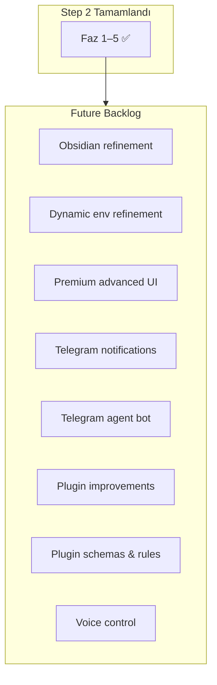
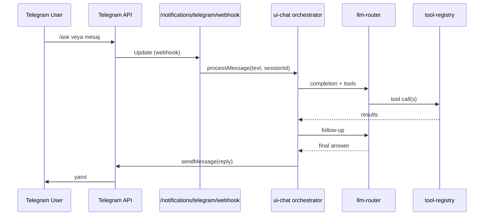

# Step 2 — Future Backlog (Faz 5 Sonrası)

Faz 5 (test temizliği) tamamlandıktan **sonra** planlanacak özellikler. Step 2 sıralı planının parçası değildir; öncelik sırası product kararı ile belirlenir.

Son güncelleme: Haziran 2026  
Önkoşul: [step2-phase-05-tests-cleanup.md](./step2-phase-05-tests-cleanup.md) gate ✅

---

## Backlog Özet



| # | Özellik | Karmaşıklık | Bağımlılık |
|---|---------|-------------|------------|
| 1 | Obsidian görsel bellek (refinement) | M | Faz 3 |
| 2 | Dynamic env & connections (refinement) | M | Faz 4 |
| 3 | Premium advanced UI | XL | Faz 1 |
| 4 | Telegram bildirimleri | S | notifications plugin |
| 5 | Telegram agent bot | L | Faz 1 chat + B4 |
| 6 | Mevcut plugin iyileştirmeleri | L | — |
| 7 | Strict plugin kuralları & schema | M | plugin-meta.schema.json |
| 8 | Voice control | L | Faz 1 UI |

---

## 1. Obsidian Görsel Bellek (Refinement)

**Temel:** [step2-phase-03-obsidian.md](./step2-phase-03-obsidian.md)

| İyileştirme | Açıklama |
|-------------|----------|
| Obsidian Community Plugin | Hub sync durumu status bar; manuel pull/push |
| Canvas export | Bellek graph'ını `.canvas` JSON |
| Dataview uyumu | Frontmatter query snippet'leri |
| İki yönlü sync | Obsidian'da düzenleme → hub PATCH |
| MOC (Map of Content) | Otomatik index sayfaları proje/tag bazlı |
| Graph filtre preset | `#mcp-hub` dışı gürültü azaltma |

---

## 2. Dynamic Env & Connections (Refinement)

**Temel:** [step2-phase-04-dynamic-env.md](./step2-phase-04-dynamic-env.md)

| İyileştirme | Açıklama |
|-------------|----------|
| Master key rotation | `key_version` UI wizard |
| Profil şablonları | "OpenAI + Notion + MSSQL" one-click |
| `.env` export/import | Encrypted backup dosyası |
| Diff görünümü | Effective config vs .env karşılaştırma |
| Plugin-level reload | `STRICT_PLUGIN_LOADING` hot toggle |
| Validation preview | Kaydetmeden önce bağlantı testi |

---

## 3. Premium Advanced UI

**Temel:** Faz 1 vanilla JS chat — bu madde büyük UX sıçraması.

| Seçenek | Artı | Eksi |
|---------|------|------|
| **A: Vanilla derinleştirme** | Build yok, mevcut pattern | Büyük feature'larda maintainability |
| **B: Vite + Preact/Alpine** | Hafif reactivity | Minimal build pipeline |
| **C: React SPA** | Ekosistem, component library | XL migration, deploy değişikliği |

**Önerilen yol:** B → gerekirse C. Faz 1'de vanilla korunması bilinçli karar ([step2-master-plan.md](./step2-master-plan.md)).

Özellikler:
- Multi-chat sidebar, pinned conversations
- Tool timeline görselleştirme
- Policy onay queue dashboard
- Dark/light theme
- Keyboard-first power user mode
- Mobile PWA

---

## 4. Telegram Bildirimleri

**Mevcut:** `mcp-server/src/plugins/notifications/index.js` — macOS/Linux/Windows native only.

### Kapsam

- Yeni kanal: `telegram`
- Env: `TELEGRAM_BOT_TOKEN`, `TELEGRAM_CHAT_ID` (veya Faz 4 settings UI)
- `notifications_send` tool — `channel: "telegram"` parametresi
- Mevcut UI token bildirimi (`issueUiTokenWithNotification`) Telegram'a da gidebilir

### Implementasyon Sketch

```javascript
// notifications/channels/telegram.js
async function sendTelegram({ title, message, token, chatId }) {
  const text = `*${escapeMd(title)}*\n${escapeMd(message)}`;
  await fetch(`https://api.telegram.org/bot${token}/sendMessage`, {
    method: "POST",
    headers: { "Content-Type": "application/json" },
    body: JSON.stringify({ chat_id: chatId, text, parse_mode: "MarkdownV2" }),
  });
}
```

**Karmaşıklık:** S  
**Dosyalar:** `plugins/notifications/index.js`, yeni `channels/telegram.js`

---

## 5. Telegram Agent Bot (On-Demand)

Kullanıcı Telegram'dan mesaj yazar → hub agent tool loop çalıştırır → yanıt Telegram'a döner.

### Mimari Sketch



### Bileşenler

| Bileşen | Konum (öneri) | Sorumluluk |
|---------|---------------|------------|
| Webhook router | `plugins/notifications/telegram.webhook.js` | Update parse, auth |
| Session map | Redis `telegram:{chatId}:session` | Faz 1 chat session reuse |
| Command handler | `/start`, `/ask`, `/tools`, `/help` | UX |
| Auth | Allowlist chat ID | `TELEGRAM_ALLOWED_CHAT_IDS` |
| Long polling fallback | Dev mode | webhook olmadan local test |

### Güvenlik

- Yalnızca allowlist chat ID
- Write tool'lar Telegram'dan varsayılan kapalı veya onay linki (Web UI)
- Rate limit: chat başına dakikada N mesaj
- Audit: `audit_archive` actor=`telegram:{chatId}`

### Bağımlılıklar

- Faz 1 `ui-chat` orchestrator (paylaşımlı)
- Telegram notifications kanalı (B4)
- HTTPS public URL (webhook) veya ngrok dev

**Karmaşıklık:** L

---

## 6. Mevcut Plugin İyileştirmeleri

[technical-debt.md](./technical-debt.md) ve [plugins/overview.md](../plugins/overview.md) referans.

| Plugin | İyileştirme |
|--------|-------------|
| slack / email | OAuth2, webhook verification, tam requireScope |
| image-gen / video-gen | Auth + cost tracking |
| marketplace | İmzalı paketler |
| docker | Resource limits |
| llm-router | Model listesi güncelleme |
| rag | Ollama embedding fallback |
| project-orchestrator | Self-HTTP kaldır, internal import |
| prompt-registry | v1 deprecation tamamla |
| secrets | `auditEntry` → `auditLog` (Faz 5'te kısmen) |

---

## 7. Strict Plugin Kuralları & Schema

**Mevcut:** `mcp-server/schemas/plugin-meta.schema.json` — 4 plugin'de dosya var.

### Hedef

- Tüm 35 plugin `plugin.meta.json` zorunlu
- `validatePluginMeta()` startup'ta fail (strict mode)
- JSON Schema CI validation
- Tool schema: `explanation` write tool'larda required
- README şablonu zorunlu alanlar
- Risk level → policy preset otomatik eşleme

### Yeni Plugin Yazım Kuralları (özet)

1. `createMetadata()` + `plugin.meta.json` sync
2. Tüm REST route → `requireScope()`
3. Write MCP tool → `explanation` + `ToolTags`
4. Audit → `auditLog()` core API
5. Env → `config.js` key dokümantasyonu
6. Manual test checklist plugin README'de

**Karmaşıklık:** M  
**Belge:** `docs/plugins/development.md` genişletme + `PLAN-V2.md` checklist

---

## 8. Voice Control

| Katman | Teknoloji |
|--------|-----------|
| UI | Web Speech API (browser STT) |
| Sunucu | Opsiyonel Whisper API via llm-router |
| TTS | Browser speechSynthesis veya OpenAI TTS |
| Tetikleme | Push-to-talk butonu, wake word (future) |

Entegrasyon: Faz 1 chat UI — ses → metin → aynı `/ui/chat` pipeline.

**Karmaşıklık:** L  
**Out of scope ilk iterasyon:** Sunucu tarafı wake word, mobil native

---

## Önerilen Backlog Sırası (Taslak)

1. Telegram notifications (S) — hızlı değer
2. Plugin schema strict (M) — kalite temeli
3. Obsidian refinement (M)
4. Dynamic env refinement (M)
5. Telegram agent bot (L)
6. Plugin improvements (L, paralel küçük PR'lar)
7. Premium advanced UI (XL)
8. Voice control (L)

---

## İlgili Belgeler

- [step2-master-plan.md](./step2-master-plan.md)
- [future-directions.md](./future-directions.md) — eski Faz 4+ vizyon
- [technical-debt.md](./technical-debt.md)
- [plugins/development.md](../plugins/development.md)
