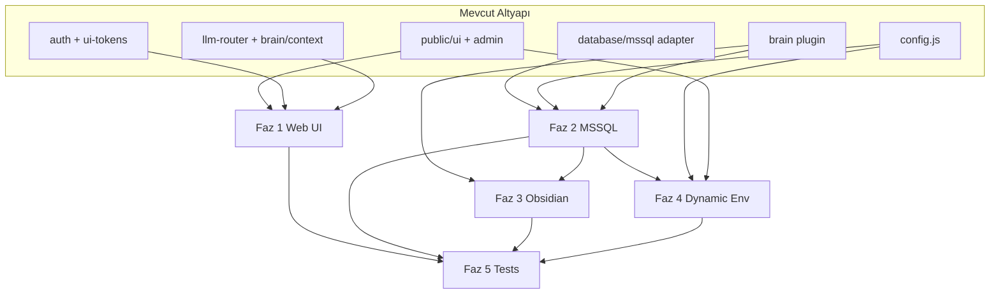

# Step 2 — Master Plan (Sıralı Yol Haritası)

> **Canonical sıra:** [**EXECUTION-ORDER.md**](./EXECUTION-ORDER.md) — geliştirme sırası, kapılar (gate) ve faz durumu için **tek kaynak**. Bu master plan vizyon ve mimari bağlam sağlar; **sıralama çelişkisinde EXECUTION-ORDER geçerlidir**.

mcp-hub'un bir sonraki büyük geliştirme döngüsü: **Web UI üzerinden LLM bağlantısı** ile başlayan, **MSSQL kalıcılık**, **Obsidian bellek görselleştirme**, **dinamik env yönetimi** ve ardından **test temizliği** ile tamamlanan sıralı plan.

> **Kural:** Faz N, kabul kriterlerinin tamamı karşılanmadan Faz N+1 başlamaz. Feature hopping yok. Faz 0 (stabilizasyon) → Faz 1 öncesi kapı — ayrıntılar EXECUTION-ORDER'da.

Son güncelleme: Haziran 2026  
Önceki bağlam: [current-state.md](./current-state.md), [phase3-summary.md](./phase3-summary.md), [technical-debt.md](./technical-debt.md)

---

## Vizyon Özeti

Cursor dışındaki LLM istemcilerinden de mcp-hub kullanılabilsin; yapılandırma ve audit verisi MSSQL'de kalıcı olsun; brain bellekleri Obsidian vault'ta görüntülenebilsin; env değişkenleri UI'dan yönetilsin. Test suite genişletmesi bu döngünün **son** adımıdır — öncelik manuel doğrulama ve gereksiz test kodunun temizlenmesidir.

---

## Faz Diyagramı

```mermaid
flowchart LR
    subgraph Step2["Step 2 — Sıralı Fazlar"]
        P1["Faz 1<br/>Web UI + LLM"]
        P2["Faz 2<br/>MSSQL Persistence"]
        P3["Faz 3<br/>Obsidian Memory"]
        P4["Faz 4<br/>Dynamic .env UI"]
        P5["Faz 5<br/>Test Cleanup"]
    end

    subgraph Future["Step 2 Sonrası Backlog"]
        FB["step2-future-backlog.md"]
    end

    P1 -->|"100% kabul"| P2
    P2 -->|"100% kabul"| P3
    P3 -->|"100% kabul"| P4
    P4 -->|"100% kabul"| P5
    P5 --> FB

    style P1 fill:#1e3a5f
    style P2 fill:#1e3a5f
    style P3 fill:#1e3a5f
    style P4 fill:#1e3a5f
    style P5 fill:#1e3a5f
    style FB fill:#334155
```

---

## Faz Özet Tablosu

| # | Faz | Hedef (tek cümle) | Karmaşıklık | Detay |
|---|-----|-------------------|-------------|-------|
| 1 | Web UI + LLM | Tarayıcıdan LLM ile hub'a bağlan, premium UI temeli | **XL** | [step2-phase-01-web-ui.md](./step2-phase-01-web-ui.md) |
| 2 | MSSQL Persistence | Config, audit, bellek meta verisi MSSQL'de kalıcı | **L** | [step2-phase-02-mssql.md](./step2-phase-02-mssql.md) |
| 3 | Obsidian Memory | Brain belleklerini vault'a export/görselleştir | **M** | [step2-phase-03-obsidian.md](./step2-phase-03-obsidian.md) |
| 4 | Dynamic .env UI | Env UI'dan girilsin, şifreli MSSQL, hot reload | **L** | [step2-phase-04-dynamic-env.md](./step2-phase-04-dynamic-env.md) |
| 5 | Test Cleanup | Manuel test odaklı; gereksiz test kodu temizliği | **M** | [step2-phase-05-tests-cleanup.md](./step2-phase-05-tests-cleanup.md) |
| — | Future Backlog | Telegram, voice, plugin standartları, premium UI | — | [step2-future-backlog.md](./step2-future-backlog.md) |

---

## Temel İlkeler

### 1. Sıralılık (Sequential Gate)

Her fazın **Acceptance Criteria** bölümündeki maddelerin tamamı işaretlenmeden sonraki faz PR'ı açılmaz. Paralel feature branch'ler yalnızca mevcut fazın scope'u içinde kabul edilir.

### 2. Manuel Test Önceliği

Bu döngüde Vitest coverage genişletmesi hedef değildir. Her faz **Manual Test Checklist** ile doğrulanır. Otomatik testler yalnızca Faz 5'te mevcut kırık suite temizlenirken güncellenir veya kaldırılır.

### 3. Mevcut Kod Tabanına Sadakat

| Alan | Mevcut konum | Step 2 yaklaşımı |
|------|--------------|------------------|
| Web paneller | `mcp-server/src/public/ui/`, `admin/`, `landing/` | Vanilla JS + Tailwind CDN; React'e geçiş yok (Faz 1) |
| Sunucu rotaları | `mcp-server/src/core/server.js` | `/ui`, `/admin`, `/ui/token` genişletilir |
| Config | `mcp-server/src/core/config.js`, `config-schema.js` | Faz 2–4'te MSSQL + runtime reload |
| Brain bellek | `mcp-server/src/plugins/brain/brain.memory.js` (Redis) | Faz 2 meta sync, Faz 3 Obsidian export |
| Database | `mcp-server/src/plugins/database/adapters/mssql.js` | Faz 2 persistence katmanı temeli |
| Bildirimler | `mcp-server/src/plugins/notifications/` | Future backlog — Telegram kanalı |
| Auth | `mcp-server/src/core/auth.js`, `ui-tokens.js` | UI token + HUB_*_KEY korunur |

### 4. Güvenlik

- `.env` dosyası okunmaz / commit edilmez; UI'dan girilen değerler Faz 4'te AES-GCM ile şifrelenir (`settings_encrypted`).
- UI token yalnızca localhost'tan (`server.js` → `POST /ui/token`).
- Write/destructive tool çağrıları policy + scope ile korunur.

### 5. Out of Scope (Tüm Step 2)

- React/Vue SPA rewrite (future backlog'ta "Premium advanced UI")
- Tam otomatik E2E test suite
- Cloud SaaS deployment
- Multi-agent orchestration (Faz 4+ eski plan)

---

## Mevcut Durum vs Step 2

| Bileşen | Şimdi | Step 2 sonrası |
|---------|-------|----------------|
| `/ui` panel | Read-only tool/plugin/audit görüntüleme | LLM chat + tool execution |
| `/admin` | 20 plugin yönetim, audit tabloları | Env + connection profilleri (Faz 4) |
| Brain memory | Redis (`brain.memory.js`) | Redis + MSSQL meta + Obsidian export |
| Config | `process.env` + `config.js` startup | MSSQL override + hot reload |
| MSSQL | Database plugin adapter (sorgu) | Hub persistence schema |
| Testler | 114/778 fail | Temizlenmiş, manuel checklist odaklı |

---

## Bağımlılık Haritası

---

## MSSQL Schema Özeti (Faz 2 Detay)

Faz 2'de oluşturulacak tabloların üst düzey özeti. Tam DDL: [step2-phase-02-mssql.md](./step2-phase-02-mssql.md).

| Tablo | Amaç |
|-------|------|
| `settings_encrypted` | UI'dan girilen env değerleri (Faz 4 ile dolar) |
| `connection_profiles` | MSSQL/PG/Redis/API profilleri |
| `audit_archive` | Core + tool audit kalıcı arşiv |
| `memory_sync_state` | Brain → MSSQL/Obsidian senkron durumu |

---

## UI Teknoloji Kararı

**Öneri: Vanilla JS + Tailwind CDN (mevcut pattern korunur)**

Gerekçe:
- `public/ui/index.html`, `public/admin/index.html`, `public/landing/` zaten inline `<script>` + Tailwind CDN kullanıyor
- Build pipeline yok; deployment basit (`server.js` → `sendFile`)
- Faz 1 scope'u chat UI eklemek; React migration XL efor ve Faz 2–4'ü geciktirir

**Ne zaman React düşünülür:** [step2-future-backlog.md](./step2-future-backlog.md) — "Premium advanced UI" maddesi, Step 2 tamamlandıktan sonra.

Modülerlik için Faz 1'de `public/ui/` altına ayrı JS dosyaları (`chat.js`, `api-client.js`) eklenebilir; bundler zorunlu değil.

---

## Faz Geçiş Kontrol Listesi (Gate)

Her faz kapanışında:

- [ ] Acceptance criteria maddelerinin tamamı ✅
- [ ] Manual test checklist tamamlandı ve kayıt altına alındı
- [ ] İlgili docs/ güncellendi
- [ ] Bilinen regresyon yok (manuel smoke)
- [ ] Sonraki faz PR açıklamasında önceki faz gate referansı var

---

## İlgili Belgeler

| Belge | İçerik |
|-------|--------|
| [**EXECUTION-ORDER.md**](./EXECUTION-ORDER.md) | **Canonical sıra** — gate, manuel test, faz durumu |
| [step2-phase-01-web-ui.md](./step2-phase-01-web-ui.md) | LLM Web UI |
| [step2-phase-02-mssql.md](./step2-phase-02-mssql.md) | MSSQL persistence |
| [step2-phase-03-obsidian.md](./step2-phase-03-obsidian.md) | Obsidian entegrasyonu |
| [step2-phase-04-dynamic-env.md](./step2-phase-04-dynamic-env.md) | Dynamic env UI |
| [step2-phase-05-tests-cleanup.md](./step2-phase-05-tests-cleanup.md) | Test temizliği |
| [step2-future-backlog.md](./step2-future-backlog.md) | Step 2 sonrası |
| [technical-debt.md](./technical-debt.md) | Mevcut borç (Faz 5'te ele alınır) |
| [future-directions.md](./future-directions.md) | Eski Faz 4+ vizyon (referans) |
