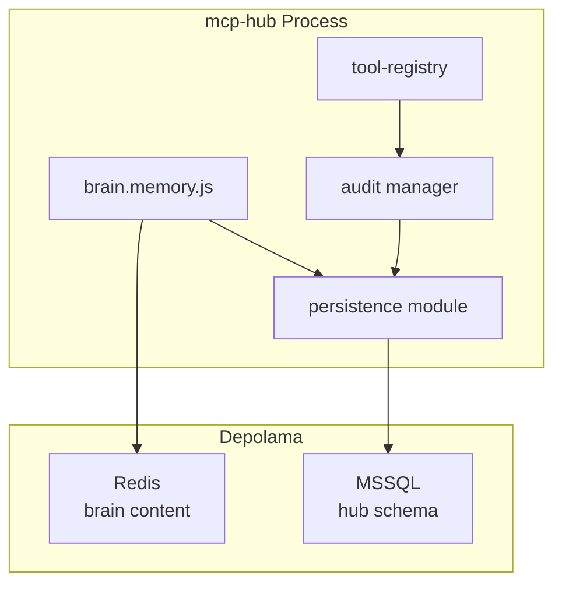

# Faz 2 — MSSQL Persistence Katmanı

**Öncelik:** 2 / 5  
**Karmaşıklık:** L  
**Durum:** Planlandı  
**Gate:** Faz 1 tamamlanmadan başlanmaz; Faz 3, Faz 2 gate'inden sonra

---

## Hedef

mcp-hub'un kritik verilerini **Microsoft SQL Server** üzerinde kalıcı olarak saklamak: şifreli ayarlar, bağlantı profilleri, audit arşivi ve brain bellek senkron meta verisi. Redis/bellek modu tek başına production için yeterli olmasın.

---

## Mevcut Durum (Codebase Referansı)

| Bileşen | Konum | Durum |
|---------|-------|-------|
| MSSQL adapter | `mcp-server/src/plugins/database/adapters/mssql.js` | ✅ Sorgu CRUD; pool singleton |
| Config | `mcp-server/src/core/config.js` | `MSSQL_CONNECTION_STRING`, `PG_*`, `MONGODB_URI` |
| Brain memory | `mcp-server/src/plugins/brain/brain.memory.js` | Redis-only (`brain:{NS}:mem:*`) |
| Audit | `mcp-server/src/core/audit/` | Memory + opsiyonel file sink |
| Jobs | `mcp-server/src/core/jobs/job.store.js` | Memory veya Redis |

Database plugin **harici** veritabanlarına sorgu atar; hub'un kendi persistence schema'sı henüz yok.

---

## Kapsam (In Scope)

### 1. Hub Persistence Modülü

Yeni modül: `mcp-server/src/core/persistence/` (veya `core/db/hub-schema.js`)

- Migration runner (versiyonlu SQL script'ler)
- Connection pool — mevcut `mssql.js` adapter'dan **ayrı** hub-internal pool (plugin sandbox'tan izole)
- Health check: startup'ta schema versiyonu doğrulama

### 2. MSSQL Schema (Sketch)

```sql
-- ── settings_encrypted ─────────────────────────────────────────────
-- UI'dan veya API'den girilen env değerleri (Faz 4 doldurur)
CREATE TABLE settings_encrypted (
    id              UNIQUEIDENTIFIER PRIMARY KEY DEFAULT NEWID(),
    key_name        NVARCHAR(128)  NOT NULL,          -- örn. OPENAI_API_KEY
    ciphertext      VARBINARY(MAX) NOT NULL,          -- AES-256-GCM
    iv              VARBINARY(16)  NOT NULL,
    auth_tag        VARBINARY(16)  NOT NULL,
    key_version     INT            NOT NULL DEFAULT 1,-- rotation için
    namespace       NVARCHAR(64)   NOT NULL DEFAULT 'default',
    updated_by      NVARCHAR(128)  NULL,
    created_at      DATETIME2      NOT NULL DEFAULT SYSUTCDATETIME(),
    updated_at      DATETIME2      NOT NULL DEFAULT SYSUTCDATETIME(),
    CONSTRAINT UQ_settings_key_ns UNIQUE (key_name, namespace)
);

-- ── connection_profiles ────────────────────────────────────────────
CREATE TABLE connection_profiles (
    id              UNIQUEIDENTIFIER PRIMARY KEY DEFAULT NEWID(),
    profile_name    NVARCHAR(128)  NOT NULL,
    profile_type    NVARCHAR(32)   NOT NULL,          -- mssql | pg | redis | http | custom
    config_json     NVARCHAR(MAX)  NOT NULL,          -- non-secret alanlar düz JSON
    secret_ref_id   UNIQUEIDENTIFIER NULL,            -- FK → settings_encrypted (opsiyonel)
    is_default      BIT            NOT NULL DEFAULT 0,
    is_active       BIT            NOT NULL DEFAULT 1,
    namespace       NVARCHAR(64)   NOT NULL DEFAULT 'default',
    created_at      DATETIME2      NOT NULL DEFAULT SYSUTCDATETIME(),
    updated_at      DATETIME2      NOT NULL DEFAULT SYSUTCDATETIME(),
    CONSTRAINT UQ_conn_profile_name_ns UNIQUE (profile_name, namespace)
);

-- ── audit_archive ──────────────────────────────────────────────────
CREATE TABLE audit_archive (
    id              BIGINT IDENTITY(1,1) PRIMARY KEY,
    event_id        UNIQUEIDENTIFIER NOT NULL,
    event_type      NVARCHAR(32)   NOT NULL,          -- tool | operation | auth | config
    plugin_name     NVARCHAR(64)   NULL,
    operation       NVARCHAR(256)  NULL,
    actor           NVARCHAR(128)  NULL,
    scope           NVARCHAR(32)   NULL,
    success         BIT            NOT NULL,
    duration_ms     INT            NULL,
    payload_json    NVARCHAR(MAX)  NULL,              -- sanitized; secret yok
    correlation_id  NVARCHAR(64)   NULL,
    namespace       NVARCHAR(64)   NOT NULL DEFAULT 'default',
    occurred_at     DATETIME2      NOT NULL,
    archived_at     DATETIME2      NOT NULL DEFAULT SYSUTCDATETIME(),
    INDEX IX_audit_occurred (occurred_at DESC),
    INDEX IX_audit_plugin (plugin_name, occurred_at DESC)
);

-- ── memory_sync_state ──────────────────────────────────────────────
-- Brain Redis bellekleri ↔ MSSQL/Obsidian senkron durumu
CREATE TABLE memory_sync_state (
    id              UNIQUEIDENTIFIER PRIMARY KEY DEFAULT NEWID(),
    memory_id       NVARCHAR(64)   NOT NULL,          -- brain UUID
    namespace       NVARCHAR(64)   NOT NULL DEFAULT 'default',
    sync_target     NVARCHAR(32)   NOT NULL,          -- mssql_meta | obsidian
    target_path     NVARCHAR(512)  NULL,              -- vault relative path
    content_hash    NVARCHAR(64)   NULL,              -- SHA-256
    last_synced_at  DATETIME2      NULL,
    sync_status     NVARCHAR(16)   NOT NULL DEFAULT 'pending', -- pending|synced|error
    error_message   NVARCHAR(MAX)  NULL,
    created_at      DATETIME2      NOT NULL DEFAULT SYSUTCDATETIME(),
    updated_at      DATETIME2      NOT NULL DEFAULT SYSUTCDATETIME(),
    CONSTRAINT UQ_mem_sync UNIQUE (memory_id, namespace, sync_target)
);
```

### 3. Entegrasyon Noktaları

| Veri | Kaynak | Persistence davranışı |
|------|--------|-------------------------|
| Tool audit | `core/audit`, `tool-registry.js` | Async batch insert → `audit_archive` |
| Operation audit | Admin `/admin` ops tab | Aynı tablo, `event_type=operation` |
| Brain memory meta | `brain.memory.js` | `memory_sync_state` + opsiyonel `memories_meta` genişlemesi |
| Config snapshot | `config.js` | Non-secret değerler `connection_profiles.config_json` |
| Chat sessions | Faz 1 UI chat | Opsiyonel `chat_sessions` tablosu (Faz 2 stretch) |

### 4. Fallback Davranışı

- `HUB_PERSISTENCE_ENABLED=false` veya MSSQL erişilemez → mevcut memory/Redis modu; startup warning
- Production checklist: MSSQL zorunlu önerilir

---

## Kapsam Dışı (Out of Scope)

- UI'dan env girişi ve encryption key yönetimi (Faz 4)
- Obsidian markdown export (Faz 3)
- PostgreSQL/Mongo hub persistence (yalnızca MSSQL Step 2'de)
- Full brain content Redis'ten MSSQL'e taşıma (meta + sync state yeterli)
- Test suite düzeltmesi (Faz 5)

---

## Görevler

| # | Görev | Konum |
|---|-------|-------|
| 1 | `core/persistence/index.js` — pool, query helper | Yeni modül |
| 2 | Migration script v001 — 4 tablo DDL | `mcp-server/migrations/001_hub_schema.sql` |
| 3 | `config.js` — `HUB_MSSQL_URL`, `HUB_PERSISTENCE_ENABLED` | `core/config.js`, `config-schema.js` |
| 4 | Audit sink: `MssqlAuditSink` | `core/audit/sinks/mssql.audit.js` |
| 5 | Startup migration runner | `core/persistence/migrate.js` |
| 6 | Brain hook: memory create/update → `memory_sync_state` pending | `plugins/brain/brain.memory.js` |
| 7 | Admin UI: audit archive sayfalama (MSSQL kaynak) | `public/admin/index.html` |
| 8 | Health: `/health` persistence durumu | `core/health/health.service.js` |
| 9 | Dokümantasyon: env + schema | `docs/configuration.md` |

---

## Kabul Kriterleri

- [ ] Migration script temiz MSSQL instance'da hatasız çalışıyor
- [ ] Tool execution audit olayları `audit_archive`'e yazılıyor
- [ ] Admin panel eski in-memory audit yerine/yanında MSSQL audit gösteriyor
- [ ] Brain yeni memory oluşturduğunda `memory_sync_state` satırı `pending` oluşuyor
- [ ] MSSQL kapalıyken hub başlıyor (degraded mode + warning log)
- [ ] Mevcut database plugin MSSQL sorguları etkilenmiyor (ayrı pool)
- [ ] Manual test checklist tamamlandı

---

## Manuel Test Kontrol Listesi

### Schema

- [ ] Boş MSSQL DB'de migration çalıştır → 4 tablo oluştu
- [ ] Migration tekrar çalıştır → idempotent (hata yok)
- [ ] `SELECT * FROM settings_encrypted` boş ama erişilebilir

### Audit Persistence

- [ ] Hub başlat, bir read tool MCP/REST ile çağır
- [ ] `audit_archive` tablosunda yeni satır var
- [ ] `payload_json` içinde API key / secret yok
- [ ] Admin "İşlem audit" sekmesi MSSQL kayıtlarını gösteriyor

### Brain Sync State

- [ ] `POST /brain/memories` ile bellek ekle
- [ ] `memory_sync_state` → `sync_target=mssql_meta`, `status=pending`
- [ ] Bellek silindiğinde sync state güncelleniyor veya soft-delete

### Degraded Mode

- [ ] Yanlış connection string → hub başlıyor, health `persistence: degraded`
- [ ] Audit bellekte birikiyor veya file sink'e düşüyor (dokümante davranış)

### Regresyon

- [ ] Database plugin `database_query` MSSQL harici tabloya sorgu atabiliyor
- [ ] Redis brain memory hâlâ çalışıyor
- [ ] Faz 1 Web UI chat etkilenmedi

---

## Bağımlılıklar

| Bağımlılık | Tip |
|------------|-----|
| Faz 1 Web UI | Hard gate |
| MSSQL Server instance | Hard (dev: Docker `mcr.microsoft.com/mssql/server`) |
| `mssql` npm paketi | Mevcut (`database/adapters/mssql.js`) |
| Encryption key | Soft (Faz 4'te `settings_encrypted` dolar; Faz 2'de tablo boş kalabilir) |

**Sonraki faz:** [step2-phase-03-obsidian.md](./step2-phase-03-obsidian.md)

---

## Mimari Diyagram



---

## İlgili Belgeler

- [step2-master-plan.md](./step2-master-plan.md)
- [step2-phase-01-web-ui.md](./step2-phase-01-web-ui.md)
- [configuration.md](../configuration.md)
- [operations.md](../operations.md)
