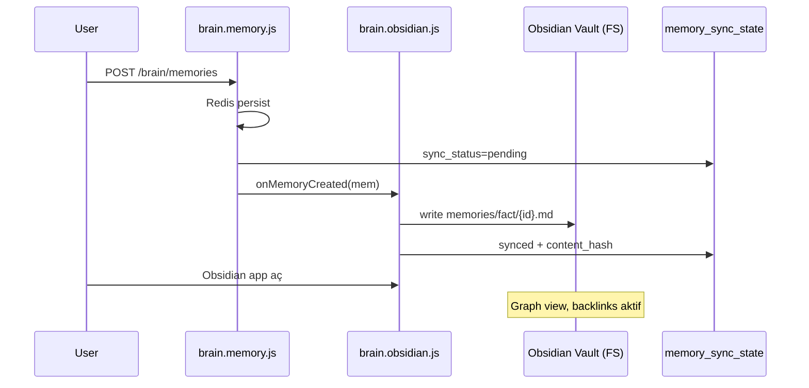

# Faz 3 — Brain Memory UI (+ opsiyonel Obsidian export)

> **Pivot (2026-06-24):** Birincil teslimat hub-içi `/brain` React UI (liste, markdown CRUD, filtreler). Obsidian vault export **ikincil/opsiyonel** (Faz 3C). Kullanım: [brain-ui.md](../brain-ui.md).

**Öncelik:** 3 / 5  
**Karmaşıklık:** M  
**Durum:** Tamamlandı (3A + 3B + 3C kod)  
**Gate:** Faz 2 tamamlanmadan başlanmaz

---

## Hedef (güncel)

Kullanıcı hub içinde brain belleklerini görsün, filtrelesin ve markdown olarak düzenlesin. Obsidian yalnızca “dışarı aktar” isteyenler için opsiyonel kalır.

*(Aşağıdaki Obsidian odaklı plan orijinal Faz 3 taslağıdır; export `brain.obsidian.js` ile 3C kapsamında uygulandı.)*

## Eski hedef (Obsidian-first — superseded)

Brain plugin'in Redis'te tuttuğu bellek verilerini **Obsidian vault** formatında görselleştirmek ve export etmek. Kullanıcı ikinci beyin (second brain) workflow'unu Obsidian graph, backlink ve tag'lerle kullanabilsin.

---

## Mevcut Durum (Codebase Referansı)

| Bileşen | Konum | Durum |
|---------|-------|-------|
| Brain memory | `mcp-server/src/plugins/brain/brain.memory.js` | Redis: episodic memories, profile, projects |
| Brain REST | `mcp-server/src/plugins/brain/index.js` | `GET/POST /brain/memories`, `/brain/projects` |
| MCP tools | `brain_remember`, `brain_recall`, `brain_build_context` | Aktif |
| Sync state | Faz 2 → `memory_sync_state` | `sync_target=obsidian` |
| Obsidian plugin | Yok | Bu fazda eklenecek veya brain genişletilecek |

Bellek tipleri (`brain.memory.js`): `fact | decision | preference | event | project_note`

---

## Kapsam (In Scope)

### 1. Obsidian Export Modülü

Yeni: `mcp-server/src/plugins/brain/brain.obsidian.js` (veya `plugins/obsidian-export/`)

- Markdown dosya üretimi (Obsidian uyumlu frontmatter)
- Vault path yapılandırması
- Incremental sync (`memory_sync_state.content_hash` ile)

### 2. Vault Dizin Yapısı (Öneri)

```
{OBSIDIAN_VAULT_PATH}/
└── mcp-hub/
    ├── _index.md                    # Hub sync özeti + son güncelleme
    ├── memories/
    │   ├── fact/
    │   │   └── {uuid}.md
    │   ├── decision/
    │   ├── preference/
    │   ├── event/
    │   └── project_note/
    ├── projects/
    │   └── {slug}.md
    ├── profile/
    │   └── user-profile.md
    └── graph/
        └── links.md                 # Manuel graph hint (opsiyonel)
```

### 3. Markdown Şablonu

```markdown
---
id: "550e8400-e29b-41d4-a716-446655440000"
type: fact
tags: [mcp-hub, brain, fact]
project: my-project
importance: 0.8
confidence: 1.0
source: user
created: 2026-06-24T10:00:00.000Z
updated: 2026-06-24T10:00:00.000Z
synced: 2026-06-24T12:00:00.000Z
---

# Bellek Başlığı (ilk satır özeti)

Tam bellek içeriği burada.

## Bağlantılar
- [[projects/my-project]]
- #tag1 #tag2
```

### 4. Brain Plugin Hook'ları

| Olay | Hook | Davranış |
|------|------|----------|
| `addMemory()` | post-create | Markdown yaz, sync_state → synced |
| `updateMemory()` | post-update | Dosya güncelle, hash yenile |
| `deleteMemory()` | post-delete | Dosyayı `_trash/` taşı veya sil |
| `registerProject()` | post-create | `projects/{slug}.md` |
| `updateProfile()` | post-update | `profile/user-profile.md` |
| Periyodik | cron/job | `pending` sync_state kayıtlarını retry |

### 5. REST / MCP API

| Endpoint / Tool | Açıklama |
|-----------------|----------|
| `POST /brain/obsidian/sync` | Tam veya incremental export |
| `GET /brain/obsidian/status` | Son sync, hata sayısı, vault path |
| `brain_obsidian_sync` | MCP tool — agent tetikleyebilir |
| `brain_obsidian_export` | Tek memory → markdown preview (UI için) |

### 6. UI Entegrasyonu (Minimal)

- `/ui` veya `/admin` Brain sekmesi: "Obsidian'a sync" butonu + durum pill
- Son sync zamanı, hata listesi

---

## Obsidian Entegrasyon Yaklaşımı



**Dosya sistemi vs Obsidian Sync:** Export doğrudan vault klasörüne yazar; Obsidian Desktop vault path'i aynı dizin olmalı. Obsidian Sync / iCloud ayrı — dokümante edilir.

**Wikilink stratejisi:** Proje slug'ları `[[projects/{slug}]]`; tag'ler frontmatter + inline `#tag`.

---

## Kapsam Dışı (Out of Scope)

- Obsidian plugin (Community plugin `.js` Obsidian içinde) — future backlog refinement
- Graph view otomasyonu (Obsidian native yeterli)
- İki yönlü sync (Obsidian → hub) — future backlog
- MSSQL'de bellek içeriği duplicate (yalnızca meta Faz 2'de)
- Canvas / Excalidraw export

---

## Görevler

| # | Görev |
|---|-------|
| 1 | `brain.obsidian.js` — markdown renderer + frontmatter |
| 2 | Env: `OBSIDIAN_VAULT_PATH`, `OBSIDIAN_EXPORT_ENABLED` |
| 3 | `addMemory` / `updateMemory` / `deleteMemory` hook entegrasyonu |
| 4 | `POST /brain/obsidian/sync` + MCP tool |
| 5 | `memory_sync_state` obsidian target güncelleme |
| 6 | Hata retry job (hub jobs veya setInterval) |
| 7 | Admin/UI sync durum widget |
| 8 | `docs/` — Obsidian kurulum rehberi bölümü |

---

## Kabul Kriterleri

- [ ] `OBSIDIAN_VAULT_PATH` set iken yeni bellek otomatik markdown olarak yazılıyor
- [ ] Obsidian'da dosya açıldığında frontmatter properties görünüyor
- [ ] Proje bellekleri `[[projects/slug]]` linki içeriyor
- [ ] Silinen bellek vault'tan kaldırılıyor veya `_trash/` altına taşınıyor
- [ ] `GET /brain/obsidian/status` doğru sync istatistiği dönüyor
- [ ] Vault path yokken hub normal çalışıyor (export skip + warning)
- [ ] Manual test checklist tamamlandı

---

## Manuel Test Kontrol Listesi

### Kurulum

- [ ] Obsidian Desktop kurulu
- [ ] Test vault oluştur: `~/Obsidian/mcp-hub-test`
- [ ] `.env`: `OBSIDIAN_VAULT_PATH=/path/to/vault`, `OBSIDIAN_EXPORT_ENABLED=true`
- [ ] Faz 2 MSSQL + Redis çalışıyor

### Otomatik Export

- [ ] `POST /brain/memories` — type=fact, tags=["test"]
- [ ] Vault'ta `mcp-hub/memories/fact/{uuid}.md` oluştu
- [ ] Frontmatter alanları doğru
- [ ] `memory_sync_state.sync_status = synced`

### Proje Linkleri

- [ ] Proje kaydet → `mcp-hub/projects/{slug}.md`
- [ ] project_note bellek → wikilink proje dosyasına

### Sync API

- [ ] `POST /brain/obsidian/sync` — tüm pending kayıtlar işlendi
- [ ] Bilerek bozuk path → status endpoint hata gösteriyor
- [ ] Path düzelt → retry başarılı

### Obsidian UX

- [ ] Obsidian'da vault aç, graph view'da mcp-hub node'ları görünüyor
- [ ] Tag pane'de `#mcp-hub` filtresi çalışıyor
- [ ] Backlink panel proje ↔ bellek bağlantısı gösteriyor

### Regresyon

- [ ] `brain_recall` Redis'ten hâlâ çalışıyor
- [ ] Faz 1 chat context injection etkilenmedi
- [ ] Export kapalıyken performans regresyonu yok

---

## Bağımlılıklar

| Bağımlılık | Tip |
|------------|-----|
| Faz 2 MSSQL | Hard — `memory_sync_state` |
| Faz 1 Web UI | Soft — UI sync butonu |
| Redis (brain) | Hard |
| Dosya sistemi yazma izni | Hard — vault path |

**Sonraki faz:** [step2-phase-04-dynamic-env.md](./step2-phase-04-dynamic-env.md)

---

## İlgili Belgeler

- [step2-master-plan.md](./step2-master-plan.md)
- [step2-phase-02-mssql.md](./step2-phase-02-mssql.md)
- [plugins/overview.md](../plugins/overview.md) — brain plugin
