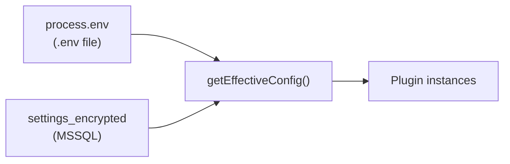

# Faz 4 — Dynamic .env via UI

**Öncelik:** 4 / 5  
**Karmaşıklık:** L  
**Durum:** Planlandı  
**Gate:** Faz 3 tamamlanmadan başlanmaz

---

## Hedef

Ortam değişkenlerini **Web UI üzerinden** girerek yönetmek; değerleri **MSSQL'de şifreli** saklamak; mümkün olan bağlantıları **restart olmadan** yeniden yüklemek.

---

## Mevcut Durum (Codebase Referansı)

| Bileşen | Konum | Durum |
|---------|-------|-------|
| Config load | `mcp-server/src/core/config.js` | Startup'ta `process.env` → immutable export |
| Schema validation | `mcp-server/src/core/config-schema.js` | HUB key min length vs auth open mode çelişkisi |
| Secrets plugin | `mcp-server/src/plugins/secrets/` | `{{secret:NAME}}` template; env register |
| Admin UI | `public/admin/index.html` | Env yönetimi yok |
| MSSQL settings | Faz 2 `settings_encrypted` | Tablo hazır, Faz 4 doldurur |
| Database pool | `database/adapters/mssql.js` | Singleton pool — reload gerekir |

`config.js` satır 1: `import "dotenv/config"` — tek seferlik yükleme.

---

## Kapsam (In Scope)

### 1. Settings Service

Yeni: `mcp-server/src/core/settings/settings.service.js`

- CRUD: key_name, ciphertext (AES-256-GCM)
- Master key: `HUB_SETTINGS_MASTER_KEY` env (32 byte base64) — yalnızca startup'ta okunur
- Namespace desteği (multi-tenant hazırlık)

### 2. Runtime Config Overlay

- Öncelik: MSSQL override > process.env > default
- Non-secret ayarlar (port, feature flags) düz JSON `connection_profiles.config_json`

### 3. UI — Admin Settings Sekmesi

`public/admin/index.html` genişletme:

| UI Bölümü | İçerik |
|-----------|--------|
| Env değişkenleri | Key, masked value, son güncelleme, namespace |
| Bağlantı profilleri | MSSQL, Redis, OpenAI, Notion profilleri |
| Reload | "Bağlantıları yenile" butonu |
| Audit | Config değişiklikleri `audit_archive` event_type=config |

Form validasyonu: `config-schema.js` kurallarıyla uyumlu key isimleri.

### 4. Hot Reload Matrisi

| Ayar | Restart gerekir? | Reload stratejisi |
|------|------------------|-------------------|
| `OPENAI_API_KEY` | Hayır | llm-router client cache invalidate |
| `NOTION_API_KEY` | Hayır | notion plugin client reload |
| `MSSQL_CONNECTION_STRING` (hub persistence) | Kısmen | persistence pool reconnect |
| `MSSQL_*` (database plugin) | Evet* | pool.close() + lazy reconnect |
| `REDIS_URL` | Kısmen | redis.js reconnect |
| `HUB_*_KEY` | **Evet** | Auth middleware restart (güvenlik) |
| `PORT` | **Evet** | HTTP listener |
| Plugin enable flags | Kısmen | registry soft reload (stretch) |

\* Database plugin: `mssql.js` pool singleton — `reloadConnection()` export edilir.

### 5. REST API

| Endpoint | Scope | Açıklama |
|----------|-------|----------|
| `GET /settings` | admin | Key listesi (değer masked) |
| `PUT /settings/:key` | admin | Upsert encrypted |
| `DELETE /settings/:key` | admin | Remove override |
| `GET /settings/connections` | admin | connection_profiles list |
| `POST /settings/reload` | admin | Hot reload tetikle |
| `GET /settings/effective` | admin | Merged config (secrets masked) |

### 6. Güvenlik

- Tüm write endpoint'ler `requireScope("admin")`
- Ciphertext loglanmaz
- `audit_archive` her değişiklik kaydı (eski/yeni key adı, actor)
- UI'da değer gösterimi: `••••••••` + "göster" tek seferlik reveal (opsiyonel)

---

## Kapsam Dışı (Out of Scope)

- `.env` dosyasını otomatik rewrite (opsiyonel export backup)
- HashiCorp Vault entegrasyonu
- Multi-master key rotation UI (yalnızca key_version altyapısı)
- Kubernetes secrets sync
- Test suite (Faz 5)

---

## Görevler

| # | Görev | Konum |
|---|-------|-------|
| 1 | `settings.service.js` — encrypt/decrypt, CRUD | `core/settings/` |
| 2 | `getEffectiveConfig()` — merge layer | `core/config.js` refactor |
| 3 | Admin Settings UI sekmesi | `public/admin/index.html` |
| 4 | REST routes | `core/server.js` veya settings router |
| 5 | `connection_profiles` CRUD | settings service |
| 6 | Plugin reload hooks registry | `core/plugins.js` |
| 7 | llm-router, notion, redis reconnect | ilgili plugin'ler |
| 8 | `database/adapters/mssql.js` → `reloadPool()` | adapter |
| 9 | Startup: MSSQL settings overlay load | `index.js` |
| 10 | Docs: `configuration.md` UI bölümü | docs |

---

## Kabul Kriterleri

- [ ] Admin UI'dan yeni API key girildiğinde MSSQL `settings_encrypted`'e yazılıyor
- [ ] Restart olmadan llm-router yeni key ile başarılı istek atıyor
- [ ] `POST /settings/reload` sonrası health OK
- [ ] `HUB_ADMIN_KEY` değişikliği restart gerektiriyor (dokümante + UI uyarı)
- [ ] Effective config endpoint secret'ları maskeleyerek dönüyor
- [ ] Config değişikliği audit_archive'de görünüyor
- [ ] `.env` dosyası olmadan (yalnızca UI/MSSQL) hub minimal config ile başlayabiliyor
- [ ] Manual test checklist tamamlandı

---

## Manuel Test Kontrol Listesi

### Encryption

- [ ] Master key olmadan settings write → anlamlı hata
- [ ] Key kaydet → DB'de ciphertext, düz metin yok
- [ ] Aynı key güncelle → updated_at değişiyor

### Hot Reload

- [ ] Yanlış OPENAI key → chat fail
- [ ] UI'dan doğru key gir → reload → chat success (restart yok)
- [ ] Redis URL değiştir → brain memory reconnect (yeni key test)

### Restart Gerektiren

- [ ] PORT değiştir → UI "restart gerekli" uyarısı
- [ ] HUB_WRITE_KEY değiştir → restart olmadan eski key hâlâ geçerli (beklenen)

### Connection Profiles

- [ ] Yeni MSSQL profili oluştur, default işaretle
- [ ] Database plugin sorgusu profil üzerinden çalışıyor

### Güvenlik

- [ ] Read scope ile `PUT /settings` → 403
- [ ] Audit log'da secret değeri yok
- [ ] Non-localhost'tan settings API (production auth)

### Regresyon

- [ ] Mevcut `.env` ile startup hâlâ çalışıyor (backward compat)
- [ ] Faz 3 Obsidian sync etkilenmedi
- [ ] Faz 1 chat UI settings sekmesine link var

---

## Bağımlılıklar

| Bağımlılık | Tip |
|------------|-----|
| Faz 2 MSSQL | Hard — `settings_encrypted`, `connection_profiles` |
| Faz 1 Web UI / Admin | Hard — UI yüzeyi |
| Faz 3 | Hard gate |
| `HUB_SETTINGS_MASTER_KEY` | Hard — production deploy |

**Sonraki faz:** [step2-phase-05-tests-cleanup.md](./step2-phase-05-tests-cleanup.md)

---

## İlgili Belgeler

- [step2-master-plan.md](./step2-master-plan.md)
- [configuration.md](../configuration.md)
- [security.md](../security.md)
- [authentication.md](../authentication.md)
