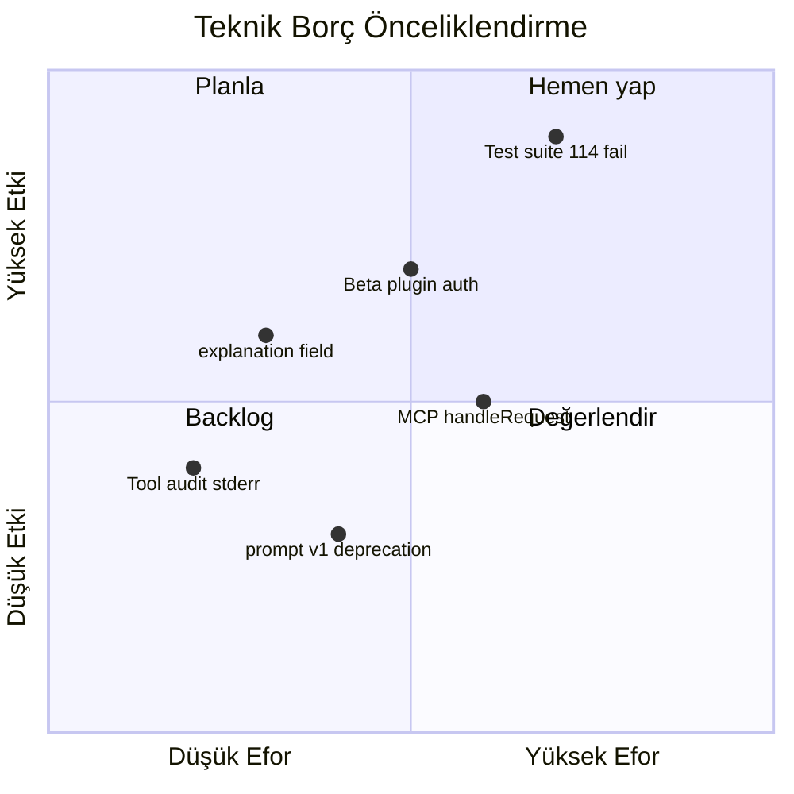

# Teknik Borç

mcp-hub codebase'inde bilinen teknik borç, test başarısızlıkları, standardizasyon eksikleri ve refactoring ihtiyaçları.

---

## Öncelik Matrisi

---

## 1. Test Suite — 114 Başarısız Test

**Durum:** 778 test case'den 114'ü başarısız (664 geçti).

**Etki:** CI merge gate olarak kullanılamaz; regresyon riski yüksek.

### Kök neden kategorileri

| Kategori | Örnek | Etkilenen alan |
|----------|-------|----------------|
| Audit API uyumsuzluğu | `auditEntry is not a function` | workspace, secrets testleri |
| Eski mock beklentileri | Core audit manager migration | plugin integration testleri |
| Auth partial | Beta plugin scope eksik | slack, email testleri |
| Env bağımlılığı | NOTION_API_KEY placeholder | startup testleri |

### Önerilen düzeltme sırası

1. `auditEntry` → `auditLog` migration tutarlılığı (workspace, secrets)
2. Test helper'larında mock audit manager standardizasyonu
3. Plugin testlerinde `createServer()` isolation
4. Beta plugin'ler için auth test skip veya fix

**Hedef:** %100 geçen test suite (778/778)

---

## 2. Audit API Tutarsızlığı

**Sorun:** Bazı plugin'ler eski `auditEntry()` local helper kullanırken core `auditLog()` API'sine geçmiş durumda.

**Etkilenen plugin'ler:** workspace (kısmen düzeltildi), secrets (store-level audit), http (local helper)

**Çözüm:**
- Tüm plugin'lerde `import { auditLog } from "../../core/audit/index.js"`
- Local in-memory audit implementation'ları kaldır
- Test mock'larını `getAuditManager()` ile uyumlu hale getir

---

## 3. explanation Field Standardizasyonu (Faz 3)

**Sorun:** Write/destructive MCP tool'ların çoğunda `inputSchema.properties.explanation` yok.

**Mevcut:** tool-registry yalnızca startup'ta warn verir.

**Hedef:** Core 20 plugin'deki tüm write tool'lara explanation ekle; opsiyonel olarak schema'da required yap.

**Etkilenen plugin'ler:** shell, git, workspace, github (write tools), database (write), n8n-workflows, project-orchestrator

---

## 4. Beta Plugin Auth Eksikleri

| Plugin | Sorun |
|--------|-------|
| slack | Kısmi requireScope |
| email | Kısmi requireScope |
| image-gen | Auth eksik |
| video-gen | Auth eksik |
| marketplace | Partial auth |
| docker | Scope tutarsızlığı |

**Çözüm:** PLAN-V2 checklist uygula — tüm REST route'lara `requireScope()`.

---

## 5. MCP HTTP Transport

**Dosya:** `mcp-server/src/mcp/http-transport.js`

**Sorunlar:**
- `server.handleRequest()` SDK API uyumluluğu — SDK versiyon güncellemelerinde kırılgan
- GET SSE implementasyonu basitleştirilmiş — tam Streamable HTTP spec uyumu belirsiz
- POST yanıtı REST envelope değil raw JSON-RPC

**Öneri:** MCP SDK transport helper'larını doğrudan kullan; integration test ekle.

---

## 6. Config Schema vs Açık Mod Çelişkisi

**Sorun:** `config-schema.js` HUB key'leri min 1 karakter bekler; `auth.js` boş key = açık mod.

**Etki:** Geliştiriciler placeholder key girmek zorunda kalabilir.

**Çözüm:** Schema'da key'leri opsiyonel yap veya dev profili için ayrı validation modu.

---

## 7. Job Depolama

**Sorun:** Redis yoksa job'lar bellekte; restart'ta kaybolur.

**Etki:** Production'da uzun job'lar güvenilir değil.

**Çözüm:** Production checklist'te `REDIS_URL` zorunlu; startup warning ekle.

---

## 8. Tool Execution Audit

**Sorun:** `callTool()` audit log stderr'e JSON yazar — yapılandırılabilir sink yok.

**Dosya:** `tool-registry.js` → `logToolExecution()`

**Çözüm:** Core audit manager'a entegre et veya `AUDIT_TOOL_EXECUTIONS=true` env ile file sink.

---

## 9. prompt-registry v1 Deprecation

**Sorun:** v1 `prompts.json` formatı hâlâ destekleniyor; v2 migration tamamlanmadı.

**Çözüm:**
- `PROMPT_REGISTRY_USE_V2=true` default yap
- v1 okuma kodunu deprecation warning ile işaretle
- 1 release sonra v1 kaldır

---

## 10. Plugin Meta Coverage

**Sorun:** Yalnızca 4 plugin'de `plugin.meta.json` var (github, shell, notion, llm-router); diğer 31 plugin metadata dosyası olmadan yükleniyor.

**Etki:** `validatePluginMeta()` fallback davranışına bağlı; kalite raporu eksik.

**Çözüm:** Tüm 35 plugin için `plugin.meta.json` oluştur.

---

## 11. llm-router Model Listesi

**Sorun:** Model isimleri ve fiyat tabloları güncel olmayabilir (PLAN.md S2, S5).

**Etki:** Yanlış model routing, hatalı maliyet tahmini.

**Çözüm:** Periyodik model listesi güncelleme; env override ile custom model list.

---

## 12. RAG Embedding Fallback

**Sorun:** `OPENAI_API_KEY` yoksa keyword-based arama — semantic kalite düşük.

**Çözüm:** Local embedding provider (Ollama) desteği; fallback davranışını dokümante et.

---

## 13. Self-HTTP Calls

**Sorun:** project-orchestrator bazı operasyonlarda localhost HTTP self-call yapıyor.

**Etki:** Gereksiz network overhead, auth header karmaşıklığı.

**Çözüm:** Doğrudan plugin fonksiyon import'u veya internal service layer.

---

## 14. Duplicate / Dead Code

| Konum | Sorun |
|-------|-------|
| observability | Duplicate health route (PLAN-V2 notu) |
| secrets | Eski `runWithAudit()` kaldırıldı ✅ |
| policy | Preset load idempotency edge case |

---

## Borç Azaltma Roadmap

| Sprint | Odak | Beklenen etki |
|--------|------|---------------|
| S1 | Audit API + test fix | 114 → <30 fail |
| S2 | explanation field + beta auth | Faz 3 tamamlanma |
| S3 | plugin.meta.json tüm plugin'ler | Kalite raporu |
| S4 | MCP transport hardening | Entegrasyon güvenilirliği |
| S5 | Config schema + job Redis default | Ops iyileştirme |

---

## İlgili Belgeler

- [Mevcut Durum](./current-state.md)
- [Faz 3 Özeti](./phase3-summary.md)
- [Operasyonlar](../operations.md)
- [PLUGIN-GAPS-ANALYSIS.md](../PLUGIN-GAPS-ANALYSIS.md)
