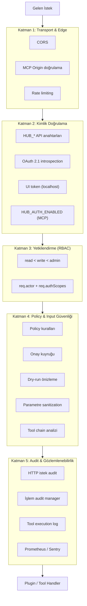
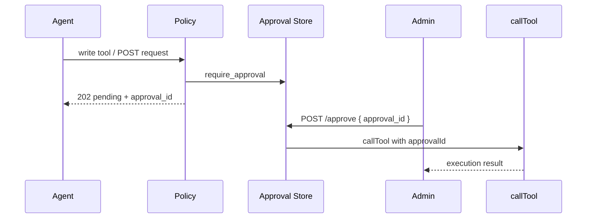

# Güvenlik

mcp-hub, AI agent'ların güçlü tool'lara erişmesini kontrollü ve denetlenebilir kılmak için **5 katmanlı** bir güvenlik modeli uygular. Her katman bir sonrakini tamamlar; tek bir katmanın atlanması diğerlerinin etkisini sınırlar.

---

## 5 Katmanlı Güvenlik Modeli



---

## Katman 1: Transport & Edge

Ağ sınırında temel koruma.

| Kontrol | Konum | Açıklama |
|---------|-------|----------|
| CORS | `server.js` | `cors()` middleware — cross-origin REST |
| MCP Origin | `mcp/http-transport.js` | DNS rebinding koruması; localhost pattern veya `MCP_ALLOWED_ORIGINS` |
| Rate limit | `core/ratelimit.js`, plugin policy | HTTP plugin domain RPM, policy rate limit kuralları |
| TLS | Deployment | Production'da reverse proxy (nginx, Caddy) ile HTTPS zorunlu |

**MCP GET `/mcp`:** SSE stream; origin header kontrol edilir.

---

## Katman 2: Kimlik Doğrulama

Kim olduğunuzu kanıtlama — REST ve MCP **ayrı** yapılandırılır.

### REST API (HUB anahtarları)

| Anahtar | Scope |
|---------|-------|
| `HUB_READ_KEY` | `read` |
| `HUB_WRITE_KEY` | `read`, `write` |
| `HUB_ADMIN_KEY` | `read`, `write`, `admin` |

Üç anahtar da boş → **açık mod** (yalnızca yerel geliştirme).

Header: `Authorization: Bearer <key>` veya `x-hub-api-key`.

### MCP (ayrı flag)

| Değişken | Etki |
|----------|------|
| `HUB_AUTH_ENABLED=true` | `/mcp` ve STDIO'da token zorunlu |
| `HUB_AUTH_ENABLED` yok/false | Geçerli token varsa kabul; yoksa açık mod |

**Önemli:** REST auth (`HUB_*_KEY` tanımlı mı?) ile MCP auth (`HUB_AUTH_ENABLED`) birbirinden bağımsızdır. REST korumalı olabilirken MCP açık kalabilir veya tersi.

### OAuth 2.1

`OAUTH_INTROSPECTION_ENDPOINT` tanımlıysa Bearer token RFC 7662 introspection ile doğrulanır.

### UI Token

`POST /ui/token` yalnızca localhost'tan; 6 haneli kod, ~5 dk TTL, admin scope.

Detay: [authentication.md](./authentication.md)

---

## Katman 3: Yetkilendirme (RBAC)

Scope hiyerarşisi: `read` < `write` < `admin` (`danger` = `admin`).

```javascript
// auth.js
requireScope("read")   // READ, WRITE veya ADMIN key
requireScope("write")  // WRITE veya ADMIN key
requireScope("admin")  // yalnızca ADMIN key
```

Her istekte:

- `req.authScopes` — kullanıcının scope listesi
- `req.actor` — `{ type: "api_key"|"ui_token"|"oauth", scopes: [...] }`

Plugin endpoint manifest'lerinde `scope: "read"|"write"|"danger"` tanımlanır.

Tool seviyesinde `security-guard.hasToolScope()` plugin metadata'sındaki `security.scope` ile kontrol yapar.

---

## Katman 4: Policy & Input Güvenliği

### REST Policy Guard (`policy-guard.js`)

Write HTTP istekleri policy motorundan geçer:

| Sonuç | HTTP | Anlam |
|-------|------|-------|
| allow | — | Devam |
| block | 403 | Kalıcı engel |
| require_approval | 202 | Onay bekliyor |
| dry_run | 200 | Önizleme; onay için `?confirmed=true` |
| policy_rate_limit | 429 | Kural bazlı rate limit |

Preset kurallar: `plugins/policy/presets.json` (startup'ta yüklenir).

### MCP Tool Policy (tool-hooks)

Policy plugin `registerBeforeExecutionHook` ile tool çağrılarını değerlendirir. Onay gerektiren tool'lar `require_approval` döner; MCP gateway bunu kullanıcıya metin olarak iletir.

### Parametre Sanitization (`security-guard.js`)

| Pattern | Tehdit |
|---------|--------|
| SQL injection | `SELECT`, `OR 1=1`, `--` |
| Path traversal | `../`, `%2e%2e` |
| Command injection | `;`, `|`, `` ` ``, `$()` |
| XML XXE | `<!ENTITY ... SYSTEM "file://"` |
| Template injection | `{{}}`, `${}` |

Kritik eşleşmede argümanlar sanitize edilir veya engellenir.

### Tool Chain Analizi

Tehlikeli ardışık tool kombinasyonları risk skoru üretir:

| Zincir | Risk |
|--------|------|
| `shell_execute` → `file_write` | Malware |
| `shell_execute` → `http_request` | Data exfiltration |
| `secrets_get` → `http_request` | Credential theft |
| `database_query` → `http_request` | Veri sızıntısı |
| `git_clone` → `shell_execute` | Supply chain |

`riskScore >= 100` → blocked; `>= 30` → requiresApproval.

### Plugin-Spesifik Güvenlik

| Plugin | Kontrol |
|--------|---------|
| `http` | SSRF, domain allowlist/blocklist, URL safety |
| `shell` | Allowlist, DANGEROUS_PATTERNS, session cwd validation |
| `workspace` | WORKSPACE_ROOT sınırı, path traversal |
| `git` | WORKSPACE_BASE repo path validation |
| `secrets` | Agent asla gerçek değer görmez; `{{secret:NAME}}` ref |
| `database` | Read-only mod, query limitleri |

---

## Katman 5: Audit & Gözlemlenebilirlik

Her katmanın kararları loglanır.

### HTTP İstek Audit

- Middleware: `audit.js`
- Son 1000 kayıt bellekte
- Secret alanlar maskelenir
- Admin panel → **İstek logu**

### İşlem Audit (Core Manager)

- Plugin write/tool operasyonları
- Actor, correlation ID, süre, izin kararı
- Sink: memory + opsiyonel file
- Admin panel → **İşlem audit**

### Tool Execution Log

`callTool()` her çağrıyı stderr'e JSON satırı olarak yazar (`type: "tool_audit"`).

### Observability

- Prometheus: `GET /observability/metrics`
- Sentry: `SENTRY_DSN` (opsiyonel)
- Aggregate health: `GET /observability/health`

---

## Onay Workflow'u



MCP'de onay gerektiren tool sonucu `⏳ Approval Required` metni olarak döner.

---

## Production Güvenlik Kontrol Listesi

- [ ] Güçlü rastgele `HUB_*_KEY` değerleri
- [ ] `NODE_ENV=production`
- [ ] `HUB_AUTH_ENABLED=true` (MCP için)
- [ ] `REQUIRE_PROJECT_HEADERS=true` (multi-tenant)
- [ ] `MCP_ALLOWED_ORIGINS` production origin'leri
- [ ] Reverse proxy + TLS
- [ ] `AUDIT_SINKS=memory,file`
- [ ] Redis job persistence
- [ ] `HTTP_ALLOWED_DOMAINS` kısıtlı allowlist
- [ ] `SHELL_ALLOWLIST` minimum gerekli komutlar
- [ ] Secret'lar `.env`'de; repoya commit edilmez

---

## İlgili Belgeler

- [Kimlik Doğrulama](./authentication.md)
- [MCP Entegrasyonu](./mcp-integration.md)
- [Core Bileşenler](./core-components.md)
- [Operasyonlar](./operations.md)
