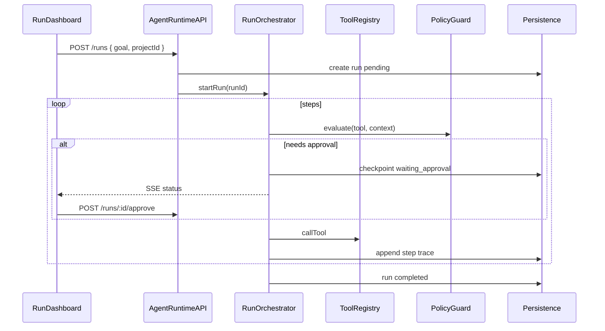

# 01 — Agent Runtime / Workflow Katmanı

> **Status:** not_started  
> **Öncelik:** P0 (Faz 1)  
> **Bağımlılık:** [10-production-hardening.md](./10-production-hardening.md) (jobs + audit tek kaynak)

---

## Amaç

Tool hub'un üzerine **agent çalıştırma motoru** eklemek: çok adımlı planlar, tool-call history, retry/rollback, approval checkpoint, uzun süren run'lar, replay/resume ve timeline.

**Örnek senaryo:** *"Repo analiz et → issue aç → branch oluştur → kodu değiştir → test koş → PR aç"* tek `run_id` altında izlenebilmeli.

---

## Mevcut durum

| Var | Eksik |
|-----|-------|
| `chat-orchestrator.js` — LLM + tool loop, SSE | Run entity yok (sadece conversation) |
| `project-orchestrator` — `project_init` vb. | Genel workflow engine değil |
| `jobs.js` — async job queue | Agent run ≠ job (ayrı modeller) |
| `audit/` — tool archive | Run ile ilişkilendirilmiş değil |
| Chat approval (SSE `onApproval`) | Checkpoint persistence + resume |

**İlgili dosyalar:** `mcp-server/src/core/chat-orchestrator.js`, `mcp-server/src/core/jobs.js`, `mcp-server/src/plugins/project-orchestrator/index.js`

---

## Hedef mimari

---

## Veri modeli (öneri)

### `agent_runs`

| Alan | Tip | Açıklama |
|------|-----|----------|
| `id` | UUID | `run_id` |
| `project_id` | string? | Workspace bağlamı |
| `conversation_id` | UUID? | Chat ile köprü |
| `goal` | text | Kullanıcı hedefi / plan özeti |
| `status` | enum | `pending`, `running`, `waiting_approval`, `paused`, `completed`, `failed`, `cancelled` |
| `current_step` | int | Sıra numarası |
| `plan` | JSON | Fazlar / görevler (project-orchestrator uyumlu) |
| `metadata` | JSON | model, plugin filter, priority |
| `created_by` | string | user / api key id |
| `started_at`, `finished_at` | datetime | |
| `error` | JSON? | Son hata |

### `agent_run_steps`

| Alan | Tip | Açıklama |
|------|-----|----------|
| `id` | UUID | |
| `run_id` | UUID | FK |
| `step_index` | int | |
| `type` | enum | `llm`, `tool`, `approval`, `system` |
| `tool_name` | string? | |
| `input` | JSON | masked secrets |
| `output` | JSON | |
| `status` | enum | `ok`, `error`, `skipped`, `pending` |
| `duration_ms` | int | |
| `retry_count` | int | |
| `usage` | JSON | token/cost snapshot |

### `agent_run_checkpoints`

Onay veya pause noktaları — resume için `last_checkpoint_id`.

---

## API yüzeyi (öneri)

| Method | Path | Açıklama |
|--------|------|----------|
| POST | `/runs` | Yeni run başlat |
| GET | `/runs` | Liste (filter: project, status) |
| GET | `/runs/:id` | Detay + steps özeti |
| GET | `/runs/:id/steps` | Paginated trace |
| GET | `/runs/:id/events` | SSE stream (chat benzeri) |
| POST | `/runs/:id/approve` | Checkpoint onayı |
| POST | `/runs/:id/cancel` | İptal |
| POST | `/runs/:id/resume` | Checkpoint'ten devam |
| POST | `/runs/:id/replay` | Salt okunur replay (yeni run veya dry-run) |

MCP tool: `agent_run_status`, `agent_run_list` (read scope).

---

## Uygulama fazları

### Faz A — Run modeli + chat köprüsü (2 hafta)

- [ ] Migration: `agent_runs`, `agent_run_steps`
- [ ] `RunOrchestrator` servisi — `chat-orchestrator` içinden veya wrapper
- [ ] Her chat turn'de `run_id` üret veya conversation'a bağlı run devam ettir
- [ ] Tool call'ları `agent_run_steps`'e yaz
- [ ] Audit archive'a `run_id` metadata ekle

**Exit:** Chat'ten yapılan tool call'lar DB'de run step olarak görünür.

### Faz B — Job entegrasyonu + uzun run (2 hafta)

- [ ] `job.type = agent_run` — `jobs.js` tek implementasyon (Pillar 10 sonrası)
- [ ] Uzun run'lar worker'da; SSE ile progress
- [ ] Timeout + graceful cancel

**Exit:** 10+ dakika süren run UI'da kaybolmaz.

### Faz C — Retry, rollback, replay (2 hafta)

- [ ] Step-level retry policy (transient errors)
- [ ] Compensating action hook (plugin opt-in) — tam rollback değil, "undo hint"
- [ ] Replay: aynı input trace'i read-only oynatma
- [ ] Resume: `waiting_approval` sonrası kaldığı step'ten devam

**Exit:** Onay reddedilince run `cancelled` veya alternatif path ile devam seçeneği.

### Faz D — Workflow şablonları (2 hafta)

- [ ] `workflow_templates` — örn. `repo-ship-feature`, `incident-triage`
- [ ] `project-orchestrator` plan çıktısını run planına map et
- [ ] Template parametreleri: repo, branch, notion project id

**Exit:** Örnek 6 adımlı repo workflow tek tıkla başlatılabilir.

---

## Chat orchestrator entegrasyonu

1. `streamChat()` başında `ensureRun(conversationId)` 
2. `onTool` → `appendRunStep(runId, { type: 'tool', ... })`
3. `onApproval` → run status `waiting_approval`, checkpoint kaydı
4. `onDone` → usage + run `completed`

Mevcut `conversations` tablosu korunur; `agent_runs.conversation_id` optional FK.

---

## Retry politikası

| Hata sınıfı | Davranış |
|-------------|----------|
| `notion_rate_limited`, network | Otomatik retry (max 3) |
| `insufficient_scope`, policy deny | Retry yok; run pause veya fail |
| Tool execution error | Orchestrator kararı; kullanıcıya sor |

---

## Güvenlik

- Run başlatma: `write` scope
- Run listesi: `read` veya project membership (gelecek)
- Step input/output: secret mask (`settings/crypto` pattern)
- Replay: destructive tool'lar dry-run veya mock

---

## Test planı

- [ ] Unit: RunOrchestrator state machine
- [ ] Integration: mock LLM + 2 tool → 4 step trace
- [ ] Approval pause/resume E2E
- [ ] Golden trace: `tests/fixtures/runs/repo-ship-feature.json`

---

## Exit criteria (pillar tamamlandı)

- [ ] Run CRUD API + persistence
- [ ] Chat ve project-orchestrator run'a bağlı
- [ ] Approval checkpoint resume çalışıyor
- [ ] En az 1 workflow template dokümante
- [ ] Timeline UI (Pillar 04) bu API'yi tüketiyor

---

## Riskler

| Risk | Azaltma |
|------|---------|
| chat-orchestrator şişmesi | Ayrı `run-orchestrator.js` modülü |
| jobs çift stack | Pillar 10 önce |
| Trace boyutu | Step output truncate + blob storage (file-storage plugin) |

**Sonraki:** [02-policy-approval-center.md](./02-policy-approval-center.md), [04-visual-run-dashboard.md](./04-visual-run-dashboard.md)
