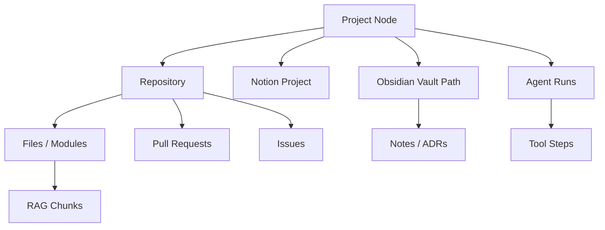

# 03 — Project Workspace Intelligence

> **Status:** faz_a_done (Faz 2 exit); Faz D intelligence = Faz 5  
> **Öncelik:** P1 (Faz 2)  
> **Bağımlılık:** [01-agent-runtime-workflow.md](./01-agent-runtime-workflow.md), brain/RAG stabilitesi

---

## Amaç

Repo, Notion, Obsidian, GitHub, RAG ve brain parçalarını tek **project memory** altında birleştirmek — "engineering brain".

**Örnek sorular:**
- "Bu projede auth nasıl çalışıyor?"
- "Son 2 haftada ne değişti?"
- "Bu issue hangi modülleri etkiler?"

---

## Mevcut durum

| Kaynak | Modül | Durum |
|--------|-------|-------|
| Kod / repo | `repo-intelligence`, `github`, `git` | Ayrı tool'lar |
| Dokümantasyon | `brain`, Obsidian export, RAG | Parçalı |
| Görevler | Notion `project-orchestrator` | Proje DB bağlı |
| Kararlar / notlar | brain graph, Obsidian | Senkron eksikleri |
| PR / issue | `github` plugin | Run'a bağlı değil |

**İlgili:** `mcp-server/src/plugins/brain/`, `rag/`, `notion/`, `project-orchestrator/`, `obsidian-plugin/`

---

## Hedef: Context Graph

Her **Project** hub node; diğerleri edge ile bağlı.

---

## Veri modeli (öneri)

### `projects` (genişletme veya yeni)

Mevcut `projects` plugin ile birleştir veya `workspace_projects` tablosu:

| Alan | Açıklama |
|------|----------|
| `id` | `proj_...` |
| `name` | |
| `slug` | |
| `github_repo` | `owner/name` |
| `notion_project_id` | |
| `obsidian_vault_path` | |
| `default_branch` | |
| `metadata` | stack, team |

### `project_links`

| `project_id` | `link_type` | `external_id` |
|--------------|-------------|---------------|
| ... | `github_repo` | ... |
| ... | `notion_db_row` | ... |

### `context_events` (activity feed)

| timestamp | type | summary | refs |
|-----------|------|---------|------|
| | `commit`, `pr`, `run`, `notion_task`, `obsidian_edit` | | JSON |

Indexer job'ları bu tabloyu doldurur.

---

## Sorgu API'leri

| Endpoint | Açıklama |
|----------|----------|
| `GET /projects/:id/context` | Özet graph + son olaylar |
| `POST /projects/:id/ask` | RAG + graph — LLM soru cevap |
| `GET /projects/:id/changes?since=` | Son N gün diff özeti |
| `GET /projects/:id/impact?issue=` | Issue → modül tahmini |

MCP tools: `project_context_search`, `project_recent_changes`.

---

## Uygulama fazları

### Faz A — Project registry + linking (2 hafta)

- [ ] Project CRUD UI (Settings veya `/projects`)
- [ ] GitHub repo, Notion project, vault path bağlama
- [ ] Agent run başlatırken `projectId` zorunlu/önerilen
- [ ] `chat-orchestrator` system prompt'a project context inject

**Exit:** Bir proje için 3 link tipi tanımlanabilir.

### Faz B — Unified indexer (3 hafta)

- [ ] Background job: GitHub sync (PR, issue, son commit)
- [ ] Notion task sync (mevcut DB)
- [ ] Obsidian vault watch / export pull (`brain.obsidian.js`)
- [ ] RAG re-index project-scoped collection

**Exit:** `GET /projects/:id/changes?since=14d` anlamlı veri döner.

### Faz C — Impact + ADR (2 hafta)

- [ ] Modül haritası (repo-intelligence çıktısı cache)
- [ ] "Bu dosya hangi feature?" — embedding + path heuristic
- [ ] ADR notları Obsidian tag ile graph'a

**Exit:** Örnek issue için modül listesi UI'da.

### Faz D — Agent-native memory + intelligence (Faz 5)

- [x] Run tamamlanınca özet `context_events`'e yaz
- [ ] Graph **edges** (project→repo, run→event, issue→pr)
- [ ] `lastChangeSummary` + otomatik ilişki çıkarma (indexer)
- [ ] `project_context_for_goal` — goal-aware ranked retrieval
- [ ] Opsiyonel RAG bridge (project-scoped)
- [ ] Mini graph UI (Settings / Runs)
- [ ] Uzun hafıza: önemli kararları otomatik Notion/Obsidian'a öner

---

## Frontend

- **Project switcher** — Chat ve Run Dashboard'da
- **Project overview** — activity, health, son run'lar, maliyet
- Brain graph — project filtreli görünüm

---

## Exit criteria

- [ ] En az 1 gerçek proje uçtan uca bağlı (GitHub + Notion + vault)
- [ ] 3 örnek soru API'den cevaplanır
- [ ] Run'lar project activity feed'e düşer

**Sonraki:** [04-visual-run-dashboard.md](./04-visual-run-dashboard.md), [09-local-sidecar-desktop-agent.md](./09-local-sidecar-desktop-agent.md)
