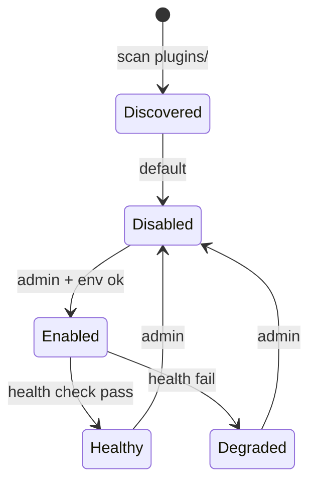

# 05 — Connector Marketplace (Kontrollü)

> **Status:** not_started  
> **Öncelik:** P2 (Faz 3)  
> **Bağımlılık:** [08-secrets-env-management.md](./08-secrets-env-management.md), [10-production-hardening.md](./10-production-hardening.md)

---

## Amaç

35 plugin'i **iç marketplace** deneyimine çevirmek — install/enable/disable, env wizard, health check, permission manifest, test connection, version/maturity badge. **Admin-only, fail-closed.**

---

## Mevcut durum

| Var | Eksik |
|-----|-------|
| `plugins.js` dynamic load | Enable/disable runtime |
| `plugin.meta.json` 35/35 | Kalite scaffold; boş envVars |
| `validate:plugins` script | CI'da var |
| `PluginsPage` — liste | Wizard, test connection |
| `marketplace` plugin | Dış kaynak; iç catalog değil |
| `plugin-env-catalog.js` | UI'da tam wizard değil |

---

## Marketplace ilkeleri

1. **Admin-only** — `requireScope("admin")` tüm mutasyonlar
2. **Fail-closed** — Default disabled olan capability'ler açıkça enable edilmeli
3. **Manifest zorunlu** — `security.capabilities`, `envVars`, `riskLevel`
4. **No arbitrary install** — Sadece repo içi `src/plugins/*` (V3); harici paket V4+
5. **Unsafe warning** — `shell`, `destructive` açık uyarı

---

## Plugin yaşam döngüsü

### `plugin_state` (MSSQL veya config overlay)

| Alan | Açıklama |
|------|----------|
| `plugin_name` | |
| `enabled` | bool |
| `enabled_at` | |
| `enabled_by` | |
| `last_health` | ok / fail |
| `env_complete` | bool |

Startup: `STRICT_PLUGIN_LOADING` + enabled listesi.

---

## UI: Plugin Setup Wizard

Adımlar (her plugin için):

1. **Overview** — description, maturity badge, tool count
2. **Permissions** — capability manifest, risk özeti
3. **Configuration** — required/optional env, masked inputs
4. **Test connection** — `POST /plugins/:name/health` veya özel test
5. **Enable** — onay checkbox ("I understand shell access")

Mevcut `SettingsPage` entegrasyonları ile birleştir.

---

## API

| Method | Path | Açıklama |
|--------|------|----------|
| GET | `/marketplace/catalog` | Tüm plugin meta + state |
| POST | `/marketplace/plugins/:name/enable` | admin |
| POST | `/marketplace/plugins/:name/disable` | admin |
| POST | `/marketplace/plugins/:name/test` | connection test |
| GET | `/marketplace/plugins/:name/wizard` | required env + health schema |

---

## Maturity badge

`plugin.meta.json` → `status`: `experimental` | `beta` | `stable`

UI renkleri + "production use" uyarısı experimental için.

---

## Uygulama fazları

### Faz A — Enable/disable (1 hafta)

- [ ] `plugin_state` persistence
- [ ] `plugins.js` — disabled plugin tool register etmez
- [ ] PluginsPage toggle (admin)

### Faz B — Wizard (1 hafta)

- [ ] Env catalog → wizard adımları
- [ ] Test connection endpoint standardı (`mountPluginHealth` genişlet)
- [ ] Incomplete env → enable blokla

### Faz C — Unsafe capabilities (1 hafta)

- [ ] Manifest `security.dangerousCombinations` UI uyarısı
- [ ] Policy default deny shell in production

---

## Exit criteria

- [ ] Admin plugin'i disable edince tool listesinden kaybolur
- [ ] Yeni plugin kurulumu wizard ile < 15 dk (dokümante senaryo)
- [ ] `validate:plugins` + marketplace state CI testi

**Sonraki:** [07-eval-regression.md](./07-eval-regression.md)
