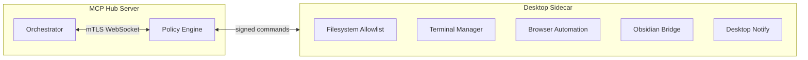

# 09 — Local Sidecar / Desktop Agent

> **Status:** not_started  
> **Öncelik:** P3 (Faz 4)  
> **Bağımlılık:** [02-policy-approval-center.md](./02-policy-approval-center.md), [10-production-hardening.md](./10-production-hardening.md)

---

## Amaç

MCP Hub server tarafı güçlü; **local machine işleri** için ayrı güvenlik modeliyle sidecar: filesystem allowlist, terminal/session manager, browser automation, desktop notification, Obsidian vault sync, secure local bridge.

---

## Mevcut durum

| Var | Eksik |
|-----|-------|
| `local-sidecar` plugin | Tam ürünleşme |
| `shell` plugin (server) | Local delegation |
| `file-watcher` | Sidecar bridge |
| `brain.obsidian.js` | Vault sync protokolü |
| Obsidian plugin (repo dışı?) | Derin entegrasyon |

**İlgili:** `mcp-server/src/plugins/local-sidecar/`, `docs/obsidian-plugin.md`

---

## Mimari



**İlke:** Server asla doğrudan kullanıcı diskine erişmez — sadece sidecar üzerinden, policy onaylı.

---

## Güvenlik modeli (ayrı)

| Katman | Kural |
|--------|-------|
| Pairing | One-time code, device cert |
| Allowlist | Path glob, max file size |
| Terminal | Session sandbox, command allowlist |
| Network | Sidecar sadece hub'a outbound |
| Audit | Her local action server'a log |

Policy: `local.*` tool'ları default **approval required**.

---

## Sidecar yetenekleri

### 1. Filesystem allowlist

- Kullanıcı tanımlı kök dizinler
- Read/write ayrımı
- `.gitignore` benzeri exclude

### 2. Terminal / session manager

- Named session, output stream
- Timeout, max output size
- Dangerous command blocklist (`rm -rf /`)

### 3. Browser automation

- Playwright/Puppeteer local
- URL allowlist
- Screenshot → hub upload

### 4. Desktop notification

- OS native notify
- Approval request popup (opsiyonel)

### 5. Obsidian vault sync

- Vault path allowlist
- Note read/write/search
- Brain plugin ile graph sync

### 6. Secure local bridge

- WebSocket + mTLS
- Command/response correlation id
- Offline queue (retry)

---

## Protokol (taslak)

```json
{
  "type": "local.fs.read",
  "id": "cmd-uuid",
  "payload": { "path": "/allowed/project/README.md" }
}
```

Response + audit event server'da `run_step` olarak kayıt.

---

## Uygulama fazları

### Faz A — Sidecar daemon MVP (2 hafta)

- [ ] Ayrı npm paket veya `sidecar/` dizini
- [ ] Pairing + mTLS
- [ ] `local.fs.read` / `local.fs.write` (allowlist)

### Faz B — Terminal session (1 hafta)

- [ ] Session create/exec/stream
- [ ] Policy approval integration

### Faz C — Obsidian bridge (2 hafta)

- [ ] Vault indexer
- [ ] `brain.obsidian` ile iki yönlü sync
- [ ] Obsidian community plugin güncelle

### Faz D — Browser + notify (1 hafta)

- [ ] Browser automation sandbox
- [ ] Desktop notification

### Faz E — Packaging (1 hafta)

- [ ] macOS/Windows installer veya `npx @mcp-hub/sidecar`
- [ ] Auto-update kanalı (admin kontrollü)

---

## Exit criteria

- [ ] Sidecar olmadan local fs tool'ları server'da **yok** (veya disabled)
- [ ] Pairing + allowlist dokümante ve test edilmiş
- [ ] Obsidian vault'tan not okuma agent run'da izlenebilir
- [ ] Tüm local action'lar audit + policy'den geçer

**Sonraki:** [03-project-workspace-intelligence.md](./03-project-workspace-intelligence.md) (local context feed)
