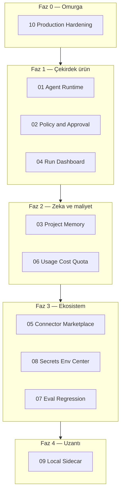

# V3 Path — Güvenli Agent Execution Platformu

> **Ürün yönü:** MCP tool hub → **AI agent işletim platformu**  
> **Değer önerisi:** 50 plugin değil; agent'ların güvenli, gözlemlenebilir, tekrar üretilebilir ve ekip içinde yönetilebilir çalışması.

Bu klasör, V3 büyüme adımlarının **tek tek takip edilebilir planlarıdır**. Her dosya bağımsız okunabilir; sıra için [EXECUTION-ORDER.md](./EXECUTION-ORDER.md) esas alınır.

---

## Strateji özeti

---

## Plan dosyaları

| # | Dosya | Odak |
|---|-------|------|
| 00 | [00-vision.md](./00-vision.md) | Vizyon, ilkeler, başarı kriterleri |
| 01 | [01-agent-runtime-workflow.md](./01-agent-runtime-workflow.md) | Çok adımlı agent run motoru |
| 02 | [02-policy-approval-center.md](./02-policy-approval-center.md) | Risk tabanlı onay ve policy ürünü |
| 03 | [03-project-workspace-intelligence.md](./03-project-workspace-intelligence.md) | Project memory / context graph |
| 04 | [04-visual-run-dashboard.md](./04-visual-run-dashboard.md) | Operasyon UI — timeline, trace |
| 05 | [05-connector-marketplace.md](./05-connector-marketplace.md) | Kontrollü plugin marketplace |
| 06 | [06-usage-cost-quota.md](./06-usage-cost-quota.md) | Maliyet, quota, budget guardrail |
| 07 | [07-eval-regression.md](./07-eval-regression.md) | Agent eval ve regression |
| 08 | [08-secrets-env-management.md](./08-secrets-env-management.md) | Integration setup center |
| 09 | [09-local-sidecar-desktop-agent.md](./09-local-sidecar-desktop-agent.md) | Local bridge ve desktop agent |
| 10 | [10-production-hardening.md](./10-production-hardening.md) | Registry, auth, observability omurgası |

**Sıra:** [EXECUTION-ORDER.md](./EXECUTION-ORDER.md)

---

## Mevcut temel (V2 → V3 köprüsü)

| Alan | Bugün kodda var | V3'te hedef |
|------|-----------------|-------------|
| Tool çağrısı | `tool-registry.js`, 35 plugin | Run içinde versioned trace |
| Chat agent | `chat-orchestrator.js`, SSE | Run = chat + tool loop birleşik |
| Onay | `policy-guard.js`, chat approval dialog | Merkezi Approval Center |
| Jobs | `jobs.js` + `job.manager.js` (çift stack) | Uzun agent run = tek job tipi |
| Audit | `audit/` + archive API | Run timeline ile birleşik |
| Usage | `usage-ledger`, UsagePage | Run/project/quota bazlı |
| Settings | MSSQL encrypted overlay | Connection wizard + rotation |
| Memory parçaları | brain, RAG, Notion, Obsidian, GitHub | Tek project context graph |
| UI | Chat, Admin, Audit, Observability | Run Dashboard (operasyon) |

---

## Nasıl kullanılır

1. [EXECUTION-ORDER.md](./EXECUTION-ORDER.md) içinden aktif fazı seç.
2. İlgili pillar dosyasındaki **Faz A → B → C** maddelerini issue/PR'lara böl.
3. Her faz sonunda **Exit criteria** kutusunu işaretle.
4. Tamamlanan maddeleri dosya başındaki `Status:` satırında güncelle.

İlgili mevcut dokümanlar: [architecture.md](../architecture.md), [technical-debt.md](../technical-debt.md), [priorities.md](../priorities.md), [roadmap.md](../roadmap.md).
