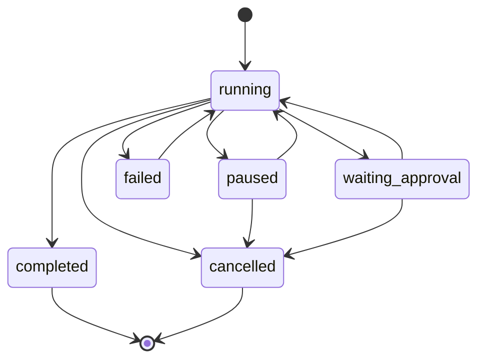

# 02 — Agent Runtime v2

> **Status:** done  
> **Faz:** V4.2  
> **Bağımlılık:** [01-platform-core-hardening.md](./01-platform-core-hardening.md)

---

## Amaç

Mevcut run sistemi MVP'den gerçek workflow motoruna ilerlesin.

---

## Kapsam

- Run state machine netleştir.
- Step retry policy UI/API.
- Conditional step: success/failure branch.
- Pause/resume checkpoint.
- Step timeout.
- Compensating rollback hook.
- Dry-run güvenli simülasyon.
- Run replay compare.

---

## Yeni endpoint/tool fikirleri

```text
POST /runs/:id/pause
POST /runs/:id/retry-step
POST /runs/:id/rollback
POST /runs/:id/compare
```

---

## v3.4'te başlayanlar

| Madde | Durum |
|-------|-------|
| `workflow-expr.js` conditional branch | done |
| Checkpoint resume | done |
| Compensate hook | done |
| Retry policy (template) | done |
| Dry-run toggle (UI) | done |
| SSE run events | done |

---

## Kalan işler

- [x] `POST /runs/:id/pause` — explicit pause API
- [x] `POST /runs/:id/retry-step` — tek step retry
- [x] `POST /runs/:id/rollback` — compensate chain tetikleme
- [x] `POST /runs/:id/compare` — replay diff
- [x] Step timeout enforcement
- [x] State machine dokümantasyonu + diagram
- [x] Destructive step dry-run/replay guard (tüm tool'lar)

---

## Başarı kriteri

- [x] Bir workflow başarısız step'ten devam edebilir
- [x] Destructive step dry-run/replay'de gerçek aksiyon almaz

---

## Run state machine (v4.0-alpha)



---

## Sonraki

[03-agent-run-designer.md](./03-agent-run-designer.md)
