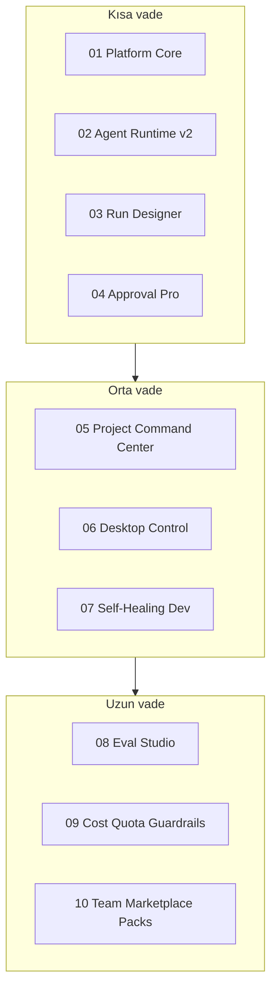

# V4 Execution Order

> **Son güncelleme:** 2026-06-24  
> **Önkoşul:** [V3 EXECUTION-ORDER](../v3-path/EXECUTION-ORDER.md) Faz 5 (v3.4) tamamlandı  
> **Kural:** Önce güvenli temel → ürünleştirme → premium otomasyon

---

## Strateji özeti



---

## Önerilen sıralama

### Kısa vade (V4.1 – V4.4)

| Sıra | Pillar | Dosya | Durum |
|------|--------|-------|-------|
| 4.1 | Platform çekirdeği sertleştir | [01-platform-core-hardening.md](./01-platform-core-hardening.md) | partial (v3.4) |
| 4.2 | Agent Runtime v2 | [02-agent-runtime-v2.md](./02-agent-runtime-v2.md) | partial (v3.4) |
| 4.3 | Agent Run Designer | [03-agent-run-designer.md](./03-agent-run-designer.md) | not_started |
| 4.4 | Approval Center Pro | [04-approval-center-pro.md](./04-approval-center-pro.md) | not_started |

### Orta vade (V4.5 – V4.7)

| Sıra | Pillar | Dosya | Durum |
|------|--------|-------|-------|
| 4.5 | Project Command Center | [05-project-command-center.md](./05-project-command-center.md) | partial (context graph) |
| 4.6 | Desktop Control Agent MVP | [06-desktop-control-agent.md](./06-desktop-control-agent.md) | not_started |
| 4.7 | Self-Healing Dev Agent | [07-self-healing-dev-agent.md](./07-self-healing-dev-agent.md) | not_started |

### Uzun vade (V4.8 – V4.10)

| Sıra | Pillar | Dosya | Durum |
|------|--------|-------|-------|
| 4.8 | Eval Studio | [08-eval-studio.md](./08-eval-studio.md) | partial (eval smoke) |
| 4.9 | Cost, Quota ve Policy Guardrails | [09-cost-quota-policy-guardrails.md](./09-cost-quota-policy-guardrails.md) | partial (usage v3) |
| 4.10 | Team, Marketplace ve Integration Packs | [10-team-marketplace-packs.md](./10-team-marketplace-packs.md) | partial (marketplace v3) |

---

## Milestone etiketleri

| Etiket | İçerik |
|--------|--------|
| `v4.0-alpha` | Platform core + runtime v2 exit (4.1–4.2) |
| `v4.0-beta` | Run Designer MVP + Approval Pro (4.3–4.4) |
| `v4.1` | Project Command Center + Desktop observe-only (4.5–4.6) |
| `v4.2` | Self-Healing + Eval Studio MVP (4.7–4.8) |
| `v4.3` | Cost guardrails + Team packs (4.9–4.10) |

---

## V3 → V4 köprüsü

| V3.4'te yapıldı | V4'te devam |
|-----------------|-------------|
| jobs-api hızlandırma, tag/audit hijyeni | 01 tam exit + CI strict gate |
| workflow-expr, checkpoint, compensate | 02 pause/retry-step/rollback/compare API |
| WorkflowTemplateDialog, SSE runs UI | 03 görsel designer |
| Sidecar pairing + local fs/terminal | 06 desktop tools |
| project_context_for_goal, graph edges | 05 command center UI |
| eval:smoke trace compare | 08 Eval Studio |

---

## Paralel çalışma kuralları

| Yapılabilir paralel | Yapılmamalı paralel |
|---------------------|---------------------|
| 03 Designer UI + 02 runtime API | 06 Desktop tools + policy refactor |
| 05 Command Center + 03 Designer | 10 Team identity + audit migration |
| 08 Eval + 09 Cost metrics | Runtime state machine değişirken golden trace yazmak |

---

## İzleme

Her pillar dosyasında:

```markdown
Status: not_started | partial | in_progress | done
Owner: —
Last reviewed: YYYY-MM-DD
```

Sprint planlarken [priorities.md](../priorities.md) ile çakışan maddeleri önce **01 Platform Core** altında kapat.

---

## V5 — Sonraki yol

V4 tamamlandıktan sonra ürün yönü [V5 path](../v5-path/README.md) ile devam eder — **Managed Autonomous Operations**.

- **Faz A:** Runbook → Schedule → Managed Autonomy
- **Faz B:** Release Manager → Maintenance → Hygiene
- **Faz C:** Reports → SLA → Incident → Env Promotion

Detay: [v5-path/EXECUTION-ORDER.md](../v5-path/EXECUTION-ORDER.md)

V5 sonrası: [V6 path](../v6-path/README.md) — agent ekosistemi ölçeklenir.
