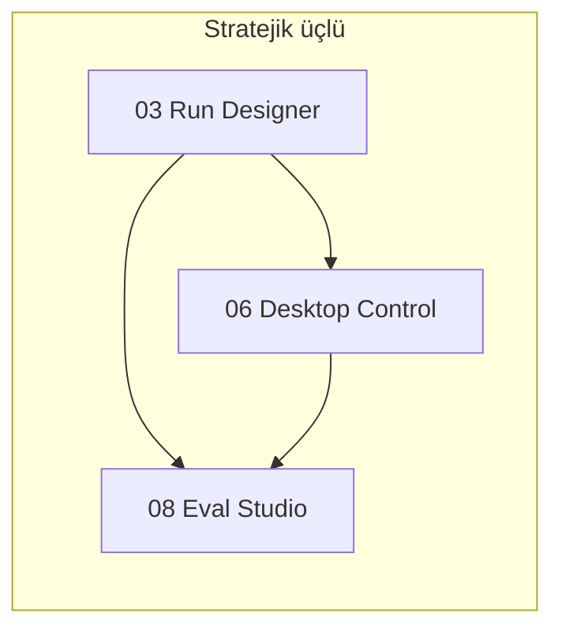

# V4 Path — Premium AI Engineering Agent Platform

> **Ürün yönü:** MCP Hub + agent runtime + premium desktop agent  
> **Değer önerisi:** Güvenli, izlenebilir, test edilebilir ve yerel bilgisayarda iş yapabilen AI engineering agent platformu.

Bu klasör, V4 büyüme adımlarının **tek tek takip edilebilir planlarıdır**. Önkoşul: [V3 path](../v3-path/README.md) Faz 0–5 (v3.4). Sıra için [EXECUTION-ORDER.md](./EXECUTION-ORDER.md) esas alınır.

---

## Strateji özeti

**Kısa vade:** Platform core → Runtime v2 → Designer → Approval Pro  
**Orta vade:** Command Center → Desktop → Self-Healing  
**Uzun vade:** Eval Studio → Cost guardrails → Team packs

---

## Plan dosyaları

| # | Dosya | Odak |
|---|-------|------|
| 00 | [00-vision.md](./00-vision.md) | Vizyon, stratejik üçlü, ilkeler |
| 01 | [01-platform-core-hardening.md](./01-platform-core-hardening.md) | Registry, jobs, audit, test hijyeni |
| 02 | [02-agent-runtime-v2.md](./02-agent-runtime-v2.md) | Workflow motoru v2 — pause, retry, rollback |
| 03 | [03-agent-run-designer.md](./03-agent-run-designer.md) | Görsel workflow tasarım UI |
| 04 | [04-approval-center-pro.md](./04-approval-center-pro.md) | Risk skoru, diff, policy önerisi |
| 05 | [05-project-command-center.md](./05-project-command-center.md) | Proje operasyon ekranı |
| 06 | [06-desktop-control-agent.md](./06-desktop-control-agent.md) | Sidecar desktop/browser kontrol |
| 07 | [07-self-healing-dev-agent.md](./07-self-healing-dev-agent.md) | CI failure → fix → PR |
| 08 | [08-eval-studio.md](./08-eval-studio.md) | Golden trace, regression, CI gate |
| 09 | [09-cost-quota-policy-guardrails.md](./09-cost-quota-policy-guardrails.md) | Budget, preflight estimate, anomaly |
| 10 | [10-team-marketplace-packs.md](./10-team-marketplace-packs.md) | Ekip, wizard, integration packs |

**Sıra:** [EXECUTION-ORDER.md](./EXECUTION-ORDER.md)

---

## V3 → V4 ilişkisi

| V3 pillar | V4 devamı |
|-----------|-----------|
| 01 Agent Runtime | → 02 Runtime v2 + 03 Designer |
| 02 Policy Approval | → 04 Approval Pro |
| 03 Project Memory | → 05 Command Center |
| 04 Run Dashboard | → 03 Designer + 05 Command Center |
| 09 Local Sidecar | → 06 Desktop Control |
| 07 Eval Regression | → 08 Eval Studio |
| 06 Usage Cost | → 09 Cost Guardrails |
| 05 Marketplace | → 10 Integration Packs |

---

## Nasıl kullanılır

1. [EXECUTION-ORDER.md](./EXECUTION-ORDER.md) içinden aktif fazı seç.
2. İlgili pillar dosyasındaki maddeleri issue/PR'lara böl.
3. Her faz sonunda **Başarı kriteri** kutusunu işaretle.
4. `Status:` satırını güncelle.

İlgili dokümanlar: [v3-path](../v3-path/README.md), [architecture.md](../architecture.md), [technical-debt.md](../technical-debt.md).

---

## V5 — Sonraki aşama

V4 tamamlandıktan sonra: [**v5-path/**](../v5-path/README.md) — managed autonomous operations (runbook, schedule, SLA, env promotion).

V5 sonrası: [**v6-path/**](../v6-path/README.md) — agent ekosistemi ölçeklenir.
