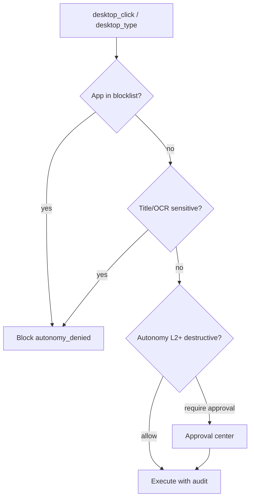

# Desktop & IDE Control — Security Design

> **Status:** design / MVP guardrails in code  
> **Scope:** `desktop_*`, `local_terminal_*`, sidecar filesystem tools  
> **Goal:** Premium agent desktop control without exposing payment, credential, or arbitrary UI surfaces.

## Threat model

| Threat | Example | Impact |
|--------|---------|--------|
| Credential harvesting | Agent clicks into 1Password / Keychain | Secret exfiltration |
| Financial abuse | Auto-fill checkout, approve payment | Direct monetary loss |
| Privilege escalation | Terminal runs outside project sandbox | Host compromise |
| Covert action | Clicks off-screen or wrong coordinates | Unintended writes |
| Audit gap | No recording of desktop mutations | Non-repudiation failure |

## Defense layers (target architecture)

```
┌─────────────────────────────────────────────────────────────┐
│ L5  Audit & retention — screen recording + structured log   │
├─────────────────────────────────────────────────────────────┤
│ L4  Human-in-the-loop — coordinate preview, step approval   │
├─────────────────────────────────────────────────────────────┤
│ L3  Context guard — OCR + window title + app allowlist      │
├─────────────────────────────────────────────────────────────┤
│ L2  Action class policy — payment/password/checkout block   │
├─────────────────────────────────────────────────────────────┤
│ L1  Autonomy matrix — L0–L5 per project/env (callTool gate) │
├─────────────────────────────────────────────────────────────┤
│ L0  Tool registry tags — needs_approval, destructive        │
└─────────────────────────────────────────────────────────────┘
```

### L0 — Registry & policy (implemented)

- Desktop tools tagged `needs_approval`, `LOCAL_FS`.
- Policy plugin evaluates before execution.
- **Autonomy hook** (`autonomy-hook.js`) enforces L0–L5 on every `callTool()`.

### L1 — App allowlist & blocked apps (partial)

**File:** `plugins/local-sidecar/desktop-guard.js`

- `DESKTOP_ALLOWED_APPS` / `DESKTOP_BLOCKED_APPS` env lists.
- Block Keychain, password managers by default.
- **Gap:** no per-project allowlist in DB; env-only.

### L2 — Sensitive context detection (partial → improved)

- Title patterns: password, payment, checkout, 2FA, bank, wallet.
- `detectSensitiveContext()` returns block reasons.
- **Implemented:** `DESKTOP_OCR_REQUIRED=true` runs screenshot + OCR text through same patterns before click/type.
- **Gap:** coordinate preview UI + mandatory bbox validation.

### L3 — OCR pre-flight (stub)

- `desktop_ocr` exists; design requires **mandatory OCR snapshot** before click/type when `DESKTOP_OCR_REQUIRED=true`.
- Compare OCR text against sensitive patterns; fail closed on match.
- **Gap:** coordinate preview UI + server-side bbox validation.

### L4 — Coordinate preview & bounded workspace

- Clicks must target coordinates inside last screenshot bounds.
- Sidecar returns screenshot dimensions; hub rejects out-of-range `(x,y)`.
- IDE control: restrict to declared workspace roots (already partially via LOCAL_FS).
- **Gap:** preview API + approval ticket linking screenshot hash to action.

### L5 — Screen recording audit (not started)

- Optional macOS screen recording segment per approved desktop session.
- Store: `{ sessionId, runId, toolName, screenshotHash, recordingRef, actor }`.
- Retention policy aligned with audit log (90d default).

## Payment / password / checkout guard (design)



**Rules:**

1. Never auto-type into fields labeled password/OTP/card.
2. Block apps in `BLOCKED_APPS` regardless of autonomy level.
3. Checkout flows: require explicit human approval + `DESKTOP_CHECKOUT_ALLOWED=true` per run.
4. Clipboard paste of secrets: disabled for desktop tools.

## IDE / terminal control

| Surface | Control |
|---------|---------|
| `local_terminal_exec` | Project cwd jail, shell policy plugin, timeout |
| `fs_*` / workspace | Path allowlist under project root |
| Cursor/VS Code | Future: extension bridge with scoped commands only |

## Configuration (proposed)

| Variable | Default | Purpose |
|----------|---------|---------|
| `DESKTOP_ALLOWLIST_DISABLED` | `false` | Emergency disable allowlist |
| `DESKTOP_ALLOWED_APPS` | Terminal, Cursor, Chrome, … | Comma-separated |
| `DESKTOP_BLOCKED_APPS` | Keychain, 1Password, … | Hard block |
| `DESKTOP_OCR_REQUIRED` | `false` | Require OCR before mutations |
| `DESKTOP_CHECKOUT_ALLOWED` | `false` | Per-deployment opt-in |
| `DESKTOP_RECORD_SESSIONS` | `false` | Enable L5 recording |

## Implementation phases

| Phase | Deliverable | Priority |
|-------|-------------|----------|
| **P0** | Wire `desktop-guard` into all desktop mutation handlers | High |
| **P0** | Autonomy global gate on `callTool` | Done (2026-06-26) |
| **P1** | OCR pre-flight + coordinate bounds | High |
| **P1** | Approval links screenshot hash → action | Medium |
| **P2** | Per-project desktop policy in autonomy store | Medium |
| **P2** | Session screen recording + export | Low |
| **P3** | IDE extension scoped command bridge | Future |

## Testing strategy

- Unit: `desktop-guard.test.js` — patterns, allowlist, blocked apps.
- Integration: mock sidecar; assert block on sensitive title.
- E2E (manual): human approves coordinate preview, verifies no click on blocked app.

## Related code

- `mcp-server/src/plugins/local-sidecar/desktop-guard.js`
- `mcp-server/src/core/ops/autonomy-hook.js`
- `mcp-server/src/plugins/policy/index.js` (tool before-hook)
- `mcp-server/tests/core/desktop-guard.test.js`
