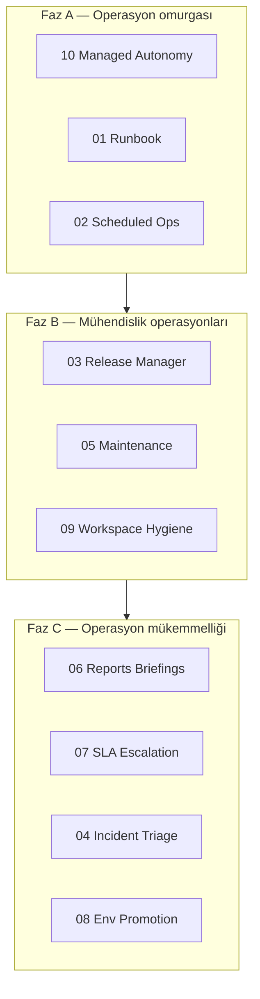

# V5 Execution Order

> **Son güncelleme:** 2026-06-24  
> **Önkoşul:** [V4 EXECUTION-ORDER](../v4-path/EXECUTION-ORDER.md) tamamlandı  
> **Sonraki:** [V6 EXECUTION-ORDER](../v6-path/EXECUTION-ORDER.md)  
> **Kural:** Önce operasyon omurgası → mühendislik agent'ları → SLA ve ortam kontrolü

---

## Strateji özeti



---

## Önerilen sıralama

### Faz A — Operasyon omurgası (V5.1 – V5.3)

| Sıra | Pillar | Dosya | Durum |
|------|--------|-------|-------|
| 5.1 | Runbook Automation | [01-runbook-automation.md](./01-runbook-automation.md) | not_started |
| 5.2 | Scheduled Agent Operations | [02-scheduled-agent-operations.md](./02-scheduled-agent-operations.md) | not_started |
| 5.3 | Managed Autonomy Policies | [10-managed-autonomy-policies.md](./10-managed-autonomy-policies.md) | not_started |

> **Not:** 10 numaralı pillar Faz A'da erken gelir — schedule ve runbook'ların policy çerçevesi buna bağlı.

### Faz B — Mühendislik operasyon agent'ları (V5.4 – V5.6)

| Sıra | Pillar | Dosya | Durum |
|------|--------|-------|-------|
| 5.4 | Release Manager Agent | [03-release-manager-agent.md](./03-release-manager-agent.md) | not_started |
| 5.5 | Dependency & Security Maintenance | [05-maintenance-agent.md](./05-maintenance-agent.md) | not_started |
| 5.6 | Workspace Automation Hygiene | [09-workspace-hygiene-agent.md](./09-workspace-hygiene-agent.md) | not_started |

### Faz C — SLA, rapor ve ortam (V5.7 – V5.10)

| Sıra | Pillar | Dosya | Durum |
|------|--------|-------|-------|
| 5.7 | Agent Reports & Briefings | [06-agent-reports-briefings.md](./06-agent-reports-briefings.md) | not_started |
| 5.8 | Operational SLAs & Escalation | [07-sla-escalation.md](./07-sla-escalation.md) | not_started |
| 5.9 | Incident Triage Agent | [04-incident-triage-agent.md](./04-incident-triage-agent.md) | not_started |
| 5.10 | Environment Promotion & Change Control | [08-environment-promotion-change-control.md](./08-environment-promotion-change-control.md) | not_started |

---

## Milestone etiketleri

| Etiket | İçerik |
|--------|--------|
| `v5.0-alpha` | Runbook + schedule + autonomy L0–L3 (5.1–5.3) |
| `v5.0-beta` | Release + maintenance + hygiene agent'ları (5.4–5.6) |
| `v5.1` | Reports + SLA escalation (5.7–5.8) |
| `v5.2` | Incident triage + env promotion (5.9–5.10) |

---

## V5 → V6 köprüsü

| V5 | V6'da genişler |
|----|----------------|
| Scheduled operations | Autonomous Watchers (event-driven) |
| Runbook templates | Agent Skill Store |
| SLA & escalation | Agent Inbox |
| Managed autonomy L4–L5 | Multi-Agent + Trust Score |
| Maintenance / release agents | Agent App Store |
| Environment promotion | Enterprise Compliance Pack |

---

## Paralel çalışma kuralları

| Yapılabilir paralel | Yapılmamalı paralel |
|---------------------|---------------------|
| 03 Release + 05 Maintenance | 08 env promotion + policy refactor aynı sprint |
| 06 Reports + 07 SLA | 04 incident triage + observability schema değişimi |
| 09 Hygiene + 02 Schedule | Autonomy level modeli değişirken runbook yazmak |

---

## İzleme

Her pillar dosyasında:

```markdown
Status: not_started | partial | in_progress | done
Owner: —
Last reviewed: YYYY-MM-DD
```
