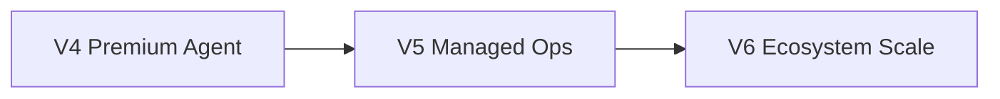

# V5 Path — Managed Autonomous Operations

> **Ürün yönü:** Agent automation'ı günlük operasyon sistemine çevirmek  
> **Değer önerisi:** Agent işleri sürekli, kontrollü, operasyonel ve üretim süreçlerine bağlı şekilde yönetilir.

Bu klasör, V5 büyüme adımlarının **tek tek takip edilebilir planlarıdır**. Önkoşul: [V4 path](../v4-path/README.md). Sonraki: [V6 path](../v6-path/README.md). Sıra için [EXECUTION-ORDER.md](./EXECUTION-ORDER.md) esas alınır.

---

## Strateji özeti

```text
V4 sorusu: Agent güçlü şekilde iş yapabiliyor mu?
V5 sorusu: Bu agent işleri sürekli, güvenli ve operasyonel olarak yönetilebiliyor mu?
V6 sorusu: Agent ekosistemi ekip/kurum ölçeğinde nasıl büyür?
```



---

## Plan dosyaları

| # | Dosya | Odak |
|---|-------|------|
| 00 | [00-vision.md](./00-vision.md) | Vizyon, V4→V5→V6 çizgisi |
| 01 | [01-runbook-automation.md](./01-runbook-automation.md) | Operasyonel runbook'lar |
| 02 | [02-scheduled-agent-operations.md](./02-scheduled-agent-operations.md) | Cron-like zamanlı agent işleri |
| 03 | [03-release-manager-agent.md](./03-release-manager-agent.md) | Release, changelog, semver |
| 04 | [04-incident-triage-agent.md](./04-incident-triage-agent.md) | Error spike → triage → aksiyon |
| 05 | [05-maintenance-agent.md](./05-maintenance-agent.md) | Dependency & security bakım |
| 06 | [06-agent-reports-briefings.md](./06-agent-reports-briefings.md) | Daily/weekly raporlar |
| 07 | [07-sla-escalation.md](./07-sla-escalation.md) | Timeout, escalation, paging |
| 08 | [08-environment-promotion-change-control.md](./08-environment-promotion-change-control.md) | Dev/staging/prod promotion |
| 09 | [09-workspace-hygiene-agent.md](./09-workspace-hygiene-agent.md) | Stale PR, branch, workflow temizliği |
| 10 | [10-managed-autonomy-policies.md](./10-managed-autonomy-policies.md) | L0–L5 autonomy seviyeleri |

**Sıra:** [EXECUTION-ORDER.md](./EXECUTION-ORDER.md)

---

## V4 → V5 → V6

| Katman | Tema |
|--------|------|
| V4 | Premium agent kabiliyetleri (designer, desktop, self-healing, eval) |
| **V5** | Managed autonomous operations (runbook, schedule, SLA, env) |
| V6 | Agent ecosystem scale (multi-agent, skill store, watchers, enterprise) |

---

## Nasıl kullanılır

1. [EXECUTION-ORDER.md](./EXECUTION-ORDER.md) içinden aktif fazı seç.
2. Pillar maddelerini issue/PR'lara böl.
3. **Başarı kriteri** kutusunu işaretle.
4. `Status:` satırını güncelle.

İlgili dokümanlar: [v4-path](../v4-path/README.md), [v6-path](../v6-path/README.md), [architecture.md](../architecture.md).
