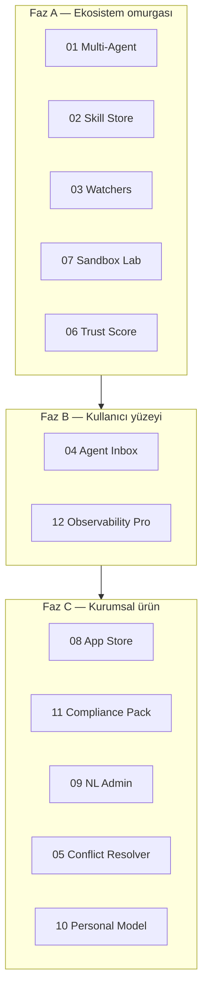

# V6 Execution Order

> **Son güncelleme:** 2026-06-24  
> **Önkoşul:** [V5 EXECUTION-ORDER](../v5-path/EXECUTION-ORDER.md) tamamlandı  
> **Kural:** Önce ekosistem omurgası → güven ve simülasyon → kullanıcı/kurum ürünleştirme

---

## Strateji özeti



---

## Önerilen sıralama

### Faz A — Ekosistem omurgası (V6.1 – V6.5)

| Sıra | Pillar | Dosya | Durum |
|------|--------|-------|-------|
| 6.1 | Multi-Agent Collaboration | [01-multi-agent-collaboration.md](./01-multi-agent-collaboration.md) | not_started |
| 6.2 | Agent Skill Store | [02-agent-skill-store.md](./02-agent-skill-store.md) | not_started |
| 6.3 | Autonomous Watchers | [03-autonomous-watchers.md](./03-autonomous-watchers.md) | not_started |
| 6.4 | Sandbox / Simulation Lab | [07-sandbox-simulation-lab.md](./07-sandbox-simulation-lab.md) | not_started |
| 6.5 | Agent Trust Score | [06-agent-trust-score.md](./06-agent-trust-score.md) | not_started |

### Faz B — Kullanıcı ve operasyon yüzeyi (V6.6 – V6.7)

| Sıra | Pillar | Dosya | Durum |
|------|--------|-------|-------|
| 6.6 | Agent Inbox | [04-agent-inbox.md](./04-agent-inbox.md) | not_started |
| 6.7 | Agent Observability Pro | [12-agent-observability-pro.md](./12-agent-observability-pro.md) | not_started |

### Faz C — Kurumsal ve kişiselleştirme (V6.8 – V6.12)

| Sıra | Pillar | Dosya | Durum |
|------|--------|-------|-------|
| 6.8 | Agent App Store | [08-agent-app-store.md](./08-agent-app-store.md) | not_started |
| 6.9 | Enterprise Compliance Pack | [11-enterprise-compliance-pack.md](./11-enterprise-compliance-pack.md) | not_started |
| 6.10 | Natural Language Admin | [09-natural-language-admin.md](./09-natural-language-admin.md) | not_started |
| 6.11 | Knowledge Conflict Resolver | [05-knowledge-conflict-resolver.md](./05-knowledge-conflict-resolver.md) | not_started |
| 6.12 | Personal Operating Model | [10-personal-operating-model.md](./10-personal-operating-model.md) | not_started |

---

## Milestone etiketleri

| Etiket | İçerik |
|--------|--------|
| `v6.0-alpha` | Parent/child runs + skill manifest (6.1–6.2) |
| `v6.0-beta` | Watchers + sandbox + trust score (6.3–6.5) |
| `v6.1` | Inbox + Observability Pro (6.6–6.7) |
| `v6.2` | App Store + Compliance MVP (6.8–6.9) |
| `v6.3` | NL Admin + Conflict Resolver + Personal Model (6.10–6.12) |

---

## V5 → V6 köprüsü

| V5'te var | V6'da genişler |
|-----------|----------------|
| Scheduled operations | Autonomous Watchers (event-driven) |
| Runbook automation | Agent Skill Store |
| SLA & escalation | Agent Inbox |
| Managed autonomy L4–L5 | Multi-Agent + Trust Score |
| Release / maintenance agents | Agent App Store |
| Environment promotion | Enterprise Compliance Pack |
| Reports & briefings | Observability Pro + NL Admin |

---

## Paralel çalışma kuralları

| Yapılabilir paralel | Yapılmamalı paralel |
|---------------------|---------------------|
| 02 Skill Store + 07 Sandbox | 01 multi-agent model değişirken 03 watcher yazmak |
| 06 Trust Score + 12 Observability | 11 Compliance + audit schema migration aynı sprint |
| 08 App Store UI + 09 NL Admin | 05 Conflict Resolver + RAG ingest refactor |

---

## V7 — Sonraki yol

V6 tamamlandıktan sonra ürün yönü [V7 path](../v7-path/README.md) ile devam eder — **Personal AI Operating System**.

- **Faz 1:** Command Center → Briefing → Telegram → Memory
- **Faz 2:** Desktop assistant → Autonomy → Hardening
- **Faz 3:** Shopping → Life agents → Jarvis

Detay: [v7-path/EXECUTION-ORDER.md](../v7-path/EXECUTION-ORDER.md)

---

## İzleme

Her pillar dosyasında:

```markdown
Status: not_started | partial | in_progress | done
Owner: —
Last reviewed: YYYY-MM-DD
```
