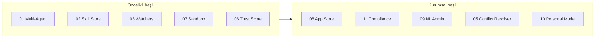

# V6 Path — Agent Ekosistemi Ölçeklenir

> **Durum:** kapatıldı (`mvp_done`, 2026-06-26)  
> **Ürün yönü:** Agent ekosisteminin ölçeklenmesi, güvenilirleşmesi ve kişiselleşmesi  
> **Değer önerisi:** Agent ekip gibi çalışır, olayla tetiklenir, güven skoru taşır ve kurum ölçeğinde yönetilir.  
> **Sonraki:** [V7 — Personal AI OS](../v7-path/README.md)

Bu klasör, V6 büyüme adımlarının **tek tek takip edilebilir planlarıdır**. Önkoşul: [V5 path](../v5-path/README.md). Sıra için [EXECUTION-ORDER.md](./EXECUTION-ORDER.md) esas alınır.

---

## Strateji özeti

V4 sorusu: *"Agent iş yapabiliyor mu?"*  
V5 sorusu: *"Bu işler operasyonel olarak yönetilebiliyor mu?"*  
V6 sorusu: *"Agent ekosistemi nasıl ölçeklenir, güvenilirleşir ve kişiselleşir?"*

---

## Plan dosyaları

| # | Dosya | Odak |
|---|-------|------|
| 00 | [00-vision.md](./00-vision.md) | Vizyon, evrim çizgisi, ilkeler |
| 01 | [01-multi-agent-collaboration.md](./01-multi-agent-collaboration.md) | Parent/child runs, rol bazlı ekip |
| 02 | [02-agent-skill-store.md](./02-agent-skill-store.md) | Skill = prompt + tools + eval + policy |
| 03 | [03-autonomous-watchers.md](./03-autonomous-watchers.md) | Event-triggered agent runs |
| 04 | [04-agent-inbox.md](./04-agent-inbox.md) | Merkezi agent ↔ kullanıcı iletişimi |
| 05 | [05-knowledge-conflict-resolver.md](./05-knowledge-conflict-resolver.md) | Çelişen project memory çözümü |
| 06 | [06-agent-trust-score.md](./06-agent-trust-score.md) | Agent/workflow güven skoru |
| 07 | [07-sandbox-simulation-lab.md](./07-sandbox-simulation-lab.md) | Fake env ile güvenli simülasyon |
| 08 | [08-agent-app-store.md](./08-agent-app-store.md) | Hazır agent ürünleri |
| 09 | [09-natural-language-admin.md](./09-natural-language-admin.md) | Doğal dille platform yönetimi |
| 10 | [10-personal-operating-model.md](./10-personal-operating-model.md) | Yönetilebilir kişisel agent memory |
| 11 | [11-enterprise-compliance-pack.md](./11-enterprise-compliance-pack.md) | SOC2-style, SSO, retention |
| 12 | [12-agent-observability-pro.md](./12-agent-observability-pro.md) | Agent davranışı observability |

**Sıra:** [EXECUTION-ORDER.md](./EXECUTION-ORDER.md)

---

## V5 → V6 ilişkisi

| V5 pillar | V6 devamı |
|-----------|-----------|
| Scheduled operations | → Autonomous Watchers |
| Runbook automation | → Skill Store, App Store |
| SLA & escalation | → Agent Inbox |
| Managed autonomy | → Multi-Agent, Trust Score |
| Reports & briefings | → Observability Pro |
| Env promotion | → Enterprise Compliance |

Önkoşul: [v5-path](../v5-path/README.md) · Temel: [v4-path](../v4-path/README.md)

---

## Nasıl kullanılır

1. [EXECUTION-ORDER.md](./EXECUTION-ORDER.md) içinden aktif fazı seç.
2. İlgili pillar maddelerini issue/PR'lara böl.
3. **Başarı kriteri** kutusunu işaretle.
4. `Status:` satırını güncelle.

İlgili dokümanlar: [architecture.md](../architecture.md).

---

## V7 — Sonraki aşama

V6 sonrası: [**v7-path/**](../v7-path/README.md) — personal AI operating system (briefing, Telegram, desktop, shopping, Jarvis).
