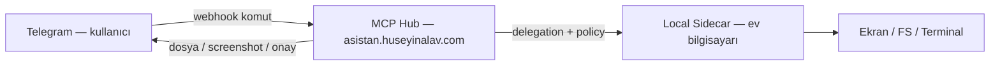

# 03 — Telegram Remote Control

> **Status:** partial (notifications plugin, telegram webhook — MVP: read-only `/ask` + outbound bildirim)  
> **Faz:** V7.3 (MVP) → **V7.3+ / V7.5 birleşimi** (tam kapsam)  
> **Son ürün notu:** 2026-06-26  
> **Bağımlılık:** [02-daily-briefing-agent.md](./02-daily-briefing-agent.md), [08-permission-autonomy-model.md](./08-permission-autonomy-model.md), [04-browser-desktop-assistant.md](./04-browser-desktop-assistant.md), [V4 Desktop Control](../v4-path/06-desktop-control-agent.md), [V3 Sidecar](../v3-path/09-local-sidecar-desktop-agent.md)

---

## Amaç

Kullanıcı evde değilken agent sistemini **Telegram üzerinden** yönetebilsin.

**Ürün hedefi (tam kapsam):** Telegram yalnızca soru-cevap kanalı değil; **birincil uzaktan kumanda** olacak. Evde değilken kendi bilgisayarından dosya alabilmeli, ekranı görebilmeli, onaylı işlemler yapabilmeli ve hub’daki tüm kişisel agent yeteneklerine erişebilmeli.

---

## Ürün notu — tam kapsamlı Telegram (V7’ye gelindiğinde)

> **Kaynak:** Ürün sahibi notu (2026-06-26)  
> **Mevcut durum:** `telegram.webhook.js` → `chatProfile: "safe"`, `allowWriteTools: false`, komutlar `/start` `/help` `/tools` `/ask` ile sınırlı.  
> **Hedef:** V7 Faz 2–3 tamamlandığında Telegram’ı **tam kapsamlı uzaktan kontrol** katmanına yükselt.

### Kullanıcı senaryosu

```text
Evde değilim → Telegram’dan:
  • Ev bilgisayarımdaki bir dosyayı iste / indir
  • Ekran görüntüsü veya aktif pencereyi gör
  • Onaylı desktop/browser aksiyonu (tıkla, yaz, uygulama aç)
  • Agent run başlat / durdur / onay ver
  • Proje durumu, brifing, hatırlatmalar
```

### Mimari köprü (önceki fazlar → Telegram)

Telegram tek başına dosya veya ekrana erişemez. Tam kapsam **hub + local sidecar + desktop agent** üçlüsüne dayanır:



| Yetenek | Altyapı kaynağı | Telegram yüzeyi (hedef) |
|---------|-----------------|-------------------------|
| Dosya okuma / indirme | V3 [Sidecar](../v3-path/09-local-sidecar-desktop-agent.md) FS allowlist | `/file get <path>`, dosya attachment |
| Terminal / komut | Sidecar terminal session | `/term …` (onaylı) |
| Ekran görüntüsü / OCR | V4 [Desktop Control](../v4-path/06-desktop-control-agent.md) | `/desktop screenshot`, `/desktop status` |
| UI aksiyonu (tıkla/yaz) | V7 [Browser Desktop](./04-browser-desktop-assistant.md) | Inline onay + screenshot preview |
| Run / onay | V3/V4 agent runtime + approval | `/runs`, `/approve`, `/deny`, `/stop` |
| Bildirim push | notifications plugin (mevcut) | `approval_required`, `run_completed`, … |

**Kural:** V7.3 MVP (komut router + run/onay köprüsü) Faz 1’de; **dosya + desktop + tam agent profili** Faz 2 sidecar/desktop hazır olduktan sonra aynı Telegram router’a bağlanır — ayrı bot değil, tek command router genişlemesi.

### Hedef komut / intent genişlemesi (Faz 2–3 sonrası)

```text
/file list <path>          — sidecar allowlist içi dizin
/file get <path>           — Telegram’a dosya gönder (boyut limiti + onay)
/desktop screenshot        — sidecar → hub → Telegram photo
/desktop status            — aktif pencere + sidecar health
/desktop approve <action>  — inline keyboard ile onaylı click/type
/runs /approve /deny /stop — agent runtime (Faz 1)
/brief /project /remind    — kişisel agent’lar (Faz 1–3)
```

### Güvenlik (tam kapsamda değişmez)

- `TELEGRAM_ALLOWED_CHAT_IDS` zorunlu
- Dosya indirme: allowlist path + max boyut + audit
- Desktop aksiyon: screenshot preview → inline approve/deny
- Write / shell / desktop: [08 Permission Autonomy](./08-permission-autonomy-model.md) seviyesine göre
- Emergency `/stop` — sidecar + hub global pause
- Sidecar offline iken: net hata + son bilinen durum (retry spam yok)

### Fazlama özeti

| Aşama | İçerik | Önkoşul |
|-------|--------|---------|
| **Şimdi (partial)** | Bildirim + güvenli `/ask` | notifications plugin |
| **V7.3 MVP** | Komut router, run/onay, event push, inline keyboard | Command Center, approval API |
| **V7.3+ tam** | `/file`, sidecar delegation, dosya attachment | V3 sidecar pairing + FS allowlist |
| **V7.5 entegrasyon** | `/desktop *`, screenshot preview, browser assist | V4 desktop tools + V7.5 assistant |

### Başarı kriteri (tam kapsam — ürün notu)

- [ ] Kullanıcı evde değilken Telegram’dan allowlist’teki bir dosyayı alabilir
- [ ] Ekran görüntüsü veya aktif pencere bilgisini görebilir
- [ ] Riskli desktop aksiyonunu screenshot + inline onay ile yapabilir
- [ ] Run başlatma, durdurma ve approval Telegram’dan tamamlanır
- [ ] Sidecar kapalıyken anlamlı hata ve güvenli fallback

---

## Komutlar (MVP — Faz 1)

```text
/brief
/news ai
/email important
/runs
/approve <id>
/deny <id>
/stop <run_id>
/project <name> status
/desktop status
/shopping search <query>
/remind <text>
```

---

## Güvenlik

- Allowed chat ID zorunlu
- Admin komutları için ikinci onay
- Riskli aksiyonlarda approval
- Para harcama aksiyonlarında manuel final confirmation
- Shell/desktop/browser aksiyonları için screenshot preview
- Emergency stop

---

## Telegram event tipleri

```text
brief_ready
approval_required
run_completed
run_failed
desktop_action_preview
shopping_result_ready
incident_alert
```

---

## Kapsam

### Faz 1 — MVP (7.3)

- [ ] Telegram command router (mevcut webhook genişletme; `safe` profilden çıkış — intent bazlı)
- [ ] Run/approval API köprüsü
- [ ] Inline keyboard: approve/deny
- [ ] Event push formatter (her event tipi)
- [ ] Admin command ikinci onay
- [ ] Emergency `/stop` global pause (hub scope)

### Faz 2 — Sidecar + dosya (7.3+ → 7.5 köprüsü)

- [ ] `/file list` / `/file get` — sidecar FS allowlist
- [ ] Telegram `sendDocument` / boyut limiti / audit
- [ ] Sidecar offline detection + kullanıcı mesajı
- [ ] Chat profile: `research` veya `personal_assistant` (Telegram kanalına özel policy)

### Faz 3 — Desktop agent entegrasyonu (7.5)

- [ ] `/desktop screenshot` → photo push
- [ ] `/desktop status` (active window, sidecar health)
- [ ] Desktop action preview + inline onay (V4 observe → assist)
- [ ] Browser assist komutları (scoped automation)
- [ ] Emergency `/stop` sidecar delegation kill

---

## Başarı kriteri

### MVP (Faz 1)

- [ ] Kullanıcı Telegram'dan run başlatabilir, durum sorabilir, onay verebilir ve sistemi durdurabilir

### Tam kapsam (ürün notu — Faz 2–3)

- [ ] Ev bilgisayarından allowlist dosya Telegram’a indirilebilir
- [ ] Ekran/aktif pencere uzaktan görülebilir
- [ ] Onaylı desktop/browser aksiyonu Telegram üzerinden tamamlanır
- [ ] Tek bot, tek webhook — hub + sidecar + desktop agent birleşik yüzey

---

## Sonraki

[07-personal-memory-profile.md](./07-personal-memory-profile.md)
