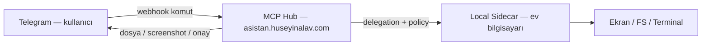

# 03 — Telegram Remote Control

> **Status:** `mvp_done` — komut router, run/onay, `/brief` `/file` `/desktop` (text preview)  
> **Production:** `pending` — dosya audit, photo push, redaction tests → [POST-MVP-BACKLOG](./POST-MVP-BACKLOG.md#3-telegram-file--desktop-production-hardening-73--75-prod)
> **Faz:** V7.3 (MVP) → **V7.3+ / V7.5 birleşimi** (tam kapsam)  
> **Son ürün notu:** 2026-06-26  
> **Bağımlılık:** [02-daily-briefing-agent.md](./02-daily-briefing-agent.md), [08-permission-autonomy-model.md](./08-permission-autonomy-model.md), [04-browser-desktop-assistant.md](./04-browser-desktop-assistant.md), [V4 Desktop Control](../v4-path/06-desktop-control-agent.md), [V3 Sidecar](../v3-path/09-local-sidecar-desktop-agent.md)

---

## Amaç

Kullanıcı evde değilken agent sistemini **Telegram üzerinden** yönetebilsin.

**Ürün hedefi (tam kapsam):** Telegram yalnızca soru-cevap kanalı değil; **birincil uzaktan kumanda** olacak. Evde değilken kendi bilgisayarından dosya alabilmeli, ekranı görebilmeli, onaylı işlemler yapabilmeli ve hub’daki tüm kişisel agent yeteneklerine erişebilmeli.

---

## Ürün notu — tam kapsamlı Telegram (V7’ye gelindiğinde)

> **Kaynak:** Ürün sahibi notu (2026-06-26)  
> **MVP (2026-06-26):** `telegram-commands.js` — `/brief`, `/runs`, `/approve`, `/file`, `/desktop`, `/life`, `/shopping`, `/mode`, memory komutları; run/onay köprüsü; text preview.  
> **Production pending:** dosya attachment, photo screenshot, inline desktop onay, sidecar offline UX → [POST-MVP-BACKLOG](./POST-MVP-BACKLOG.md#3-telegram-file--desktop-production-hardening-73--75-prod)

### Kullanıcı senaryosu

```text
Evde değilim → Telegram’dan:
  • Ev bilgisayarımdaki bir dosyayı iste / indir
  • Ekran görüntüsü veya aktif pencereyi gör
  • Onaylı desktop/browser aksiyonu (tıkla, yaz, uygulama aç)
  • Agent run başlat / durdur / onay ver
  • Proje durumu, brifing, hatırlatmalar
```

### Mimari köprü (önceki fazlar → Telegram)

Telegram tek başına dosya veya ekrana erişemez. Tam kapsam **hub + local sidecar + desktop agent** üçlüsüne dayanır:



| Yetenek | Altyapı kaynağı | Telegram yüzeyi (hedef) |
|---------|-----------------|-------------------------|
| Dosya okuma / indirme | V3 [Sidecar](../v3-path/09-local-sidecar-desktop-agent.md) FS allowlist | `/file get <path>`, dosya attachment |
| Terminal / komut | Sidecar terminal session | `/term …` (onaylı) |
| Ekran görüntüsü / OCR | V4 [Desktop Control](../v4-path/06-desktop-control-agent.md) | `/desktop screenshot`, `/desktop status` |
| UI aksiyonu (tıkla/yaz) | V7 [Browser Desktop](./04-browser-desktop-assistant.md) | Inline onay + screenshot preview |
| Run / onay | V3/V4 agent runtime + approval | `/runs`, `/approve`, `/deny`, `/stop` |
| Bildirim push | notifications plugin (mevcut) | `approval_required`, `run_completed`, … |

**Kural:** V7.3 MVP (komut router + run/onay köprüsü) Faz 1’de; **dosya + desktop + tam agent profili** Faz 2 sidecar/desktop hazır olduktan sonra aynı Telegram router’a bağlanır — ayrı bot değil, tek command router genişlemesi.

### Hedef komut / intent genişlemesi (Faz 2–3 sonrası)

```text
/file list <path>          — sidecar allowlist içi dizin
/file get <path>           — Telegram’a dosya gönder (boyut limiti + onay)
/desktop screenshot        — sidecar → hub → Telegram photo
/desktop status            — aktif pencere + sidecar health
/desktop approve <action>  — inline keyboard ile onaylı click/type
/runs /approve /deny /stop — agent runtime (Faz 1)
/brief /project /remind    — kişisel agent’lar (Faz 1–3)
```

### Güvenlik (tam kapsamda değişmez)

- `TELEGRAM_ALLOWED_CHAT_IDS` zorunlu
- Dosya indirme: allowlist path + max boyut + audit
- Desktop aksiyon: screenshot preview → inline approve/deny
- Write / shell / desktop: [08 Permission Autonomy](./08-permission-autonomy-model.md) seviyesine göre
- Emergency `/stop` — sidecar + hub global pause
- Sidecar offline iken: net hata + son bilinen durum (retry spam yok)

### Fazlama özeti

| Aşama | İçerik | Durum |
|-------|--------|-------|
| **V7.3 MVP** | Komut router, run/onay, brifing, memory, `/file` `/desktop` text | `mvp_done` |
| **V7.3+ prod** | `sendDocument`, allowlist audit, photo push | `production_pending` |
| **V7.5 prod** | Inline desktop onay, browser assist via Telegram | `production_pending` |

### Başarı kriteri (ürün notu — MVP vs prod)

- [mvp] Run başlatma, durdurma ve approval Telegram'dan tamamlanır
- [mvp] `/file` ve `/desktop` sidecar ile text preview (risk: hardening gerekli)
- [prod] Allowlist dosya Telegram attachment olarak indirilebilir
- [prod] Ekran photo + redaction; riskli aksiyon screenshot + inline onay
- [prod] Sidecar kapalıyken anlamlı hata ve güvenli fallback

---

## Komutlar (MVP — Faz 1)

```text
/brief
/news ai
/email important
/runs
/approve <id>
/deny <id>
/stop <run_id>
/project <name> status
/desktop status
/shopping search <query>
/remind <text>
```

---

## Güvenlik

- Allowed chat ID zorunlu
- Admin komutları için ikinci onay
- Riskli aksiyonlarda approval
- Para harcama aksiyonlarında manuel final confirmation
- Shell/desktop/browser aksiyonları için screenshot preview
- Emergency stop

---

## Telegram event tipleri

```text
brief_ready
approval_required
run_completed
run_failed
desktop_action_preview
shopping_result_ready
incident_alert
```

---

## Kapsam

### MVP (done)

- [mvp] Telegram command router (`telegram-commands.js` + webhook)
- [mvp] `/brief`, `/runs`, `/approve`, `/deny`, `/stop`, `/resume`
- [mvp] `/remember`, `/forget`, `/memory`, `/mode`, `/life`, `/shopping`
- [mvp] Inline keyboard: approve/deny callbacks
- [mvp] Emergency `/stop` → hub pause
- [mvp] `/file`, `/file list` — sidecar read (text preview, kısaltılmış)
- [mvp] `/desktop screenshot|window` — text preview (photo push yok)

### Production (pending)

- [prod] Path allowlist server-side enforce + max size + audit log
- [prod] `sendDocument` / `sendPhoto` + boyut limiti
- [prod] Screenshot redaction integration tests
- [prod] Sidecar offline structured error + last_seen
- [prod] Desktop action: screenshot preview → inline onay → click/type
- [prod] Event push formatter (tüm event tipleri)
- [prod] Chat profile: `telegram_assistant` policy genişletme
- [prod] Admin command ikinci onay

---

## Başarı kriteri

### MVP

- [mvp] Run/onay/brifing/memory Telegram'dan tamamlanır
- [mvp] `/file` ve `/desktop` sidecar ile text preview (risk: production hardening gerekli)

### Production (tam kapsam)

- [prod] Allowlist dosya Telegram'a güvenli attachment
- [prod] Ekran photo + redaction + onaylı desktop aksiyon
- [prod] Sidecar kapalıyken anlamlı hata

---

## Sonraki

[07-personal-memory-profile.md](./07-personal-memory-profile.md)
