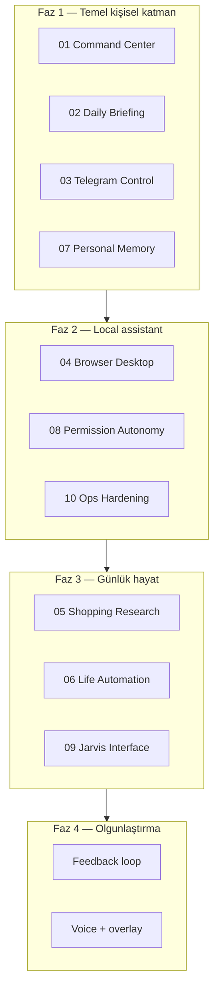

# V7 Execution Order

> **Son güncelleme:** 2026-06-26  
> **Önkoşul:** [V6 EXECUTION-ORDER](../v6-path/EXECUTION-ORDER.md) **kapatıldı** (`mvp_done`, 2026-06-26)  
> **Kural:** Önce kişisel merkez + brifing → local assistant + güvenlik → günlük hayat agent'ları → olgunlaştırma

---

## Strateji özeti



---

## Faz 1 — Temel kişisel katman (V7.1 – V7.4)

| Sıra | Pillar | Dosya | Durum |
|------|--------|-------|-------|
| 7.1 | Personal Command Center | [01-personal-command-center.md](./01-personal-command-center.md) | mvp_done |
| 7.2 | Daily Briefing Agent | [02-daily-briefing-agent.md](./02-daily-briefing-agent.md) | mvp_done |
| 7.3 | Telegram Remote Control | [03-telegram-remote-control.md](./03-telegram-remote-control.md) | mvp_done (MVP komutlar; dosya/desktop → Faz 2) |
| 7.4 | Personal Memory Profile | [07-personal-memory-profile.md](./07-personal-memory-profile.md) | mvp_done |

## Faz 2 — Local assistant (V7.5 – V7.7)

| Sıra | Pillar | Dosya | Durum |
|------|--------|-------|-------|
| 7.5 | Browser Desktop Assistant | [04-browser-desktop-assistant.md](./04-browser-desktop-assistant.md) | mvp_done |
| 7.6 | Permission Autonomy Model | [08-permission-autonomy-model.md](./08-permission-autonomy-model.md) | mvp_done |
| 7.7 | Personal Ops Hardening | [10-personal-ops-hardening.md](./10-personal-ops-hardening.md) | mvp_done |

## Faz 3 — Günlük hayat agent'ları (V7.8 – V7.10)

| Sıra | Pillar | Dosya | Durum |
|------|--------|-------|-------|
| 7.8 | Shopping Research Assistant | [05-shopping-research-assistant.md](./05-shopping-research-assistant.md) | not_started |
| 7.9 | Life Automation Agents | [06-life-automation-agents.md](./06-life-automation-agents.md) | not_started |
| 7.10 | Jarvis Interface | [09-jarvis-interface.md](./09-jarvis-interface.md) | not_started |

## Faz 4 — Olgunlaştırma (V7.11+)

| Madde | Açıklama |
|-------|----------|
| Daily feedback loop | Brifing/haber "gösterme" feedback'i |
| Memory correction UI | why_do_you_know_this, edit flow |
| Voice interface | Speech in/out |
| Desktop overlay | "Şu an ne yapıyor?" overlay |
| Mobile approval polish | Onay UX mobil |

---

## Milestone etiketleri

| Etiket | İçerik |
|--------|--------|
| `v7.0-alpha` | Command Center + Daily Briefing + Telegram MVP (7.1–7.3: run/onay, event push) |
| `v7.0-beta` | Desktop assistant + autonomy + hardening (7.5–7.7) |
| `v7.1` | **Telegram tam kapsam** (dosya/sidecar + desktop) + shopping + life agents + Jarvis (7.8–7.10) |
| `v7.2` | Voice, overlay, feedback loop (Faz 4) |

---

## V6 → V7 köprüsü

| V6 | V7'de kişiselleşir |
|----|---------------------|
| Personal Operating Model | Personal Memory Profile |
| Agent Inbox | Command Center + Telegram |
| Desktop Control | Browser Desktop Assistant → **Telegram uzaktan yüzeyi** (`/file`, `/desktop`) |
| Managed autonomy (V5) | Permission Autonomy Model (personal scope) |
| Agent App Store | Life Automation agent profilleri |
| n8n plugin | Life automation orchestration (altyapı, pillar değil) |

> **Ürün notu (2026-06-26):** Telegram şu an kısıtlı (`safe` profil). V7’de tam kapsam: ev bilgisayarına sidecar üzerinden dosya erişimi + V4 desktop agent ile ekran kontrolü — detay [03-telegram-remote-control.md](./03-telegram-remote-control.md).

---

## Paralel çalışma kuralları

| Yapılabilir paralel | Yapılmamalı paralel |
|---------------------|---------------------|
| 01 Command Center UI + 02 Briefing backend | 04 desktop tools + 10 hardening aynı sprint (policy çakışması) |
| 03 Telegram + 09 Jarvis kanalları | 05 shopping + payment policy refactor |
| 07 Memory + 08 Autonomy | Desktop action rate limit değişirken shopping flow test |

---

## İzleme

Her pillar dosyasında:

```markdown
Status: not_started | partial | in_progress | done
Owner: —
Last reviewed: YYYY-MM-DD
```
