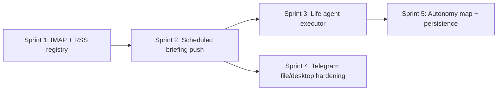

# V7 Post-MVP Backlog — Production & Günlük Hayat

> **Son güncelleme:** 2026-06-26  
> **Bağlam:** V7 pillar'ları **MVP tamamlandı** (`mvp_done`) — kişisel agent OS iskeleti, UI, API, Telegram yüzeyi, güvenlik hook'ları ve testler mevcut.  
> **Bu dosya:** Günlük hayat vizyonunun **gerçekten çalışması** ve **production güveni** için kalan işler.

---

## Durum etiketleri (doküman standardı)

| Etiket | Anlam |
|--------|--------|
| `mvp_done` | API/UI/akış iskeleti var; manuel veya hub-native sinyallerle demo edilebilir |
| `production_pending` | Connector, scheduler, hardening, persistence veya site-specific automation gerekiyor |
| `full_done` | Günlük kullanımda güvenle, otomatik ve tekrarlanabilir |

Pillar dosyalarında checklist maddeleri artık **`[mvp]`** / **`[prod]`** ile işaretlenmeli.

---

## Net ürün yorumu (2026-06-26)

V7, projenin kimliğini değiştirdi: artık yalnızca "MCP Hub" değil, **kişisel agent işletim sistemi MVP'si**.  
Ancak günlük hayat senaryolarının tam çalışması için üç omurga production seviyesine çekilmeli:

1. **Mail + haber kaynakları** (IMAP/RSS connector registry → briefing pipeline)
2. **Zamanlanmış life agent execution** (scheduler → source → run → Telegram push)
3. **Sidecar güvenli dosya/desktop** (allowlist enforcement, audit, redaction testleri)

---

## P0 — Günlük hayat omurgası

### 1. Briefing source connectors (7.2 prod)

**MVP bugün:** `hub_inbox`, `hub_runs`, `hub_projects`, `hub_memory`; `generateDailyBriefing`; feedback loop; `/brief`.

**Sprint 1 (2026-06-26):** RSS feed registry + IMAP account registry + poll → briefing items; source health API; dedup.

**Production pending (Sprint 2+):**

- [prod] IMAP/Gmail connector (oauth veya app password; read-only triage)
- [prod] RSS/Atom feed registry (URL, poll interval, etag)
- [prod] Source health + `not_configured` → `active` geçiş UI
- [prod] Dedup + cross-source importance (aynı haber birden fazla kaynaktan)
- [prod] Scheduled generate (cron / V5 schedule → `POST /personal/briefing/generate`)
- [prod] Telegram scheduled push (sabah 09:00 digest; sadece `actionRequired`)

**Kod referansları:** `briefing-sources.js`, `daily-briefing.service.js`, `briefing-feedback.service.js`

---

### 2. Life agent execution pipeline (7.9 prod)

**MVP bugün:** 8 preset, CRUD, dry-run test, watcher bind (`skill-research-brief` placeholder), `/life` UI.

**Production pending:**

- [prod] `life-agent.executor` — preset → gerçek workflow (skill/template veya n8n)
- [prod] Schedule binding: `intervalMinutes` → V5 schedule veya watcher fire
- [prod] Source connector map: `mail_triage` → IMAP; `news_briefing` → RSS
- [prod] Output channel delivery: Telegram `sendMessage`, inbox item, command center feed
- [prod] Run history ≠ dry-run; cost cap enforcement per agent
- [prod] "Her sabah mail oku + haber tara + Telegram özet" tek life agent bundle

**Kod referansları:** `life-agent-catalog.js`, `life-agent.service.js`, `watcher-store.js`, V5 `schedule.service.js`

---

### 3. Telegram `/file` + `/desktop` production hardening (7.3 + 7.5 prod)

**MVP bugün:** `/file`, `/file list`, `/desktop screenshot|window`; sidecar proxy; text preview (photo push yok).

**Production pending:**

- [prod] Path allowlist **server-side** enforce (sidecar `checkPathAllowed` + hub path normalize)
- [prod] Max file size, mime allowlist, per-chat rate limit
- [prod] Audit: her `/file` read → actor, path hash, byte count, chatId
- [prod] Screenshot: redaction pipeline **integration test** (payment/password ekranı)
- [prod] `sendDocument` / `sendPhoto` Telegram API + boyut limiti
- [prod] Sidecar offline: structured error, last_seen, retry policy
- [prod] Inline approve for desktop action (screenshot preview → callback)

**Risk notu:** Bu yüzey güçlü; production öncesi penetration-style test suite şart.

---

## P1 — Güvenlik & otonomi derinleştirme

### 4. Personal autonomy risk map (7.6 prod)

**MVP bugün:** 3 preset, `TOOL_RISK_MAP` (~15 tool), desktop hook.

**Production pending:**

- [prod] Tool family registry: `browser_*`, `email_*`, `send_*`, `fs_*`, `n8n_*`, `file-storage_*`, `shell_*`
- [prod] Prefix + tag based classification fallback
- [prod] Matrix UI: domain × risk × level
- [prod] Per-channel overrides (Telegram vs web vs schedule)

**Kod referansları:** `personal-autonomy.service.js`, `autonomy-hook.js`

---

### 5. Personal ops & sidecar audit (7.7 prod)

**MVP bugün:** emergency stop, caps, redaction helpers, injection guard.

**Production pending:**

- [prod] Run replay for personal/desktop actions
- [prod] Screenshot redaction e2e tests (fixture images)
- [prod] Daily spend cap wired to usage ledger
- [prod] Multi-signal payment block regression suite

---

## P2 — Shopping & browser (MVP üstü)

### 6. Shopping — gerçek site akışı (7.8 prod)

**MVP bugün:** Tavily search veya stub; cart approval gate; `/shopping`.

**Production pending:**

- [prod] Site-specific extract (Hepsiburada, Amazon TR, …) via `tavily_extract` veya browser
- [prod] Ürün sayfası: fiyat, satıcı, yorum özeti structured parse
- [prod] Sepet öncesi browser automation (onaylı `browser_*` / desktop)
- [prod] Payment screen hard block integration test on real checkout URLs (sandbox)

---

## P3 — Platform & kalite

### 7. Personal layer persistence (cross-cutting)

**MVP bugün:** JSON/cache stores (`operating-model`, `life-agents`, `briefing-feedback`, `jarvis-mode`, …).

**Production pending:**

- [prod] MSSQL persistence option (V6 pattern: sidecar_devices, settings)
- [prod] Encryption at rest for preferences + briefing feedback
- [prod] Backup/export schedule
- [prod] Multi-device state sync (sidecar + hub aynı user)

---

### 8. Tool registry hygiene (engineering)

- [prod] Write/destructive tools: `explanation` in inputSchema (registry warnings)
- [prod] image-gen / video-gen: deprecated `parameters` → OpenAPI 3.1 cleanup
- [prod] CI: `STRICT_TOOL_SCHEMA=true` green

---

## Önerilen sprint sırası

| Sprint | Hedef | Çıkış |
|--------|-------|-------|
| **S1** | Briefing connectors | Mail + RSS → `generateDailyBriefing` items |
| **S2** | Schedule + Telegram digest | Her sabah otomatik `/brief` push |
| **S3** | Life agent executor | `news-briefing` preset gerçekten çalışır |
| **S4** | Sidecar prod hardening | `/file` audit + redaction tests |
| **S5** | Autonomy + stores | Geniş risk map + DB persistence MVP |

---

## Milestone yeniden tanımı

| Etiket | Eski anlam | Güncel anlam (2026-06-26) |
|--------|------------|---------------------------|
| `v7.0-alpha` | Faz 1 MVP | ✅ Geçildi |
| `v7.0-beta` | Faz 2 MVP | ✅ Geçildi |
| `v7.1` | Telegram tam + life agents | **→ `v7.1-prod`**: connector + executor + sidecar hardening |
| `v7.2` | Faz 4 polish | ✅ MVP geçildi; **→ `v7.2-prod`**: persistence + autonomy depth |

---

## İlgili dosyalar

- [EXECUTION-ORDER.md](./EXECUTION-ORDER.md) — faz sırası + `mvp_done` tablosu
- [02-daily-briefing-agent.md](./02-daily-briefing-agent.md)
- [03-telegram-remote-control.md](./03-telegram-remote-control.md)
- [06-life-automation-agents.md](./06-life-automation-agents.md)
- [08-permission-autonomy-model.md](./08-permission-autonomy-model.md)
