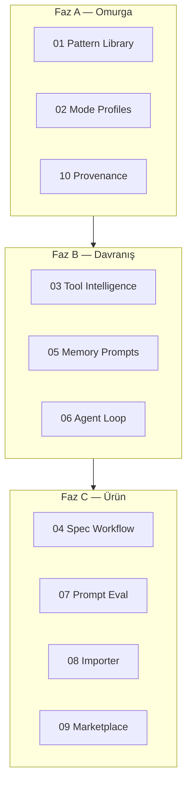

# V8 Execution Order

> **Son güncelleme:** 2026-06-26  
> **Önkoşul:** V4 Eval Studio, `prompt-registry` v2, V6 operating model  
> **Paralel olabilir:** V7 personal OS (desktop/telegram) — V8 prompt katmanı her iki yolu besler

---

## Strateji özeti

---

## Faz A — Registry ↔ Chat bağlantısı (V8.1 – V8.3)

| Sıra | Pillar | Dosya | Durum |
|------|--------|-------|-------|
| 8.1 | Prompt Pattern Library | [01-prompt-pattern-library.md](./01-prompt-pattern-library.md) | done |
| 8.2 | Mode Chat Profiles | [02-mode-chat-profiles.md](./02-mode-chat-profiles.md) | done |
| 8.3 | Provenance & Safety | [10-provenance-safety.md](./10-provenance-safety.md) | done |

**Exit gate:**
- [x] `buildSystemPrompt()` registry render kullanır (`felix-default` bundle)
- [x] `chat` / `agent` / `spec` / `review` / `debug` / `ops` / `desktop` modları tanımlı
- [x] Provenance metadata şeması + review checklist

---

## Faz B — Agent davranışı (V8.4 – V8.6)

| Sıra | Pillar | Dosya | Durum |
|------|--------|-------|-------|
| 8.4 | Tool Calling Intelligence | [03-tool-calling-intelligence.md](./03-tool-calling-intelligence.md) | done |
| 8.5 | Memory / Brain Prompts | [05-memory-brain-prompts.md](./05-memory-brain-prompts.md) | done |
| 8.6 | Agent Loop Contract | [06-agent-loop-contract.md](./06-agent-loop-contract.md) | done |

**Exit gate:**
- [x] Tool planning karar şeması prompt + `guardToolCall` uyumlu
- [x] Brain create/update/delete kuralları prompt + limitler hizalı
- [x] Orchestrator turn metadata: observe / plan / act / reflect

---

## Faz C — Ürünleştirme (V8.7 – V8.10)

| Sıra | Pillar | Dosya | Durum |
|------|--------|-------|-------|
| 8.7 | Spec Driven Development | [04-spec-driven-development.md](./04-spec-driven-development.md) | done |
| 8.8 | Prompt Eval Studio | [07-prompt-eval-studio.md](./07-prompt-eval-studio.md) | done |
| 8.9 | Prompt Importer | [08-prompt-importer.md](./08-prompt-importer.md) | done |
| 8.10 | Prompt Marketplace | [09-prompt-marketplace.md](./09-prompt-marketplace.md) | done |

**Exit gate:**
- [x] Spec mode: requirements → design → tasks artifact + opsiyonel runbook
- [x] `eval:prompt` veya Eval Studio panel: ≥3 variant skor kartı
- [x] Importer CLI: arşiv tarama → draft registry JSON
- [x] UI: profil/marketplace seçimi (MVP)

---

## Milestone etiketleri

| Etiket | İçerik |
|--------|--------|
| `v8.0-alpha` | Registry-rendered chat prompt + 5 mod (8.1–8.2) |
| `v8.0-beta` | Tool intelligence + brain prompt sertleştirme (8.4–8.5) |
| `v8.1` | Spec workflow + agent loop contract (8.6–8.7) |
| `v8.2` | Importer + eval A/B + marketplace MVP (8.8–8.10) |

---

## V7 / V6 köprüsü

| Önceki | V8 besler |
|--------|-----------|
| V7 Telegram / Jarvis | `desktop`, `telegram` response_style sections |
| V6 operating model | `preferences_injection` slot |
| V6 NL Admin | spec mode artifact’ları |
| V5 ops agents | `ops` mode + runbook spec |
| V4 Eval Studio | prompt variant regression |

---

## Paralel çalışma kuralları

| Yapılabilir paralel | Yapılmamalı paralel |
|---------------------|---------------------|
| Importer + Pattern library analizi | Registry schema değişirken eval golden yazmak |
| Mode profiles UI + Spec workflow backend | `chat-system-prompt.js` silmeden registry migrate |
| Prompt eval + Tool planning | Identity section’da arşiv metni yapıştırmak |
